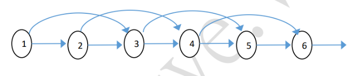
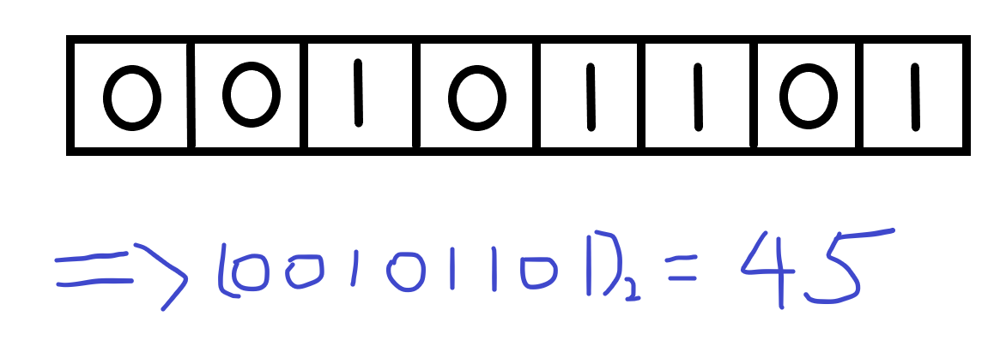
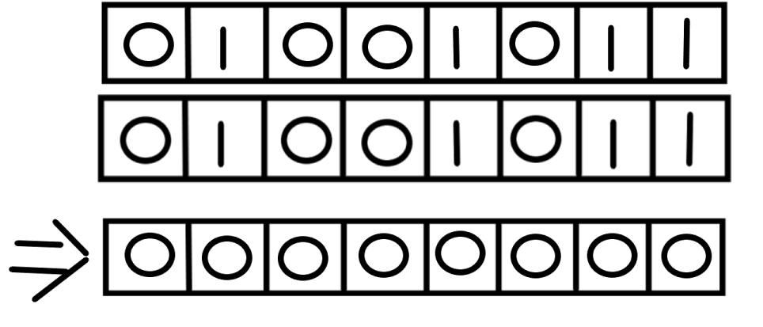
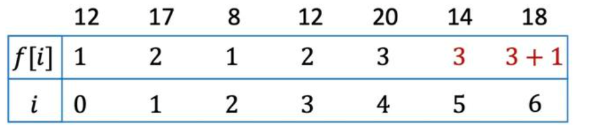
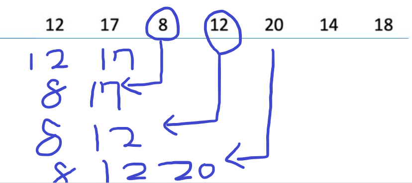
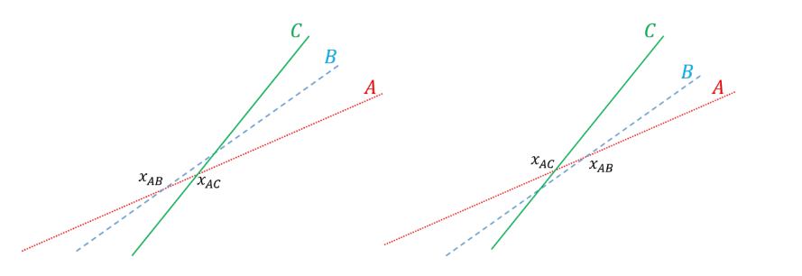
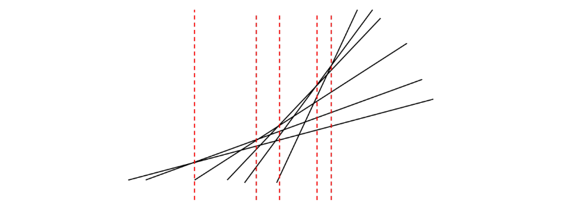
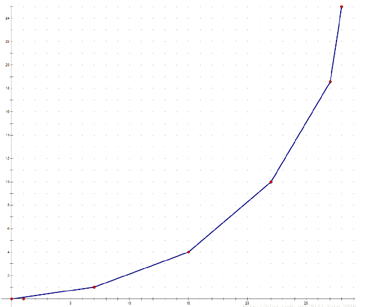

## 前言

DP的思路過程。時間上，一般我們會把「狀態數 × 轉移時間」當作是 DP 的時間複雜度,不過 DP 並不是這樣死的東西,在許多情況下，我們都能基於題目的性質來略去許多計算過程，或者是拿一些資料結構來維護好轉移的求值。所以接下來會討論基於優化時間的 DP 優化方法。 

在深入了解DP優化之前，我們來談談有趣的優化空間，時間的方法。

## 滾動數組

這東西常來應用在當空間不夠的時候，在bottom up的時候，常常需要用到連續的解，前面的解往往用過就不會再用了，所以使用滾動數組可以很有效率的降低空間，代價是犧牲了一些效率整理。

舉例來說，前面提到的費波那契數，我們可以用bottom up : F[i] = F[i-1] + F[i-2]



可以發現，1給了2和3之後其實就沒有了用處，2給了3和4之後也是，也就是說，如果要求出一個F[n]，其實只需要陣列大小3就夠了

```cpp
int main(void){
    int F[3], n;
    F[1] = 0;
    F[2] = 1;
    std::cin >> n;
    for(int i = 2 ; i <= n ; i ++){
        F[0] = F[1];
        F[1] = F[2];
        F[2] = F[0] + F[1];
    }
    std::cout << F[2];
}
```
簡單說滾動數組就是犧牲一些效率來換內存。不過有一種方法，在一定條件下，既可以節省空間，還可以增加效率。那就是狀態壓縮。

## 狀態壓縮
狀態壓縮，以最小代價來表示某種狀況，通常是用二進制(01)來表示點的狀態，當然也可以使用多進制來表示點的狀態。(不過因為是電腦，所以二進制上效率會好很多)

### 使用條件: 
- 每個狀態可以用二進制表示，也就是只有兩種情況，比如硬幣正反面。整個狀態數據就可以為二進位表示。

之後我們就可以將此狀態轉成其他形式表示，如int。 一方面節省時間，另外一方面在狀態對比和狀態處理可以提高效率。

### 例子

假設丟8次硬幣，丟出正面我們表示0，丟出反面我們表示1，我們在第3 5 6 8輪丟出反面。



所以可以將00101101轉成45來存放。也就是原本需要用8個東西存放，現在只需要1個int就解決了，那要進行狀態處理，我們就要來談談位元運算。

### 位元運算
在[c++基礎](/Posts/Algorithm/basic.html)那篇其實有提到了，這邊快速介紹一下

| 位元符號 | 意思                              | 例如(下列以二進位表示) |
|:--------:|:--------------------------------- |:----------------------:|
|    &     | 且(and)，同1為1，其餘為0          |    100 & 101 = 100     |
|    \|    | 或(or)，其1為1，其餘為0           |    100 \| 101 = 101    |
|    ^     | 互斥(xor)，其1為1，同1為0，同0為0 |    100 ^ 101 = 001     |
|    ~     | 非(not)，把1換0，把0換1           |      ~ 100  = 011      |
|    <<    | 左移(將一個變數向左移動並且補0)                             |    101 << 1 = 1010     |
|    >>    | 右移(將一個變數向右移動並且捨去)                              |     101  >> 1 = 10     |

位元運算很有趣，像是處理減法，和做一些判斷都有意想不到的用法!

了解位元運算後，再回頭來看狀態壓縮，假設我們想要了解玩兩輪骰子遊戲結果一不一樣。
假設第一輪結果是01001011，第二輪也是01001011，我們可以讓AB兩個用int來存放，同時利用位元運算中的xor性質，如果A^B為0，就代表他們兩個一樣。

## 




## 滾動DP/狀壓DP(位元DP)

就是把滾動數組或狀態壓縮的方式應用在DP上，簡單說就是需要DP的容量太大，不夠存放，把一些用過就不會用到的內存換成現在需要的。滾動DP比較好理解且剛剛提過現在就不再敘述，所以我們來看狀壓DP的例子:

### 擺滿棋盤

問題: 有一個N*M(N<=5,M<=1000)的棋盤，現在有1X2及2X1的小木塊無數個，要蓋滿整個棋盤，有多少種方式？答案只需要mod1,000,000,007即可。
                      
我們可以看到N,M相差甚遠，(為了方便，不然其實你也可以多個int疊起來)，我們可以使用長度為N的二進制來表示這個影響，例如(01011)=11

因此狀態可以這樣表示: dp[i][state] 表示填充第i列，第i-1列影響是state的時候的方法數。
也就是dp[i][state] = ∑dp[i-1][pre]
然後記得初始化dp[1][0]=1; 也就是第一列狀態為0的時候方法數為1

狀態壓縮/轉移方式:
```cpp
for (int i = 1 ; i <= M ; i++) {
    for (int j = 0 ; j < (1<<N) ; j++) {
        if (dp[i][j]) dfs(i,0,j,0)	
    }
}
```
定義dfs作法: 第i列，列舉到了第j行，當前狀態是state，對下一列的影響是nex
```cpp
void dfs(int i , int j , int state , int nex){
    if (j == N){ 
        dp[i+1][nex]+=dp[i][state];	
        dp[i+1][nex]%=mod;
        return ;
    }
	
    //這個位置不空 跳過
    if ((1<<j)&state > 0) 
        dfs(i,j+1,state,nex); 

    //這個位置空，嘗試放1*2木板
    if ((1<<j)&state == 0)
        dfs(i,j+1,state,nex|(1<<j)); 
	
    //這個位置空下個位置空，嘗試放2*1木板
    if (j+1 < N && (1<<j)&state == 0 && (1<<(j+1))&state == 0)
        dfs(i,j+2,state,nex);
    return 
}
```
                                  
而我們要的答案就是dp[M+1][0] 
(位元運算要多加熟悉，不然很常會看不懂實作和怎麼用，建議在旁邊自己畫個模擬)

# 單調性質(monotonicity)

### 函數單調性
函數單調性也叫做函數的遞增遞減性，分成遞增函數，遞減函數，
也就是若f : X - > Y ，滿足x1<x2 則 f(x1)>f(x2) or f(x1)>f(x2) 

                                    
## 單調隊列優化

單調隊列優化的技巧主要用在取極值這個動作。有時候我們必須針對一個序列的好幾個區段。此優化的是利用我們查詢的左界 L 與右界 R 只需要單調遞增之特性。藉此我們可開始推知：

1. 一元素從右界進入後必定只會從左界出去。
2. 越左邊之元素一定會越先出去。

而有一種可以左右都pop 跟 push 的做法，叫雙向佇列(deque)
於是我們只需用 Deque 維護有單調性的序列。在加入新元素時就開始從 Deque 右方 pop 元素，直到最右方的元素比新元素更極端或 Deque 已經空了，再將新元素 push 入。要刪除元素時只需檢查所要刪的是否是當前 Deque 最左端的元素，是即刪。查詢極值時，直接取 Deque 最左端元素之值即可。這邊我們直接舉個例子

### LIS (最長遞增子序列)

給定一個子序列，求出最長遞增子序列長度
例如: 1 2 5 3 4 6 1 
則最長的長度為5 (1 2 3 4 6)

### 1. DP $O(n^2)$ 作法:

可以知道每個點的f[i] 為前面小於這個值的最大值+1，所以做法為$N^2$方法



### 2. 單調隊列優化

> 下面的算法我們一般會稱之為 貪心 + 二分搜

那會發現，其實如果出現比前面還小的數字，其實可以跟他替換，也就是f[3]的8 比f[1]的12來的好，因為他們的f[i]都是1但值更小了一點。所以我們可以直接用deque的方式來維護這個LIS。
                                   
步驟為:
1. 如果是極大值，那直接推進右邊
2. 如果不是極大值，那就從右邊開始找到一個位置比他還要小的一個替換掉(或者若為極小值，直接推進去最左邊就好)。



最後得到deque的長度就是我們要的答案。

那在做步驟二的時候，因為是遞增函數，所以可以直接二分搜。
時間複雜度直接降為$O(nlogn)$

```cpp
int LIS(vector<int>& nums){
    vector<int> box; 
    for (auto it : nums) {
        if(box.size()==0 || it > box.back()) box.push_back(it);
        else{
            auto target = lower_bound(box.begin(),box.end(),it);
            *target = it;
        }
    }
    return box.size();
}
```

## 斜率優化
                    
                   
有些動態轉移形式可以寫成: dp[i] = min/max { dp[j] + ... + x[i] } 
省略號中只與j有關，也就是說每個dp[i]只會多一個+x[i]判斷，這種類型就可以用單調隊列優化，使時間複雜度從 $O(n^2)$ 降為 $O(n)$ 

但如果是 dp[i] = min/max { dp[j] * x[i] } 既有i相關的量和j相關的量，就沒辦法單純只考慮x[i]了，所以這時候不能使用單調隊列優化。那怎麼辦呢?
### 斜率優化
我們先考慮簡單的轉移式 dp[i] = a[j]*x[i] + b[j]
觀察可以發現，對於所有的 j 為 y = a[j] x + b[j] 的線性函數，所以dp[i] 在求的就是在這些線性函數中代入 x[i] 的最大值是多少。 現在我們來看下面這張圖



對於三條線型函數 A B C滿足斜率有 mA < mB < mC 時，可以分類成以上兩種情況。
- 左邊這張圖: 每條線，都有在某個時刻當上最大值的時候，所以每條線都是有用的。
- 右邊這張圖: B這條線，在所有時刻都無法成為最大值，所以我們稱B為沒有用的線。

而要判斷B這條線沒有用，可以利用$X_{AB}$ , $X_{AC}$ 大小來判斷 
如果把一堆線段中所有「沒有的線段」移除掉，可以得到如下圖: 



只擷取最大值的區段，我們可以得到一個下面這張圖，我們稱之為「凸包」 




對於每條還存在的線段,我們都能夠找到連續的一段區間使得在這段區間代入 x 時有最大值，並且由斜率小到大這些區間會是接起來的。所以我們只需要維護所有最大值出現的區間，在算X的極值時，就可以用二分搜找出他在哪個區間，代入轉移式即可找出極值。

### 舉個例子:
給你一個長度 N 的正整數序列 $a_1 ∼ a_N$，請你將區間分割成若干段,每段 [l, r] 的權
重為 $(\sum_{i=l}^ra_i)^2 + C$，試問分段後的最小權重和。

定義dp[i]是把前綴[1,i]切段後的最小權重和 (同時定義S[i]為前綴和
所以dp[i] = $min$ { $(\sum_{k=j+1}^ia_k)^2 + C + dp[j]$ } 
=> dp[i] = $min$ { $(S[i] - S[j])^2 + C +d[j]$ }
=> dp[i] = $min$ { $S[i]^2 -2S[j]S[i] + S[j]^2 + C + dp[j]$ }

提出所有跟j無關的項
=> dp[i] = $min$ { $-2S[j]S[i] + S[j]^2 + dp[j]$ } $+ S[i]^2 + C$ 

我們就可以定義
y = dp[i]
k = S[i]
x = 2*S[j]
b = s[j]*s[j] + dp[j]

y = kx + b，所以可以發現K就是斜率，B是截距
我們就只需要去維護k就好了

### 實作: 

```cpp
#include <bits/stdc++.h>
#define ll long long
using namespace std;

int f[500005], s[500005];
set<ll> tree;

double slope(ll l, ll r) {  // 計算兩點斜率 y2-y1/x2-x1
    return double((f[l]+s[l]*s[l]) - (f[r]+s[r]*s[r])) / (2*s[l]-2*s[r]);
}

int main() {
    int n, x, c;
    cin >> n >> c;
    s[0] = 0;
    f[0] = 0;
    tree.insert(0);
    
    for (int i = 1 ; i <= n ; i++) {
        cin >> x;
        s[i] = s[i-1]+x;
    }
    for (int i = 1 ; i <= n ; i++) {
        while (tree.size()>1) {
            auto it = tree.begin() , it2 = it;
            ++it;
            if(slope(*(it2),*it) <= s[i]) tree.erase(it2); //左極值維護
            else break;
        }
        ll front = *tree.begin();
        f[i] = f[front]+(s[i]-s[front])*(s[i]-s[front]) + c;
        
        while (tree.size()>1) {
            auto it = tree.rbegin() , it2 = it;
            ++it;
            if(slope(*it2,*it) <= slope(*it2,i)) tree.erase(*it2); //右極值下凸包維護
            else break;
        }
        tree.insert(i); 
    }
    for (int k = 1 ; k <= n ; k++) {
        cout << k << " : " << f[k] << '\n';   
    }
}
```


