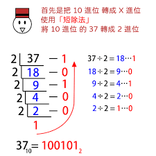
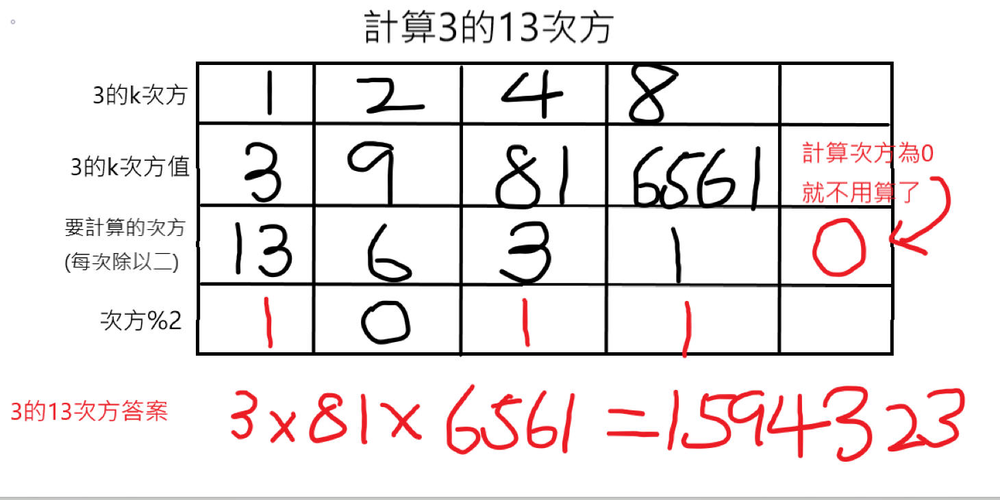
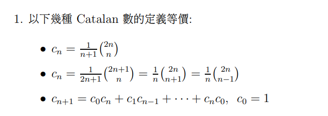
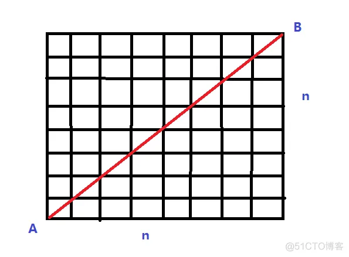
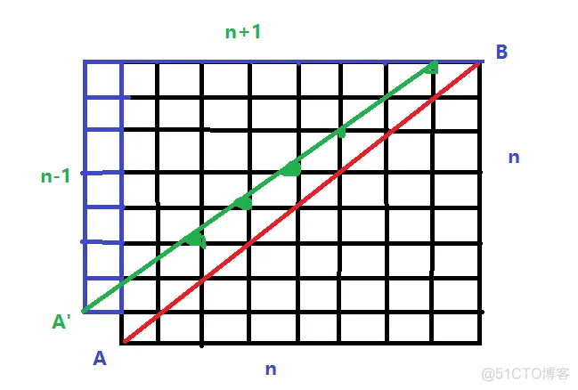
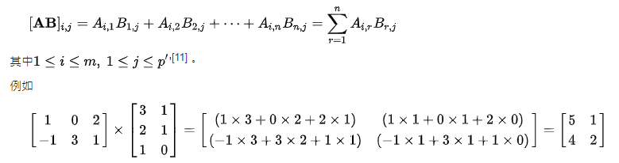
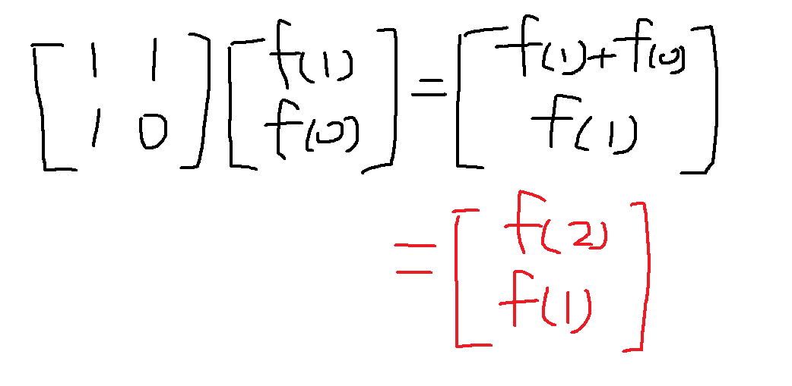
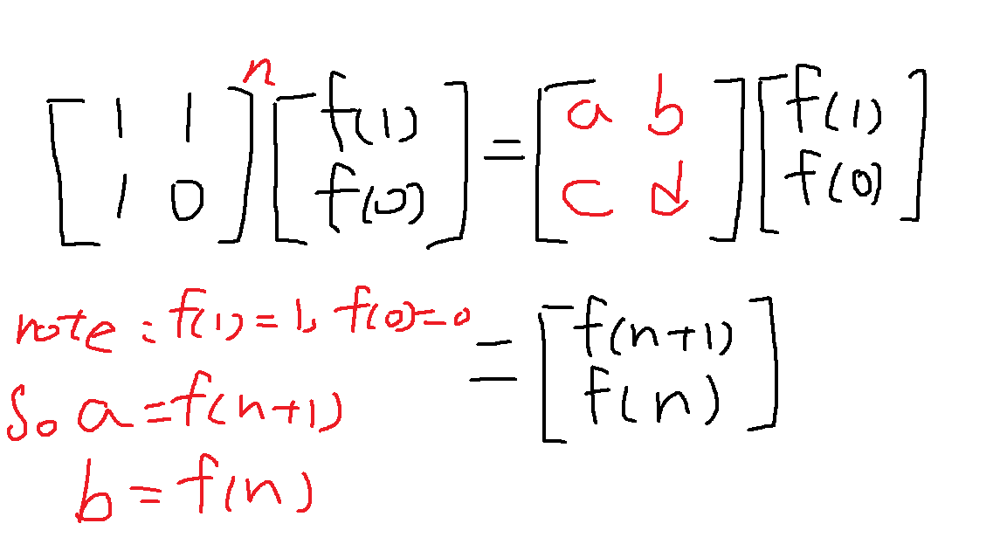
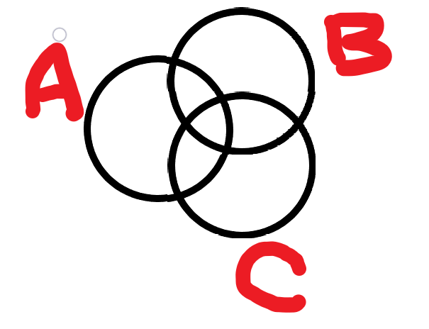

基礎數論I： 主要章節有下
- 快速冪
- 模運算 & 模逆元
- 矩陣快速冪 
- 質因數分解
- 歐幾里得算法(輾轉)
- 拓展歐幾里得(extgcd)
- 中國剩餘定理(Chinese remainder theorem, CRT)
- 排容定理
- 鴿籠原理 :dove_of_peace:
<!-- more -->

## 快速冪

### 定義

:::info
用來快速計算 $a^n$ 的值，並且是針對整數，因為數字成長過快，通常會mod一個值。 也就是算 $a^n \space mod \space p$。 
:::


###  作法 

快速冪的想法是將其使用二進制來分割成更小的任務。
一般形式： $a^n = a^{n_02^0} * a^{n_12^1} * ... * a^{n_t2^t}$ 
例如 $3^{13} = \space 3^{(1101)_2} = \space 3^1 * 3^4 * 3^8$ 

這樣子有什麼好處呢？ 在計算$a^{2^k}$ 時，任一元素是其前一個元素的平方，舉個例子
$2^1 = 2$
$2^2 = {(2^1)}^2$
$2^k = {(2^{k/2})}^2$
所以在計算 $a^n$ 時候，原本一個一個乘需要 $O(n)$ 用了快速冪後只需要 $O(logn)$

###  實作 

那在程式怎麼實作呢？ 首先要先知道，如何將 $n$ 轉為二進制。做法是將 $n mod 2$ 的值放入 $0$ 位數，再將 $n$ 除以 $2$，在將 $n mod 2$ 的結果放入 $1$ 位數 ， 再將 $n$ 除以二 .... 直到 $n$ 變成 $0$



然後要計算快速冪需要將 $a^n$ 換成  $a^{n_02^0} * a^{n_12^1} * ... * a^{n_t2^t}$ 

所以我們只需要將 $a^1$ 慢慢乘上去($a^2 a^4 a^8...$)，每次判斷 $n mod 2$ 是不是 $1$ ， 如果是，就將答案乘上 $a^k$ ，同時將 $n$ 除以 $2$。

例子： 計算$3^{13}$



### 程式碼

```cpp
// 計算 a 的 k 次方 mod p
#define ull unsigned long long 
//因不可能小於0 要單純用long long也可以

ull big_pow(ull a, ull k, ull p) { 
    ull ans = 1;
    while(k > 0){ //要計算的次方
        //如果次方%2為1，將答案乘上去
        if (k % 2) ans = ans * a % p; 
        a = a * a % p; //將a的k次方以次方增長
        k /= 2; //要計算的次方除以二
    }
    return ans;
}
```


## 模運算 & 模逆元

PS: 在這邊可以應用在排列組合上，但內容過於多，我會再寫一篇關於排列組合的介紹，下面放了幾個常用的。

### 模運算

整數在模空間底下計算，加減乘可以直接做，但除法會發生甚麼事情呢?
- (a +b) mod p = ((a % p)+ (b % p)) % p
- (a - b) mod p = ((a % p) - (b % p)) % p
- (a * b) mod p = ((a % p) * (b % p)) % p
- (a / b) mod p ?

### 費馬小定理

數論中的定理，假設a是整數，p是一個質數，則$a^p - a 是 p的倍數$
同時可以表示為(a，p互質)
1. $a^p \space \equiv \space a \space (mod \space p)$
2. $a^{p-1} \space \equiv \space 1 \space (mod \space p)$

### 模逆元技巧

在計算Cn取x時， 通常數字會太大所以題目會要求 mod 很大的質數，如果我們直接讓分子已經是mod的結果，分母也mod，兩個相除並不會是正確解答，因為除法沒有結合律。

例如 5 * 6 * 7 / 6 (mod 13)
但是如果分子先算並且mod會等於2
分母mod(13) = 6
所以相除並不會是正確答案

但是題目通常會要求mod很大的質數，例如1e9 + 7
因為1e9 + 7 是質數，就可以透過費馬小定理
根據定義 $a^{p-1} \space \equiv \space 1 \space (mod \space p)$
也就是 $a *a^{p-2} \space \equiv \space 1 \space (mod \space p)$

所以$a^{p-2}$ 就是 a mod 之後的逆元(反元素)。

### 二項式定理(巴斯卡三角形)

- $(a+b)^n = \sum_{i=0}^{n} C^n_i \cdot a^{n-i}b^i$ 
- $\tbinom{m+1}{k+1} - \tbinom{m}{k}$ = $\tbinom{m}{k+1}$ 

雖然很理所當然，但注意這很重要，這裡常常是會不會TLE的關鍵，而且這方面的題目很難很難很難。


### 卡塔蘭數

1, 1, 2, 5, 14, 42, 132, 429, 1430, 4862, 16796, 58786, 208012, 742900, 2674440, 9694845, 35357670, 129644790, 477638700, 1767263190

定義： 符合 $C_{n+1}$ = $C_0C_n + C_1C_{n-1} + ... + C_nC_0$ , 同時 $C_0$ = 1
也就是  $C_n$ = $\tbinom{2n}{n} - \tbinom{2n}{n-1}$ = $\frac{1}{n+1}\tbinom{2n}{n}$ 
就稱之卡塔蘭數 Catalan



### 應用

求A->B 不超過(可碰觸)紅線的方法數



那只要碰觸到綠色的線，就是非法的。



所以合法路徑=總路徑-非法路徑 = $\tbinom{2n}{n} - \tbinom{2n}{n-1}$。
### 根據卡塔蘭數 可得 $\tbinom{2n}{n} - \tbinom{2n}{n-1}$ = $\frac{1}{n+1}\tbinom{2n}{n}$


## 矩陣運算

### 方陣

如果A=n\*n matrix

```cpp
struct mat{
    int M[n][n]; // 初始化方陣大小 
    mat(){
        memset(M,0,sizeof(M));
    }
};
```

### 矩陣乘法




這邊考慮方陣，如果非方陣則自己寫一個function去運算即可。

```cpp
struct mat{
    int M[n][n]; // 初始化方陣大小 
    mat(){
        memset(M,0,sizeof(M));
    }
    mat operator * (const mat &b) const{
        mat res;
        for (int i = 0 ; i < n ; i++){
            for(int j = 0 ; j < n ; j++){
                for(int k = 0 ; k < n ; k++){
                    res.M[i][j] = (res.M[i][j] + M[i][k] * b.M[k][j]);
                }
            }
        }
        return res;
    }
};
```


## 矩陣快速冪

- 矩陣+快速冪？

還記得快速冪嗎，就只是單純把數字變成矩陣而已，記得ans的初始化要單位矩陣

```cpp
// 計算 [A] 的 k 次方 mod p
#define ll long long
const int N = 3; //方陣大小
const ll p = 1e9 + 7;

struct mat{
    ll M[N][N]; // 初始化方陣大小 
    mat(){
        memset(M,0,sizeof(M));
    }
    mat operator * (const mat &b) const{
        mat res;
        for (int i = 0 ; i < N ; i++){
            for(int j = 0 ; j < N ; j++){
                for(int k = 0 ; k < N ; k++){
                    res.M[i][j] = (res.M[i][j] + M[i][k] * b.M[k][j]) % p; 
                    //這邊記得 mod p
                }
            }
        }
        return res;
    }
};


mat big_pow(mat A, ll k) { 
    mat ans;
    for(int i = 0 ; i < N ; i++) ans.M[i][i] = 1; 
    while(k > 0){ 
        if (k % 2) ans = ans * A; 
        A = A * A; 
        k /= 2; 
    }
    return ans;
}
```


### 費氏數列


在DP那篇有說到，如果用DP的方式時間複雜度是$O(n)$，感覺已經很快了，不過有更更更快的方式可以算出答案，時間複雜度是$O(logn)$

怎麼做到的呢？ 還記得滾動數組的概念嗎？

觀察發現，我們可以透過矩陣來表達費氏數列






:::danger
也就是說只需要算該矩陣的n-1次方後，就可以達到我們想要的f(n) = a 了。
但也要記得看該費氏數列的前兩項怎麼定義
:::


### 程式碼

```cpp
#include <bits/stdc++.h>
using namespace std;

#define ll long long
const int N = 2; //方陣大小
const ll p = 1e9 + 7;

struct mat{
    ll M[2][2]; 
    mat(){
        memset(M,0,sizeof(M)); // 初始化方陣大小 
    }
    mat operator * (const mat &b) const{
        mat res;
        for (int i = 0 ; i < N ; i++){
            for(int j = 0 ; j < N ; j++){
                for(int k = 0 ; k < N ; k++){
                    res.M[i][j] = (res.M[i][j] + M[i][k] * b.M[k][j]) % p; 
                    //這邊記得 mod p
                }
            }
        }
        return res;
    }
};


mat big_pow(mat A, ll k) { 
    mat ans;
    for(int i = 0 ; i < N ; i++) ans.M[i][i] = 1; 
    while(k > 0){ 
        if (k % 2) ans = ans * A; 
        A = A * A; 
        k /= 2; 
    }
    return ans;
}

int main(void){
    mat A;
    A.M[0][0] = 1;
    A.M[0][1] = 1;
    A.M[1][0] = 1;
    A.M[1][1] = 0;
    ll x;
    cin >> x;
    A = big_pow(A,x);
    cout << A.M[1][0] << endl;
    return 0;
}
```

:::

## 質因數分解

:::info
對於輸入一個整數 N 想找到他的所有質因數。
:::


### 想法


整數N，在其2~N之間找到能被整除的最小因數，其商作為新的N，重複步驟，不斷輸出因數，直到最小的數等於N本身。

```123
例如N=24
24 = 2 * 12 (輸出2，並且N=12)
12 = 2 * 6 (輸出2，N=6)
6 = 2 * 3 (輸出2，N=3)
3 = 3 * 1 (輸出3，N=1)
1 = 1 * 1 (結束)
```

特性：可以知道最小因數肯定為質數，所以這樣找下去就會是N的所有質因數(因為因數是成對出現的)

### 時間複雜度


可以知道因數是成對出現的，所以會分布在\[2,$\sqrt{N}$\]，\[$\sqrt{N}+1$,N\]，也就是說我們需要遍歷[2,$\sqrt{N}$]
所以時間複雜度為 $O(\sqrt{N})$

### 優化

因為最小因數必定為質數，所以一開始建好質數表的話，那時間複雜度會降為$O(Ω(n))$ + 建表所花複雜度

註 : $Ω(n)$ 為 n 的質因數個數\*冪次，

## 質數篩法(sieve篩法) 埃拉托斯特尼篩法


大家習慣叫他埃氏篩，這邊有人提醒我，我的是優化版的埃氏篩，應該叫歐式篩。

### 想法

找出N以內所有的質數。
定義fa為質數家庭，prime[i]為i是否為質數

1. 把所有數假設為質數prime[i] = true，(當然偶數例外，但要注意2是質數)
2. 跑For迴圈從3~N，如果當下的數被假設為質數，那就放進去質數家庭fa
3. 把所有fa的數 * i 定義為非質數 prime[fa[x] * i] = false (注意fa[x] * i 如果大於N就要跳出)

如果只是要因數分解，只需要找$\sqrt{N}$，所以時間複雜度會壓在$O(\sqrt{N})$
### 程式碼

```cpp
const int N = 1e6
// 定義所有數的prime[i] = 0 代表為質數，1為非質數
bool prime[N+5] = {0}; 
vector<int> fa;
int main(void) {
    ios::sync_with_stdio(false),cin.tie(0);
    prime[1] = 1;
    for (int i = 3 ; i <= N; i += 2) {
        if (!prime[i]) fa.emplace_back(i);
        for (auto it : fa) {
            if (it*i > N) break;
            prime[it*i] = 1;
        }
    }
}
```
:::

### 質因數搭配sieve優化

轉個念頭，如果我們定義 factor\[x] 為 x 的最小質因數，這樣是建完表之後，就可以根據最原始質因數的取法，不斷除以factor\[N]直到N為質數。

那我們要怎麼做到呢?

可以先定義所有 factor\[x] = 0，用 sieve 篩的流程，跑個迴圈，只要factor\[x] = 0，那就把他加進質數家庭，同時設 factor\[x] = x (因為 x 是質數，根據 factor 定義 他是 x 的最小質因數)，然後把 x 乘上所有質數家庭，但這次跟原始的 sieve篩有點不同，sieve篩是把 x 乘上所有質數家庭定義為非質數，不過我們是要定義他的最小質因數，那怎麼做呢？

因為因數成對，所以假設 n = x * A，(A為質數家庭成員) 我們可以確定 x 跟 A 都是已經跑過的，所以只要取 min (factor\[x],factor\[A]) 即可。


### 程式碼

```cpp
int factor[N] = {0};
vector<int> fam;
for(long long x = 2; x <= N; x++){
    if (factor[x] == 0) fam.push_back(x), factor[x] = x;
    for (auto A : fam){
        if (x*A > N) break;
        factor[x*A] = min(factor[x],factor[A]);
    }
}
```

```cpp
map<int, int> factorization(int N){
    map<int, int> prime;
    while(factor[N]){
        prime[factor[N]]++;
        N /= factor[N];
    }
    return prime;
}
```
:::

## 歐幾里得算法(輾轉)

### 計算

在計算gcd(a,b)時，會用輾轉相除法的方式解決
即$gcd(a,b) = gcd(b, a \space mod \space b)$ 且 $a \geq b$ 同時 $a \space b$ 非負
這不是唯一能解決gcd(a,b)的方法，但它"非常快速"

### 實作

輾轉相除法在程式上的實作
```cpp
int gcd(int a, int b) {
    int r = a % b;
    while (r != 0) {
        a = b;
        b = r;
        r = a % b;
    }
    return b;
}
```
那也會發現其實可以對 r 做遞迴，所以可以簡化為
```cpp
int gcd(int a,int b) {
    return b == 0 ? a : gcd(b,a % b);
}
```

### 內建

```cpp
// 都在bits/stdc++.h 裡面
//C++14
#include<algorithm> 
__gcd(a,b);

//C++17
#include<numeric> 
gcd(a,b);
```

## 拓展歐幾里得(extgcd)

### 裴蜀定理(貝祖定理)


對任何整數a,b,m 以及未知x,y的線性不定方程式(a,b不全為0)
（貝祖等式）： $ax+by = m$

有整數解時：gcd(a,b) | m，則稱每個整數解x,y為貝祖數
- 對於任意整數 x y 使得 ax+by = k * gcd(a,b)，k為整數，且存在 x y 使 k=1
- 如果a,b互質時，存在整數解 x y 使得 ax+by = 1


證明分兩種情況
- 如果a,b其中一個是0
### 證明
:::info
設 b = 0 則 gcd(a,b) = a,
則對於任意整數x,y會使得 ax + by = ax 
當 x = 1時，為方程式ax + by = a 的解
:::


- 如果a,b都不為0

### 證明
:::info
設c = gcd(a,b)
證明 $ax + by = k*c$ (k為任意整數)
=> $a(x/k) + b(x/k) = c$
=> $a*x_1 + b*y_1 = c$ $\space \space$(令$x_1$ = (x/k), $y_1$ = (y/k))
=> $(a/c)*x_1 + (b/c)*y_1 = 1$ 
=> $a_1 * x_1 + b_1 * y_1 = 1$ $\space \space$(令$a_1$ = a/c, $b_1$ = b/c)
所以只要證明$a_1 * x_1 + b_1 * y_1 = 1$即可

透過歐幾里得算法，若a $\geq$ b 則 gcd(a,b) = gcd(b,a%b)
所以假設$a_1 / b_1 = q_1$ 餘 $r_1$
$a_1 / b_1 = q_1$ 餘 $r_1$
$b_1/r_1 = q_2$ 餘 $r_2$
$r_1/r_2 = q_3$ 餘 $r_3$
$r_2/r_3 = q_4$ 餘 $r_4$
...
$r_{n-4}/r_{n-3} = q_{n-2}$ 餘 $r_{n-2}$ 
$r_{n-3}/r_{n-2} = q_{n-1}$ 餘 $r_{n-1}$ 
$r_{n-2}/r_{n-1} = q_n$ 餘 $r_n = 0$ 
($0\leq r_1<b_1  \space$ ，$\space 0 \leq r_i \leq r_{i-1}$)
($1 \leq i \leq n$， min{n} s.t $r_n$ = 0)

所以$r_{n-2}/r_{n-1} = q_n$，因為$r_{n-2}$和$r_{n-1}$互質，所以$r_{n-1}=1$
=> $r_{n-3} = q_{n-1} * r_{n-2} + r_{n-1}$ 
=> $r_{n-3} - q_{n-1} * r_{n-2} = 1$ (這就是ax + by = 1的形式)

=> $r_{n-4} = q_{n-2} * r_{n-3} + r_{n-2}$
=> $r_{n-4} - (q_{n-2} * r_{n-3}) = r_{n-2}$
 ($r_{n-2}$帶入$r_{n-3} - q_{n-1} * r_{n-2} = 1$)
=> $r_{n-3} - q_{n-1} * (r_{n-4} - (q_{n-2} * r_{n-3})) = 1$ 
=> $r_{n-3}*(1+q_{n-2}*q_{n-1}) - r_{n-4}*q_{n-1} = 1$ (也為ax + by = 1的形式)
...
...
往上推倒後可以得到a1與b1的關係為
=> $a_1 * x + b_1 * y = 1$
得證

:::

### 應用(求解)

透過貝祖定理，$ax + by = m$ 有整數解的要件為 gcd(a,b) | m
那要如何在已知 a b 的情況求得 x y 的解

先設式子為$ax_1 +by_1 = gcd(a,b)$
根據歐幾里得存在 $bx_2 + (a\space mod \space b)y_2 = gcd(b, a \space mod \space b)$
同時有 $gcd(a,b) = gcd(b, a \space mod \space b)$

$\because a \space mod \space b = a -\lfloor \frac{a}{b} \rfloor \cdot b$
$\therefore ax_1 + by_1 = bx_2 + (a -\lfloor \frac{a}{b} \rfloor \cdot b)\cdot y_2$
=> $ax_1 + by_1 = ay_2 + b(x_2 -\lfloor \frac{a}{b} \rfloor \cdot y_2)$
=> $x_1 = y_2 \space ， \space y_1 = (x_2 -\lfloor \frac{a}{b} \rfloor \cdot y_2)$
(注意$x_1$之值為其商數，$y_1$為其餘數)

利用遞迴，在做輾轉相除法的同時
每一輪都會讓 a = b, b = a % b
只要做到 b = 0 根據歐幾里得算法 a 即為gcd(a,b)，並且 $ax_n = a$，所以$x_n = 1$ ， $y_n = 0$ (因為餘數=0)，在靠遞迴回推即可得到 $x_{n-1} \space y_{n-1}$ 之值，最後即可得$x_1 , y_1$

```cpp
int extgcd(int a,int b,int &x,int &y) {
    if(b == 0){
        x = 1, y = 0;
        return a;
    }
    int gd = extgcd(b,a%b,x,y); // 算gcd之值
    int y2 = y;
    y = x - (a/b) * y;
    x = y2;
    return gd; // gcd(a,b)
}

int main(void) {
    int a = 5, b = 3, x, y;
    int g = extgcd(a,b,x,y);
    cout << "gcd(a,b) = " << g << '\n';
    cout << x << y; // 即ax+by=gcd(a,b)之值
}
```

### 一次同餘方程(Linear Congruence)


若 a、b 為給定整數，$ax + b ≡ 0 \space (mod \space m)$ 稱為一次同餘方程(Linear Congruence)。

解同餘方程等價於求方程 $ax + b = my$ (透過extgcd即可求解)

### 模逆元  

拓展歐幾里得還可以用來求模逆元，即 a 在 模 p 意義下的逆元
用費馬小定理需 p 為質數，但拓展歐幾里得不用

令 x 為 a 在 模 p 意義下的逆元
即 $ax \equiv 1(mod \space p)$
在 $ax \equiv b(mod \space m)$ 時有 $ax + b = my$ => $ax + my = b$
所以我們有 $ax + py = 1$
x 即為 我們所求

請注意，你可能會想 應該是 -ax + py = 1才對，不過我們是在mod p下，兩種情況
x < 0, 則 x 為 (x+p) mod p
x > 0, 則 x 為 x = (x+p) mod p

所以不論解 x 為正還是負，在mod p的情況下都會是正的


```cpp
long long inv(long long a,long long p){
    long long x,y;
    long long d=extgcd(a,p,x,y);
    if(d==1) return (x+p)%p; // x在模p的情況下
    else return -1; //-1為無解
}
```


## 中國剩餘定理(Chinese remainder theorem, CRT)

$$有物不知其數，三三數之剩二，五五數之剩三，七七數之剩二。問物幾何？$$

### 介紹

上述即有個數字除以三餘二，除以五餘三，除以七餘二，問這個數為何，這個問題被稱為物不知數問題，像韓信點兵類似的問題也是

### 如何解決

問題為: 找到一個整數 $x$ 使其滿足: 
$x \equiv 2 \space (mod \space 3)$
$x \equiv 3 \space (mod \space 5)$
$x \equiv 2 \space (mod \space 7)$

那麼如果我們能找到三個整數 $x_1,x_2,x_3$，使得
$x_1 \equiv 2 \space (mod \space 3)$ and 5,7 \| $x_1$ 
$x_2 \equiv 3 \space (mod \space 5)$ and 3,7 \| $x_2$ 
$x_3 \equiv 2 \space (mod \space 7)$ and 3,5 \| $x_3$

所以此時的 $x_1$ + $x_2$ + $x_3$ 為一組解

## 

繼續分解問題：

如果我們能找到三個整數 $x_1,x_2,x_3$，使得
$x_1 \equiv 1 \space (mod \space 3)$ and 5\*7 \| $x_1$
$x_2 \equiv 1 \space (mod \space 5)$ and 3\*7 \| $x_2$
$x_3 \equiv 1 \space (mod \space 7)$ and 2\*5 \| $x_3$

上述本質上都是等價的，所以此時的 2$x_1$ + 3$x_2$ + 2$x_3$ 為一組解

所以 $x_1$ 一定是 5\*7 = 35的倍數，假設 $x_1$ = $35k$

那麼 $35k \equiv 1 \space (mod \space 3)$
k 就是 35 mod 3 的逆元 (還記得模逆元嗎XD)
k 可以記做 $[ 35^{-1} ]_3$ = 2
所以得到 $x_1 = 5 * 7 * [(5*7)^{-1}]_3$
那麼 $x_1 = 5 * 7 * 2 = 70$

- 對應\"凡三三數之剩一，則置七十\"

同理
$x_2 = 3 * 7 *[(3*7)^{-1}]_5 = 21$
$x_3 = 3 * 5 *[(3*5)^{-1}]_7 = 15$

得到 $x$ = 2$x_1$ + 3$x_2$ + 2$x_3$ = 233

同時注意要計算滿足要求的最小非負整數的話，只需要計算其總和模105即可，對應\"除百零五便得知\"

也就是 233 mod 105 = 23，所以23是最小正整數解~


我們來討論一下，如果有多個滿足需求的整數，有什麼關係呢？

假設 $X,Y$ 都滿足 除以3餘2，除以5餘3，除以7餘2
則 $X-Y$ 滿足除以三個都為0，所以 $X-Y$會是 lcm(3,5,7) = 105 的倍數。

也就是說， 在模105同餘的意義下，所求的 $x$ 恰恰就是唯一解

##

### 一般化解決

問題一般化: 假設整數 $m_1,m_2,...m_n$ 兩兩互質，且對於任意整數$a_1,a_2,...,a_n$ 滿足:
- $x \equiv a_1 \space (mod \space m_1)$ 
- $x \equiv a_2 \space (mod \space m_2)$
- ...
- $x \equiv a_n \space (mod \space m_n)$

存在整數解， 若 $X,Y$ 滿足該方程組 則必有 $X \equiv Y \space (mod \space N)$
而 $N = \prod_{i=1}^{n} m_i$

$x \equiv \prod_{i-1}^{n} a_i * \frac{N}{m_i} * [(\frac{N}{m_i})^{-1}]_{m_i} \space (mod \space N)$


## 排容定理

<!-- ### 例子1
 
:::info
30名精神疾病專家與 24位心理學家一同出席醫學會議, 而現在要從這 54個人中隨機選取 3 名專家主持會議, 請問其中至少會有 1 位心理學家的選取方法有多少種?
:::

解決方法很簡單，我們假設 |S| 為 54個人隨機取3名專家主持會議的集合也就是$C^{54}_3$ ， $|\overline{A}|$ 為 54人取3名專家中完全沒有心理學家的集合，也就是 $C^{30}_{3}$

所以所求 $|A| = |S| - |\overline{A}|$ = 20744
 -->

### 介紹



在ABC三個集合中，其個數為:
$|A\cup B \cup C|$ 
$= |A| + |B| + |C| - |A \cap B |- |A \cap C| - |B \cap C| + |A \cap B \cap C|$

### 定義

在 $N$ 個集合 $A_1, A_2,..., A_n$裡，如果要算出這 $N$ 個集合的聯集

$|\bigcup\limits_{i=1}^{N} A_i| =$

$\sum\limits_{i=1}^{N}|A_i| - \sum_{1 \le i < j \le N}|A_i\cap A_j| + \sum_{1 \le i < j < k \le N}|A_i\cap A_j\cap A_k| - ...$
$+ (-1)^{N-1}|A_1\cap ...\cap A_N|$


## 鴿籠原理 


###
$$一個簡單(廢話)的理論，淺藏著奇奇怪怪的延伸$$

### 介紹

在N個盒子裡面，若有N+1個物品，則必定存在一個盒子裡面放了兩個物品(含以上)。
可以推廣到有K個物品，N個盒子，則必定有一個盒子裡面放$\lceil \frac{K}{N} \rceil$個物品。

證明的方法用反證法就好了。(假設所有盒子存放的物品都不超過$\lceil \frac{K}{N} \rceil$，但是其總和並不等於K)

你肯定會認為這個東西就是廢話，不過你看了例子之後，你會發現這其實是超怪的東西。

### 酷酷的例子1


問題：假設一個球隊連續30天要打45場比賽，每天必定要打一場，證明一定存在某連續幾天，剛好比了15場比賽

### 證明
:::info

令 $a_{i}$ 為第一天比到第i天的比賽次數，則 {$a_i$} 為嚴格遞增的數列 (因為每天必定要打一場)，同理 $a_1$+14，$a_2$+14... $a_{30}$+14也為嚴格遞增數列
因為球隊連續30天要打45場比賽，所以$a_{30}$ = 45，$a_{30}$+14 = 59

把這兩個數列放一起，$a_1$ , $a_2$ ... $a_{30}$ , $a_1+14$ ... $a_{30}$+14，總共60項。
不過max({$a_i$}) = $a_{30}$+14 = 59，根據鴿籠原理，必定存在兩項相等。

因為 $a_1$ ~ $a_{30}$嚴格遞增，所以任何 $a_i$ != $a_j$ ( i !=j )。
同理$a_i$ + 14 != $a_j$ + 14 ( i !=j )
所以必定存在一個 $a_i$ = $a_j+14$，也就是第i天到第j天比了14場比賽。 

:::

### 酷酷的例子2

對於一個整數 N ，必定存在一個由 0，1 組成的數字 K ，使 K 會是 N 的倍數。

### 證明
:::info

數列 1 , 11 , 111 , 1111, ... , 共 N+1 個
因為有N+1個，根據鴿籠原理，存在兩個數 mod N 的結果一樣 
所以讓這兩個數字相減(絕對值)，會是N的倍數，並且會由0，1組成。
:::


