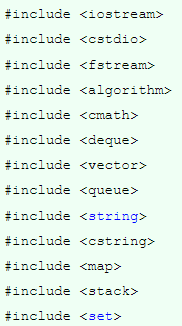
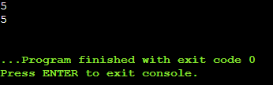
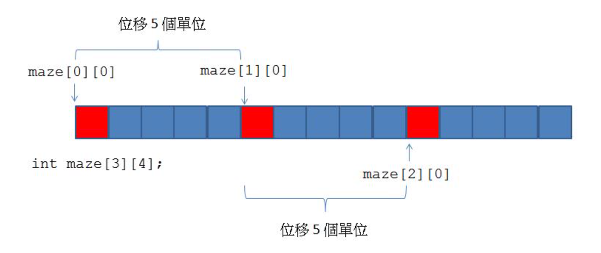
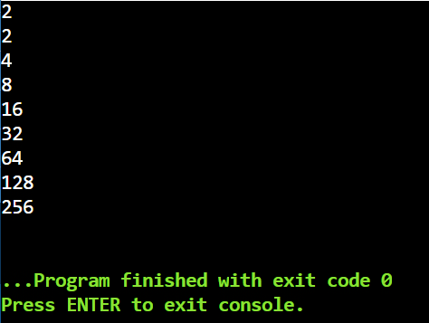
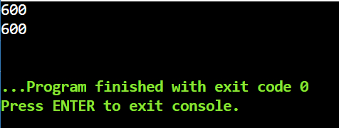
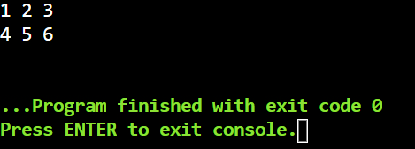
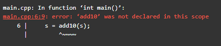

# c++ 基礎能力

### 編譯器
不是使用自己的電腦的話，推薦使用[線上c++](https://www.onlinegdb.com/online_c++_compiler) 隨時都可用。
推薦 vscode，環境變數要設定並且安裝 mingw

<!-- more -->

## 變數的宣告與指派

### 變數宣告：
```cpp
int a = 1;
long long b = 2;
char c = 'a';
double d = 2.564;
string e = "ABC";
bool ck = 0; //false
```
$常見資料型態：$
1. int：
    - 整數型態
    - 4Byte 可以存放 -2^31 ~ 2^31-1
    - 超過會出現無法預期的結果
2. long long：
    - 長整數型態
    - 8Byte 可以存放 -2^63 ~ 2^63-1
    - 運算速度小於int
    - 常常會因為忽略使用它而 WA !!! 
3. char：
    - 字元型態
    - 字元以兩個單冒號括住，像是'a'
    - 可以用int型態表示，為ASCII碼，例如'a' = 97 
4. double：
    - 雙倍精確度浮點數
    - double的精度為15~16位 
    - 會有誤差
5. long double：
    - 精度為18~19位
    - 同樣有誤差
6. string：
    - 字串型態
    - 很多個字元串在一起，以雙冒號括住，例如 "I am Hippo"
    - 和char[]語法不太一樣，不過string方便很多，競程不使用char[]。 
7. bool：
    - 布林型態
    - 僅表示 1(true) 和 0(false)
    - 常用來判斷某些情況是否用過了。
    
$不常用和注意事項：$
- float因為準確度太低，誤差太大，不適合在寫題目使用。
- 需要一開始就定義變數的型態，才能給值。
- 若宣告時未指派值，變數的值不一定是 0，可能是任何數。

### 指派 
在程式語言的世界中 = 這個符號有著不同的意思。
它代表著的，並非我們日常生活中的等於，而是指派。

所以，如果我們寫下列的程式碼，意思為 a定義為整數型態，並且給他一個值為3
```cpp
int a;
a = 3; // a你現在被我指派為3了!!
```
同時，以下的程式碼也是合法的，和我們理解的 = 不同，現實中的相等是用==表示(之後的章節會提到)
```cpp
int a = 7412;
a = 7413;
a = 7414;
```

### 型態互轉
某些型態是可以互相轉換的，例如
```cpp
int a = 3;
long long b = 5;
double c = 7.321;
a = c;
b = c;
c = a;
```
不過要注意的是，當浮點數轉為int時候，小數點會全部捨去。


## 基本輸入輸出及標頭檔

### 標頭檔
在程式設計中，特別是在C語言和C++中，標頭檔或包含檔案是一個檔案，通常是原始碼的形式，由編譯器在處理另一個原始檔的時候自動包含進來。一般來說，程式設計師通過編譯器指令將標頭檔包含進其他原始檔的開始（或頭部）。

一個標頭檔一般包含類、子程式、變數和其他識別碼的前置聲明。需要在一個以上原始檔中被聲明的識別碼可以被放在一個標頭檔中，並在需要的地方包含這個標頭檔。

簡單說，它可以提供工具來使用!! 

### 常用標頭檔


是不是很多呢，好像打完這些時間就不夠用了。
所以在競程常用一個標頭檔涵蓋了上面這些 <bits/stdc++.h> 請務必記起來!
我們只要打#include<bits/stdc++.h> 就可以了

```cpp
#include <bits/stdc++.h>
```

### standard

今天程式要寫出像是cout 或是cin等的程式碼時，如果沒有使用using namespace std; 就會讓程式無法成功運作。我們要寫 std::cout, std::cin 這樣很麻煩。

注意是因為寫題目比較方便，在外面還是盡量不要用。
```cpp
#include <bits/stdc++.h>
using namespace std;
```

### 輸入cin
運作
```cpp
int x;
cin >> x;
```
那如果我輸入123abc，x會存放什麼，答案是123
cin一個整數時，程式會一直讀取直到下一個位置的字元不是數字為止！

### 輸出cout

運作(輸出的東西，不一定要是變數！)
```cpp
int x;
cin >> x;
cout << " x值為 : " << x << '\n';
```
題目正常，行尾要輸出換行字元’\n’！
$務必注意cin，cout 的箭頭方向$

### main函式
當你要執行一個程式的時候，電腦需要知道你是從哪裡開始的所以我們需要寫一個main
完整程式:
```cpp
#include <bits/stdc++.h>
using namespace std;

int main(void){
    int a = 3 ;
    int b ;
    cin >> b;
    cout << a << " " << b << '\n';
    return 0;
}
```
這樣就完成了一個基本的程式了


## 進階輸入輸出

如果遇到字串 "Happy birthday"
cin >> a 的時候，遇到空白cin會當成你接收結束，所以此時的a值為"Happy"，那要怎麼去解決呢？

### getline
這邊介紹新的輸入字串方法，getline，運作原理是讀入直到遇到換行字元('\n')
```cpp
string a;
getline(cin,a);
```

但如果是用char[]存放字串，需使用下列方式
```cpp
char a[105];
cin.getline(a);
```
不過string方便許多，所以之後不會用char[]型式

### 若前面有輸入
假設題目先輸入一個整數，再輸入字串。
直覺上會這樣寫
```cpp
int n;
string a;
cin >> n;
getline(cin,a);
cout << n << a << '\n';
```
不過此時會發現才剛輸入完一個數字後，程式就輸出結束了


為什麼會這樣呢？因為cin是讀到不是整數的字元，而getline遇到換行字元就結束了。
所以輸入5的時候 n 讀到 5 ，不過當你按下enter時，換行字元並非整數字元，所以getline就接收到並且結束。

這樣要怎麼解決呢？ 簡單的方法就是我們直接讀取兩次，這樣雖然第一次結束了，但是第二次還是會讀進去。
```cpp
int n;
string a;
cin >> n;
getline(cin,a);
getline(cin,a);
cout << n << a << '\n';
```

但是這樣會影響程式碼的可讀性，這邊提供兩種方法，使用getchar()，或者使用cin.ignore()。
前者是讀入一個字元，所以我們的換行字元就會被getchar()讀取，後者是忽略一個字元。

第一種方法：
```cpp
int n;
string a;
cin >> n;
getchar();
getline(cin,a);
cout << n << a << '\n';
```
或者
```cpp
int n;
string a;
cin >> n;
cin.ignore();
getline(cin,a);
cout << n << a << '\n';
```
### cin/cout 加速
速度在程式解題是相當重要的一部分。
常常會遇到雖然有些時候，演算法寫的沒什麼問題卻依然TLE(超時)。
而加速的方法有常見的兩種
1. 使用輸入優化 ios::sync_with_stdio(false), cin.tie(0);
    看起來會像這樣
    ```cpp
    #include <bits/stdc++.h>
    using namespace std;
    int main(void){
        ios::sync_with_stdio(false),cin.tie(0);
        int a;
        cin >> a;
        cout << a << '\n';
    }
    ```

2. 避免使用endl來換行，取而代之我們使用'\n'，因為endl是由'\n'和flush組成，flush會使目前輸出的結果立即顯示，所以速度不高，並且細心的人可以注意到，這篇講義並不會使用endl;

若只使用第一點，不使用第二點，則在輸出時仍然會因為flush過慢拖累整體執行效率。
若只使用第二點，雖然輸出時不會 flush，但 cin 時預設也會 flush，因此依然很慢。

請注意，如果要debug，可以把優化那行先註掉，因為優化完輸出會在程式結束的時候才輸出，有些情況下不會立即顯示，很難debug。

## 四則運算

### 常用
1. $+$  加法
2. $-$  減法
3. $*$  乘法
4. $/$  除法
5. %  取餘數

注意：在進行很大的數字相加/相乘時務必注意，若於運算中之任何時刻超過int可表示的範圍，即使最終答案在int範圍，也會導致overflow而使答案錯誤

例子 輸入兩整數，輸出+ - * / % 的結果
```cpp
#include <bits/stdc++.h>
using namespace std;

int main(void){
    int a ,b;
    cin >> a >> b;
    cout << "加法:" << a + b << '\n';
    cout << "減法:" << a - b << '\n';
    cout << "乘法:" << a * b << '\n';
    cout << "除法:" << a / b << '\n';
    cout << "取餘:" << a % b << '\n';
}
```
### 運算後指派

在運算後指派如果只有一個的話，有方便的寫法
```cpp
a += 5; // a = a + 5
b -= 2; // b = b - 2
c *= 3; // c = c * 3
d /= 4; // d = d / 4

a += b; // a = a + b
```
有些情況不適用如
```cpp
a = (a + 3) * 8 + b; 
```

針對 a = a + 1 , a = a - 1 ，有下列寫法

```cpp
a++; // a = a + 1
a--; // a = a - 1
```

## 條件判斷與基礎邏輯

### 條件判斷

格式： 
```cpp
if (條件) {
    做事情;
}else if(條件){
    做事情;
}else if(條件){//可以做很多次else if
    做事情;
}else{
    做事情;
}
```
沒有很難，直接上程式碼比較好理解
```cpp
#include <bits/stdc++.h>
using namespace std ;
int main(void){
    int a, b;
    cin >> a >> b;
    if(a > b){
        cout << "a比較大" << '\n';   
    }else if(a < b){
        cout << "b比較大" << '\n';
    }else{
        cout << "ab一樣大" << '\n';
    }
}
```

### 注意事項
特別需要注意的有以下幾點：
1. 條件由小括弧包含住
2. 滿足條件後要做的事情由大括號包含住
3. 若滿足條件後要做的事情只有一句(以分號為界)，可不包大括弧
4. if 可單獨存在，也就是說，就算沒有後面的 else if 跟 else ，也是合語法的
5. if 可多層套疊


### 基礎邏輯
| 基礎邏輯 | 意思 | 例子 |
| -------- | -------- | -------- |
| >     | 大於     |  a > 3    |
| <     | 小於     |  a < 3    |
| ==     | 等於     |  a == 3    |
| !=     | 不大於     |  a != 3    |
| >=     | 大於等於     |  a >= 3    |
| <=     | 小於等於     |  a <= 3    |
| &&     | 且    |  a > 3 && a != 5   |
| \|\|      | 或     |  a > 3 \|\| a == 0    |
| !     | 否     |  !(a>3)   |

### 注意事項
1. 特別注意 並沒有 3 < a < 5 這種寫法，需要用 3 < a && a < 5 才行，危險的地方是，這個程式碼並不會導致編譯錯誤
2. 多個判斷有前後順序，由前往後，在陣列中很常用來判斷邊界問題。
3. 記住!! 等於是 == 而且寫成a=3編譯也不會出錯，然後debug半天才看到，會很想罵髒話! 

### 三元運算子
什麼是三元運算子(ternary operator)，簡單說它是 if … else … 的精簡版，
語法如下：
```cpp
條件式 ? 條件式為true時執行的陳述句 : 條件式為false時執行的陳述句
```
上面語法看不懂也沒關係，馬上直接看例子吧！
一般寫 if … else … 的例子如下：

```cpp
int ret, a = 10, b = 11;
bool flag = true;
if (flag)
    ret = a;
else
    ret = b;
```
等價於
```cpp
int ret, a = 10, b = 11;
bool flag = true;
ret = flag ? a : b; //這裡的flag就是判斷式，例如 ret = 7 == 10 ? a : b 
```

## 進階運算
### 浮點數誤差
因為電腦是離散的結構，所以在使用double進行加加減減多少會產生一些誤差。
此時我們就不以==來判斷是否相等，取而代之的是，我們只需判斷他們之間差的絕對值是否小於特定值，我們稱這個值為epsilon，是不是很像極限的概念!!

另外，在程式中可以使用1e5,1e6...這種用法，簡單說就是10的X次方，所以我們在定義epsilon可以不用定義的那麼長，例如double eps = 0.0000001;
```cpp
double a, b;
double eps = 1e-9;
cin >> a >> b >> c;
if(a > b && a-b < eps) cout << "Equal" << '\n';
else if(a < b && b-a < eps) cout << "Equal" << '\n';
else cout << "not Equal" << '\n';
```

### 字元運算
在提到char字元的時候，有說到每個字元會對應到一個[ASCII碼 - 詳情點進去看](http://kevin.hwai.edu.tw/~kevin/material/JAVA/Sample2016/ASCII.htm)
所以字元在進行運算的時候，會將其視為ASCII碼! 例如 'a'+10 其實就是 97+10 對應過去的字元也就是'k';
請注意 A’～’Z’以及’a’～’z’以及’0’～’9’，在ASCII table的位置是連續的，但這三者之間並非連續的，'A' 是 65 , 'a' 是 97 , '0' 是48

知道這個之後可以做什麼呢？ 舉個簡單例子

### <大寫轉小寫>
```cpp
char c;
cin >> c;
c += 'a' - 'A'; // c = c + ('a' - 'A');
cout << c;
```
因為'a' 和 'A' 差距是 97-65 = 32 ;
我們只要大寫字母 + 差距 就會是小寫， 反之就減回去。


### 字元比較
字元的比較以ASCII碼來比。 例如 'a' > 'A' , 'A' > '0' 
也可以拿來判斷位元是否在裡面，像是判斷字元是不是小寫
```cpp
char c;
cin >> c;
if(c >= 'a' && c <= 'z') cout << "c是小寫" << '\n';
else cout << "C不是小寫" << '\n';
```

### 位元運算 (較難，比較特殊情況才會用到)

在電腦中，數值以二進位 0 和 1 儲存，並且有以下幾種位元運算

| 位元符號 | 意思                              | 例如(下列以二進位表示) |
|:--------:|:--------------------------------- |:----------------------:|
|    &     | 且(and)，同1為1，其餘為0          |    100 & 101 = 100     |
|    \|    | 或(or)，其1為1，其餘為0           |    100 \| 101 = 101    |
|    ^     | 互斥(xor)，其1為1，同1為0，同0為0 |    100 ^ 101 = 001     |
|    ~     | 非(not)，把1換0，把0換1           |      ~ 100  = 011      |
|    <<    | 左移(將一個變數向左移動並且補0)                             |    101 << 1 = 1010     |
|    >>    | 右移(將一個變數向右移動並且捨去)                              |     101  >> 1 = 10     |

注意 互斥^ 不要把它當作次方！C++並沒有次方的運算子！ 而<< >> 和cin cout那個沒有關係

有趣的是，大寫和小寫只差32，剛好是$2^5$，所以上述的大寫轉小寫可以這樣寫

### <大小轉小寫>
```cpp
char c;
cin >> c;
c = c | 32;
cout << c << '\n';
```

可以發現使用or，可以直接讓大寫+32，那如果利用xor的性質，是不是就剛好可以讓大小轉小寫，小寫轉大寫了呢！
```cpp
char c;
cin >> c;
c = c ^ 32;
cout << c << '\n';
```

### 乘$2^n$ 除$2^n$
利用二進位的特性，假設二進位數字1010 乘2的時候，會變成10100，是不是就剛好向左移動了一位。
反之就是除法，所以我們可以這樣寫
```cpp
int a;
cin >> a;
cout << "a * 2 = " << (a << 1) << '\n';
cout << "a / 2 = " << (a >> 1) << '\n';
```
請注意，因為cout cin的箭頭和左移右移一樣，所以需要括起來，以免出錯。

### 是否為奇數
我們在判斷一個數字是否為奇數很顯然會這樣寫

```cpp
int a = 5;
if (a % 2 == 1) cout << "是奇數" << '\n';
else cout << "不是奇數" << '\n';
```

我們可以利用 true 為 1, false 為 0 的特性，搭配&且(and)。如果是奇數的話2進位的最右端一定是1，所以&1的結果就會是 1 (true)

```cpp
int a = 5;
if (a&1) cout << "是奇數" << '\n';
else cout << "不是奇數" << '\n';
```

這樣有什麼好處？ 感覺變得好難理解 ？ 理由是使用後者的話可以加速約600%的效率 有興趣可以看這篇[利用位元運算加速運算效率](http://chuiwenchiu.wordpress.com/2007/05/11/as3)


## 陣列
如果要儲存5個變數，我們可能會這樣做
```cpp
int a, b, c, d, e;
```
但如果100、1000個變數那怎麼辦呢？

### 宣告
使用陣列，可以使用儲存大量資料，語法如下。 注意，程式是從0開始，0~初始大小-1。
```cpp
int a[15]; //a[0]~a[14] 共15個
char b[150]; //b[0]~b[149] 共150個
double c[200]; //c[0]~c[199] 共200個
string str[1500]; //str[0]~str[1499] 共1500個
```
也可以在宣告時候給值
```cpp
int arr[4] = {1,5,3,4};
```

另外，可以不用指派每一個元素的值，只指派前幾個，不足者會自動補 0
常常用來全部初始為 0 。

注意:
- 若全部未指定值，則陣列中每個元素的值可能是任何值！
- 陣列宣告過後，不可改變大小或重新宣告。
- 程式語言的世界編號由0開始，所以設定大小為n，可用空間為0~n-1

### 取值和修改
如果我們想輸出陣列中位於 3 號的元素的值，這樣寫：

```cpp
cout << arr[3] << '\n';
```

陣列中的元素就像一般元素一樣，可以加減乘除，可以任意指派值，直接把它當成平常的變數就好：
```cpp
arr[1] += 15;
arr[2] = 5;
arr[3] = arr[1] + arr[2];
cout << arr[0] << arr[1] << arr[2] << '\n';
```

### RE錯誤 (記憶體區段錯誤)
當陣列取值超過範圍大小，就會跑出RE錯誤，像是剛剛提到
```cpp
int a[5] = {1,2,3,4,5};
cout << a[5] << '\n';  // Wrong!!!
```
這樣就會跑出RE錯誤，因為大小是5，但是是從0~4，所以arr[5]並沒有定義。
或者arr[-1]也是錯的，從零開始並沒有-1往下。

注意: 很常會因為邊際而導致RE錯誤，像是剛剛提到的arr[5]，也很常遇到沒看好題目給定的範圍，所以錯誤。

### 多維陣列
陣列是可以有多個維度的，例如：
```cpp
int arr[13][14][15] = {0}; // 設0，
cin >> arr[2][5][6];
cout << arr[2][5][6] << '\n';
```

用一張圖來看，假設我們 int maze[3][4]，存放的記憶體會長這樣;


同時也可以這樣定義
```cpp
int arr[2][3] ={{1,2,3},{4,5,6}}; 
```
當然我們也不是可以存放無限多的陣列，要注意，在區域變數中乘起來最大約$10^5$~$10^6$，在全域變數中乘起來不可以超過大小限制約$10^8$。
本篇最後會介紹區域變數和全域變數。


## 迴圈

當我們需要重複做同一件事很多次，總不能一個一個全部寫出來，如果要重複1000千次，那是不是程式碼就要幾千行，影響了可讀性，所以便會使用迴圈，而迴圈有下列的用法。

### for
最常用的迴圈，語法如下：
```cpp
for (int i = 0 ; i < 100 ; i++){
    cout << i << '\n' ; // do things 
}
```

for迴圈有四件事要做
1. 在第一個在分號前，代表程式執行到迴圈時，第一件會做的事情，像是我宣告了一個 i = 0
2. 在第二個分號前，代表程式進行的條件，如果不滿足，便會離開這個迴圈，像是範例中，只要 i < 100 就會繼續。
3. 執行for迴圈內文，像是我輸出 i 的值
4. 在第二個分號後，代表每次執行迴圈一次後，程式會做的事，像是我讓i的值+1

### <補充> string 基本操作(講STL會詳細一點)

和其他一樣基本輸入輸出
```cpp
string a, b = "I am Hippo";
cin >> a;
cout << a << b << '\n';
```

字串長度判斷 : 變數名稱.length()

```cpp
string a;
cin >> a;
cout << a << "長度=" << a.length() << '\n';
```

### string 使用 for迴圈遍歷
在處理字串的時候很長需要一個一個字元來判斷，此時就會用到 length()，舉個簡單例子。

```cpp
string a;
cin >> a;
for (int i = 0 ; i < a.length() ; i++) {
    if (a[i] >= '0' && a[i] <= '9') cout << "number" << '\n';
    else if (a[i] >= 'a' && a[i] <= 'z') cout << "小寫" << '\n';
    else if (a[i] >= 'A' && a[i] <= 'Z') cout << "大寫" << '\n';
    else cout << "其他" << '\n';
}
```
需要特別注意的是，string在陣列上也是從0開始到length()-1，所以for迴圈那邊不能寫<=，會出錯

### while

有時候我們的迴圈不需要用到變數，像是

```cpp
int n = 0;
for( ; n < 10 ; ){
    int x;
    cin >> x;
    n += x;
}
```
我們只需要在意n是否小於10這樣寫for迴圈就不好看，所以while就出現了!。
用法如下：
```cpp
while(n < 10){
    int x;
    cin >> x;
    n += x;
}
```
只保留了for迴圈中，是否判斷的部分，這就是while

### break

break就是字面上的意思，可以用來跳出迴圈。
直接用例子來看。假設我們要找出哪個數字的三次方為438976
此時我們不知道哪個數字，所以我們可以慢慢加上去，一一判斷是不是答案

```cpp
int x = 1;
while(true){
    if (x*x*x == 438976) break;
    x+=1;
}
cout << x << '\n';
```
當然這只是個簡單例子，也可以直接在while()判斷式寫x*x*x!=438976就好了。

### continue
continue用於跳過某種情況，但是迴圈會繼續執行。
假設今天題目要求輸出1~1000之中，不是偶數的數字，那我們可以這樣寫
```cpp
for (int i = 1 ; i < 1000 ; i++){
    if (i % 2 == 0) continue;
    else cout << i << '\n';
}
```
當然我們也可以這樣寫
```cpp
for (int i = 1 ; i < 1000 ; i+=2){
    cout << i << '\n';
}
```

## 迴圈特殊應用

### while ( cin >> n )
有些題目會要求多筆測資的輸入，有些題目會先輸入一個整數代表幾筆，但有些卻不告知，這時候怎麼辦呢？ 我們可以利用 cin 函數會回傳true false的特性。
```cpp
int n;
while(cin >> n){
    cout << n << '\n';
}
```

cin 回傳true false的條件為，不符合 n 的值。像是整數卻輸入字元就會回傳false.

### do while
有些情況下，我們無論如何要先做一次再來判斷，這時候就可以用do while來寫，像是
```cpp
int k;
cin >> k;
do{
    cout << k << '\n';
    k *= 2;
}while(k < 500);
```
如果輸入2 輸出：


如果輸出600 輸出：


也就是說，不論第一個數字是什麼，都會先輸出。

### while(t\-\-)
剛提到，有些多筆測資的題目會先輸入一個整數，代表幾筆測資，所以我們可能會這樣寫
```cpp
int n;
cin >> n;
for (int i = 0 ; i < n ; i++) {
    // do things 
}
```

但我們也可以利用 true的值是1，false的值是0來寫，所以可以寫成
```cpp
int n;
cin >> n;
while(n--){
    //dothing
}
```
每做一次n就會減1，直到為0就會跳出迴圈

### 多層迴圈
簡單明瞭，所以直接舉個例子，假設我們要輸出box裡面全部的東西，我們就可以這樣寫
```cpp
int box[2][3] = {{1,2,3},{4,5,6}};
for (int i = 0 ; i < 2 ; i++){
    for (int j = 0 ; j < 3 ; j++){
        cout << box[i][j] << " ";
    }
    cout << '\n';
}
```
輸出


### 注意事項(重要)
停不下來 ： 執行時候，發現怎麼停不下來。一定是有地方寫錯了，且高機率是判斷式子

例如 
```cpp
    for(int i = 0 ; i < 5 ; i--)
```
因為i只會變小，所以就會一直執行下去。
☆ 或者前面提到的，把 == 寫成 = ，這樣程式也不會結束。

## 函式
### 函式是什麼
什麼是函式，函式的英文是function，你可以把它想像成一塊有特定功能的程式，它不會被寫在main裡面，因為main本身也是個函式。

我們直接來看個例子

```cpp
void say_hello(){
    cout << "Hello~" << '\n';
}
```

在上面的程式中，我們宣告了一個名為say_hello 的函式。
前面的void代表並沒有要回傳什麼東西(後續會提到)。
後面的括號內是來裝參數的，不過這個例子沒有參數。 大括號底下的內容，就是要做的事情。
簡單來說，這個函式就只印 Hello~ 的功能

所以我們可以main()呼叫這個函式

```cpp
void say_hello(){
    cout << "Hello~" << '\n';
}

int main(void){
    say_hello();
    say_hello();
}
```

此時我們會稱main是"主函式" ， say_hello為"副函式"。

### 函式的小誇號
上面提到，函式的小誇號是用來裝參數的，可以看下列例子(可以好幾個參數，也可以不要就像上面一樣只有誇號)
```cpp
void sum(int x ,int y){
    cout << x + y << '\n';
}

int main(void){
    int a , b;
    cin >> a >> b;
    sum(a,b);
}
```
在定義sum的時候，用了兩個int參數x,y，代表這個函數宣告時，需放進兩個int值。
所以主函式要呼叫sum的時候，放進了ab，此時sum的xy就接收到了ab的值，並做下列的運算印出。
注意：更改xy的值並不會改動ab的值，這在後面講全域變數的時候會提到。

### 函式的型態與回傳值

在上述例子中，我們最前面寫的都是void
他的意思為並不需要回傳什麼。我們也可以透過上述例子知道他就只是單純印出一些東西而已。

接下來若我們要讓函式回傳一個值，我們就要依照回傳答案的型態定義。
舉個例子，寫個函式讓傳入的值+10後傳回。 此時知道要回傳值為整數，所以用int命名

```cpp
int add10(int x){
    return x+10;
}

int main(void){
    int s;
    cin >> s;
    s = add10(s);
    cout << s << '\n'; 
}
```
傳入一個值後，我們定義int的function，所以需要用return一個同樣為int的值。
所以回傳的是x+10。

注意： 定義什麼樣形態的函式，只能回傳同樣型態的值才行!!

### 函式的定義問題
我們把上面的例子程式碼順序改一下
```cpp
int main(void){
    int s;
    cin >> s;
    s = add10(s);
    cout << s << '\n'; 
}

int add10(int x){
    return x+10;
}
```
此時會發生以下問題


這是怎麼了？ 理由是main函式執行的時候，抓不到add10，就像我們在定義變數一樣，必須要先定義才能使用，那又為什麼上上面的例子卻可以用呢？
理由是，add10宣告在main之前，所以main抓的到函式。 那要怎麼解決呢？ 一是宣告在前面，第二是在一開始的時候宣告函式。
```cpp
#include <bits/stdc++.h>
using namespace std;
int add10(int x);

int main(void){
    int s;
    cin >> s;
    s = add10(s);
    cout << s << '\n'; 
}

int add10(int x){
    return x+10;
}
```

注意：宣告函式的時候，內容不需要寫，只需要定義名稱跟變數。

### 函式的呼叫
前面的範例都是在main主函式裡面呼叫函式，其實函式也可以呼叫函式哦
舉個例子，想要判斷是否會被當。
```cpp
void IPass(){
    cout<<"PASS";
}

void IFail(){
    cout<<"FAIL";
}

void sayResult(int score){
    if(score>=60){
        IPass();
    }
    else{
        IFail();
    }
}

int main(){
    int score;
    cin >> score;
    sayResult(score);
}
```
可以看到我們在sayResult函式裡面呼叫了IPass()跟IFail()

當然了，自己也可以呼叫自己，像是
```cpp
void say_hello()
{
    cout<<"Hello~"<<'\n';
    say_hello();
}
```
雖然有點不直覺，不過這可以做到很多神奇的事情，就是我們接下來要介紹的"遞迴"

## 遞迴

以剛剛的例子來看
```cpp
void say_hello(){
    cout << "Hello~" << '\n';
    say_hello();
}
```
這個函式在印出Hello~ 之後，會在呼叫自己，自己又會印出Hello~在呼叫自己。
就很像一個說哈囉的夢，在夢中說完哈囉會躺在床上在做一個一模一樣的夢，在夢中夢說哈囉，然後在夢中夢躺床坐夢中夢中夢.....

這樣不就不會醒來了嗎？ 對 ， 如果執行的話會變成永遠的循環，直到當掉為止。

### 注意

- 所以在使用遞迴函式的時候，需要注意：
- 必須有結束條件，或是在某些條件下才呼叫自己，這樣才有醒來的機會。

### 經典問題：費波那契數列

費波那契定義如下
1. 第0項 = 0
2. 第1項 = 1
3. 其他項 = 前兩項相加

所以我們可以照定義寫出
```cpp
int f(int n){
    if (n == 0) return 0;
    else if (n == 1) return 1;
    else return f(n-1) + f(n-2);
}
```

在主函式就可以呼叫了
```cpp
#include <bits/stdc++.h>
using namespace std;

int f(int n){
    if (n == 0) return 0;
    else if (n == 1) return 1;
    else return f(n-1) + f(n-2);
}

int main(void) {
    int n;
    cin >> n;
    cout << f(n) << '\n';
}

```
遞迴是個很神奇的東西，不知道要怎麼知道f(5)，但只需要知道f(4) f(3)的值，而這兩個也無法憑空生出來，所以在繼續呼叫下去值到條件到達，很多時候寫出來自己很難想像是怎麼寫出來的。
像是練習題的河內塔，用遞迴寫只需要短短幾行，超級神奇的。


### 因此遞迴有個名言 "遞迴只應天上有，凡人應當用迴圈"

## 區域、全域變數、靜態變數

### 區域變數
  
區域變數：又叫自動變數(Automatic Variable)
生命週期與生存空間：起始於變數宣告，結束於宣告敘述所在的區塊的大右括號。
同一區塊內不可宣告同名的區域變數
在生命週期內會佔用記憶體

缺點：記憶體會被分配在 stack 區段，而這塊區域一般來說並不夠大，因此只要陣列太大，就會立刻 stack overflow。

舉一些例子，
在 func 裡面的 abc 是屬於 func 裡的區域變數，只要出去這個 func 就結束了生命週期
在 main 裡面的 ab 是屬於 main 的區域變數，而 for 迴圈裡面的 i  x ，是屬於那個迴圈的區域變數，同樣出去之後就結束了生命週期。
(不能去抓其他地方的區域變數)
                                             
```cpp
#include <bits/stdc++.h>
using namespace std;

int func(int a, int b) {
	int c = 5;
	return c*(a+b); // abc都屬於func的區域變數 (和main的abc不衝突)
};
                                           
int main(void){
	int a, b; //屬於main函式的區域變數
	cin >> a >> b;
	cout << func(a,b) << '\n'; 
	for (int i = 0 ; i < 3 ; i++) {
		int x; //出了for迴圈之後，x就結束了
		cin >> x;
		cout << x << '\n';
	}
}
```

### 全域變數

宣告在所有區塊和類別之外的變數
不可宣告同名的全域變數
若沒有給定初始值，會自動給0
生命週期：在程式執行到程式結束期間都會暫用記憶體
生存空間：從宣告後的任意程式碼區塊都可存取

好處是，相較於區域變數不會被配置到 stack 區，他陣列大小可以取比較大，對於競程來說常常會需要大陣列。

舉個簡單例子
```cpp
#include <bits/stdc++.h>
using namespace std;
int arr[10000000]; //全域變數，所以沒有給定初始值會自動給0

int main(void){
	int str[100000]; //這邊是區域變數，沒有給定初始值就不會有
}
```

題外話：雖然在競賽中會因為需要大陣列而用到全域，不過不加上const的全域變數是不好的，會使得程式的維護性降低。

### 靜態變數(競程幾乎不會用到)
以關鍵字static修飾的變數
```cpp
static int num = 0;
```
不可宣告同名的靜態變數
若沒有給定初始值，會自動給0
生命週期：在程式執行到程式結束期間都會暫用記憶體
生存空間：任意程式碼區塊皆可存取

詳細用法可以參考[static的5種用法](https://shengyu7697.github.io/cpp-static/)
