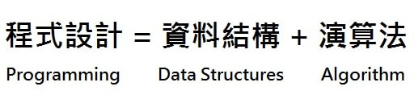
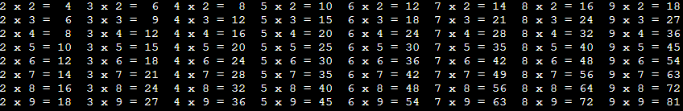
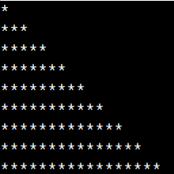
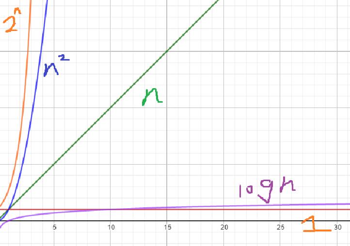

## 介紹

演算法不是程式語言。演算法是用來解決特定問題的方法與過程。

一個定義良好的計算方式，會包含單一，或一組完整的輸入，並且產生出一個值，或一組值作為輸出，如果所有輸出的值都是正確答案，則說明解決了問題。

### 例子
假設今天要解決一個問題是：「如何把芋頭和牛奶，做成芋頭牛奶」

<!-- more -->

1. 將芋頭切塊蒸至熟透。
2. 將芋泥蒸熟後先放入白糖攪拌均勻。
3. 再放入奶油攪拌均勻，最後加入牛奶時再將芋頭壓成泥狀即完成。

可以說這3個步驟就是把芋頭和牛奶做成芋頭牛奶的一種演算法

### 為什麼要學？

- 學習演算法可以讓我們了解在不同規模下的表現和效率，從而更好地理解系統的可擴展性，即系統在處理大規模數據時的能力，然而在計算領域，性能通常決定了什麼是可行的，什麼是不可能的。優化性能可以讓原本不可行的任務成為可能，或者讓原本可行但低效的任務變得更加有效。
- 可以透過學習算法，了解不同的思維，由其在離散的框架上，很多時候和一般思維下會有一些不同的看法，以及觀點。
- 然而實作是加強理論的實現，如果一個人只懂理論，從來沒動手過，很容易會導致遇到問題的時候，根本不知道怎麼下手，或者使用了所謂的 "笨" 方法。


### 特性
在電腦科學中有一條公式：



我們透過設計一連串的指令、動作，讓電腦去執行，以便協助我們解決一些特定問題
今天說穿了，其實演算法就是一種解決問題的邏輯思維！

而在TAOCP整理了一個演算法需要具備五個特性:
1. 輸入 : 一個演算法必須有一個或多個輸入。
2. 輸出 : 一個演算法必須有一個或多個輸出(結果)。
3. 明確性 : 演算法描述明確定義清楚，保證實際執行結果符合期望，通常要求結果正確。
4. 有限性 : 演算法須在有限的次數內解決問題。
5. 有效性 : 演算法的每個步驟需可行，也須在有限時間內完成

### 電腦 + 程式設計 ( 資料結構 + 演算法 ) = 無所不能 ？

所謂的電腦，可不只單純是主機、筆電，具上述計算能力的最小單位就是一個晶片，而晶片早就被廣泛應用在我們生活之中，像是遙控器，手機，電視，火警，保全。
所以只要具備計算能力硬體在的地方我們就需要演算法，也因此有演算法可以改變世界之說。

### 迷思

$$ 電腦並不聰明，反而很笨，對，電腦超級笨，超級無敵笨!!! $$

你可能不這麼認為，電腦不是很聰明嗎？ 你看現在有自動駕駛，AI繪圖，聊天室AI... 
但是沒騙你，電腦真的超級笨，電腦就像超級魁儡一樣，超級聽話，而且幾乎不出錯，更重要的是，運算速度超級快。

根據這三個特性，發明了一種方式叫做"Programming" 把現實世界要解決的問題變成數學，丟給電腦來幫我們做運算，所以聰明的並不是電腦，而是背後的人用聰明的方式，讓其他人誤以為電腦很強大，很聰明。

<!--  
	其實我小時候也是認為電腦甚麼都做得到@@
-->

## 寫演算法的好習慣及小技巧

無論如何，我認為你都應該把自己的想法寫下來，一是如果題目複雜，你可能會想很多種想法，但如果都沒寫下來，會很難判斷可行性。

再者當你詢問其他人的時候，別人不知道你的程式碼的變數意義，也不知道你寫的邏輯，當你一一介紹你的變數意涵時，別人很有可能還是看不懂QQ，所以如果你直接拿出你的想法紙，根據題目意義來敘述，會簡單明瞭許多，這也就是你為什麼要把自己的想法寫下來。

那要如何寫下自己的想法呢？ 


### 從下而上（Bottom - UP）設計策略
嘗試把人腦變的單純，不要用人腦習以為常的觀點來思考事情，而是要模擬計算機（computer）處理事情的方法。依據這種思維模式，很自然的會這樣想：「不要一次看到事情的全貌，要把問題切割成一個一個具體的數理步驟，將解決步驟條列式的以數學和邏輯的語言寫出來」。

Bottom – UP程式設計策略的精隨就是：遇到不會解的問題時，就不要嘗試一次全部解決，先找出「解決部分問題」的方法，先做會做的部分，接著再用「相同的方法、相似的程式片段」，依序把剩下的問題用暴力式的方式寫出來。這時候的暴力程式雖然不夠優雅，但確實可以正確的解決問題。

之後，我們就可以引入變數和迴圈…等觀念，用變數取代重複的敘述中「不同的部分」，然後再用迴圈取代重複的敘述中「相同的部分」，來優化暴力程式。

### 例子
來看一個經典的範例：在螢幕上顯示（印出）九九乘法表。假設我們現在根本不知從哪裡開始著手，沒關係，依照Bottom – UP程式策略的精神，我們先做會做的部分就好，例如寫2 * 2 = 4 ~ 2 * 9 = 18 …，這個總沒有問題吧。所以我們就先寫出：

2 * 2 = 4
2 * 3 = 6
2 * 4 = 8
… … …
2 * 9 = 18

3 * 2 = 6
3 * 3 = 9
3 * 4 = 12
… … …
3 * 9 = 27

注意到了嗎，我們可以把前面的乘數以一個變數取代（例如i），後面的乘數以另一個變數取代（例如 j），所以其實我們的演算法就是計算「i * j」，並讓 i 的值從2 ~ 9做變化，j 的值也是從2 ~ 9做變化。

我們以變數取代「不同的部分」，並且用迴圈取代「相同的部分」，將暴力程式做優化，結果如下：
```cpp
for (int i = 2; i <= 9 ; i++) {  
    for (int j = 2; j <= 9 ; j++) {
        // 因為要美化，所以用printf()，用法跟python差不多
        printf("%1d x %1d = %2d  ",j,i,i*j); 
    }  
    cout << '\n';   // 印完一整列之後要換列 
} 
```



### 由上而下（UP - Bottom）設計策略
UP – Bottom程式設計策略有兩個步驟：

- 寫出解決問題的「最外層迴圈」敘述，再依序向內逐步寫出迴圈，必要時可以先用中文作為虛擬碼，並以工作變數描述需要被重複執行的工作。
- 逐步將迴圈內的虛擬碼轉換成實際的C語言程式碼，必要時使用「方程式」描述工作變數與迴圈變數之間的關係。

工作變數、迴圈變數（計數器）、或者另一個常聽到的旗標變數（flag），其實也都是一般的變數而已，只是方便做出變數應用情境上的區別，便於我們理解與使用。

這裡我們舉一個「印出圖形」的例子，應用UP – Bottom程式設計策略的精隨。例如要在螢幕上顯示（印出）以下的圖形：

```
*
***
*****
*******
*********
```

一開始我們不知道如何著手，於是依照UP – Bottom程式設計策略的精神，先想想看如何寫出解決問題的「最外層迴圈」敘述，也就是「印出一列訊息後換列，共印出五列」。這樣的迴圈蠻簡單的，如下：
```cpp
for (int i = 1 ; i <= 5 ; i++) {
    第一列印出1個 * 符號;        
    換列;
    第二列印出3個 * 符號; 
    換列;
    … … … 
    第五列印出9個 * 符號; 
    換列;
}
```
外迴圈和虛擬碼都寫出來了，我們再來想想如何把中文的虛擬碼轉換成C語言。由於每一列印出的 * 號不固定，因此我們以一個整數變數x來代表每列 * 符號的個數，為了便於理解與使用，我們把x特稱為工作變數。
我們把最外層的迴圈變數i，和工作變數x的關係寫出來：
```
i = 1x = 1 *
i = 2x = 3 ***
i = 3x = 5 *****
i = 4x = 7 *******
i = 5x = 9 *********

得出x = 2*i–1
```

所以我們就可以把剛剛的程式碼寫的更清楚了

```cpp
for (int i = 1 ; i <= 5 ; i++) {
    每一列印出x個（即2*i-1個）星號
    （印出後）換行;
}
```

中間的部分很明顯就是用for迴圈來完成，所以程式碼結果為：
```cpp
for (int i = 1; i <= n ; i++) {  
    for (int j = 1 ; j <= 2*i-1 ; j++) {
        cout << "*";
    }
    cout << '\n';
} 
```




### 結合
第三個訣竅就是，整合了前兩種，無論是Bottom – UP或是UP – Bottom兩種方法，只是思維方式的不同，最後還是可以得到一樣的答案，就算程式碼略有不同也無所謂。所以綜合起來應用，成為第三種訣竅，其步驟是：

- 分析問題，會寫多少就先寫多少敘述，不會寫的部分就先用中文虛擬碼表示。
- 用Bottom – UP策略把中文虛擬碼翻譯成C語言，如果程式碼足夠多，或有這個價值，就把它寫成函數的型式。
- 如果仍然有無法一次解決的問題（或子問題），就先「簡化問題」，先從最簡單的狀況開始著手，再修改簡化問題的程式碼，或加以擴充，來解決原始問題。

不過訣竅終究只是訣竅，只是輔助的技巧而已，還是要搭配許多練習和實戰經驗，下苦功去實作過，還要不停吸收新知，不停的精進自己的技巧，才能真正學好演算法。

## 演算法優劣

常常聽到有人說，這個效率不好! 另外一個效率比較好，那到底怎麼來比較一個演算法的效率呢？

### 目標

- 描述函數在極限中的行為方式。
- 如何表示算法的運行時間。
- 比較函數的“大小”的方法。
- 判斷一個程式(做法)會不會TLE
- 透過測資反推所需的演算法效能可以到多少

### 簡單方程比較

這邊簡單說一些常見的方程，在極限中的行為

非常重要的函數關係！！！！
- 指數函數 > 多項式函數 > 對數函數 > 常數函數




而當出現多個函數，如果是加法，可以直接取最大的，乘法則不行

例如 
$n^2 + 3n + 5$ ~ $n^2$
$2^n + n^2logn$ ~ $2^n$

有這些估計，就可以帶入題目，或者現實上的 size 進行估計。

如果一個題目的 n 值為 $10^6$，根據OJ上一秒大概跑 $10^8$
可以推論 $n^2$ 的算法是不行的，而 $nlgn 的算法是可以的$


### 符號

然而描述一個函數有以下幾種方式 (但通常會直接用 big O 居多)

- O-notation (big-o or o)
- Ω-notation (big-omega)
- Θ-notation
- o-notation (little-o)
- ω-notation (little-omega)


簡單一點的描述你可以看成
- O ~ <= 
- Ω ~ >=
- Θ ~ =
- o ~ <
- ω ~ >

所以當我們描述兩個方程 f, g 在趨近極限的狀況
f = O(g) 你就可以大致看成成 f <= g ，以此類推
接下來來進行比較嚴謹的定義

### O-notation (big-o or o) ☆☆☆☆☆

O-notation（大O符號）描述了函數漸近行為的上限 (upper bound)：它表示一個函數的增長速度不會超過某個特定的速率。這個速率是基於最高次項的。

數學上的定義，若 f = O(g)，則存在一個常數 c > 0 使得當 N 夠大的時候，對於所有 n >= N，有 f(n) <= c(g(n))

舉例來說： 

$5x^2 + 3logx + x + 3$ = O($x^2$)
$3e^x + 99x^{99}$ = O($e^x$)
$3xlogx + 5x$ = O($3xlogx$)


## 常見演算法分析

### 迴圈

- O($n$)

```cpp
for (int i = 0 ; i < n ; i++) {
    // do something
}
```

- O($n^2$)

```cpp
for (int i = 0 ; i < n ; i++) {
    for (int j = 0 ; j < n ; j++) {
        // do something
    }
}
```


注意這裡是用 big-O ，所以以下情況也是 $O(n^2)$

```cpp
for (int i = 0 ; i < n ; i++) {
    for (int j = i ; j < n ; j++) {
        // do something
    }
}
```

這樣是 $\frac{1}{2}(n)(n+1)$ = $O(n^2)$

### 二分 (logn)

```cpp
int arr[5] = {1,2,3,4,5};
int left = 0, right = 5;
int target;
cin >> target;
while (left < right) {
    int mid = (left + right)/2;
    if (arr[mid] < target) {
        left = mid + 1;
    } else {
        right = mid;
    }
}
cout << "index = " << (left + right)/2;
```

為什麼二分會是 (logn)

假設區間大小是 n ，二分的時候每次都會讓區間大小縮小一半
第 1 次找: $\frac{n}{2}$
第 2 次找: $\frac{n}{4}$
$....$
第 k 次找: $\frac{n}{2^k}$
當 $\frac{n}{2^k}$ 等於 1 的時候停止搜尋

所以得到
$\frac{n}{2^k} = 1$
$k = log_2n = O(logn)$

### 遞迴

簡單的可以直接看出來的 (讚!)
複雜遞迴: 可以使用 master theorem 來判斷
太複雜的??

### 輸入輸出問題

雖然複雜度可以估計，但實際上輸入輸出的時間也是耗費很大，所以為了避免掉這個問題，會使用，但基本上 CPE 不需要用也可以。

```cpp
ios::snyc_with_stdio(false),cin.tie(0);
```

(畢竟如果卡了輸入輸出，就看不出演算法實際效率了，例如圖論題目，需要大量 node 以及 edge 的時候，通常輸入挺龐大的)


## 常見內建函數

- memset O(N)
- sort O(NlogN)
- __gcd / gcd (c++17) O(logN)
- lower_bound / upper_bound / equal_bound O(logN)
- vector insert O(N) !!