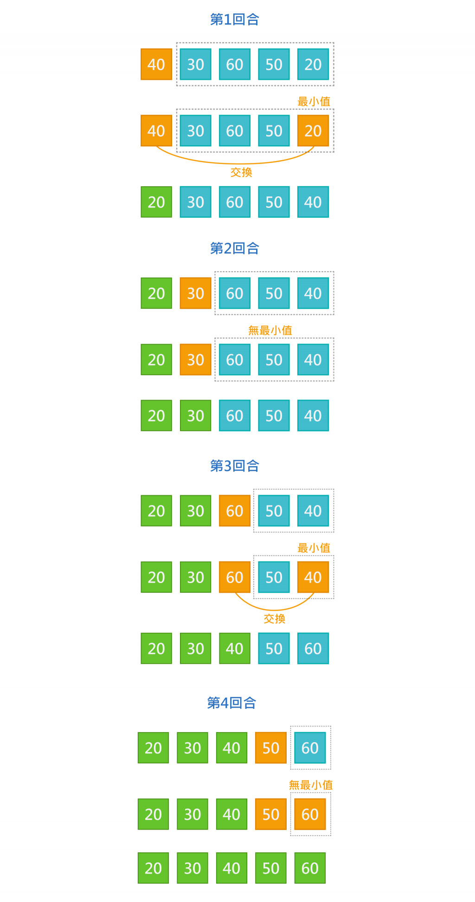
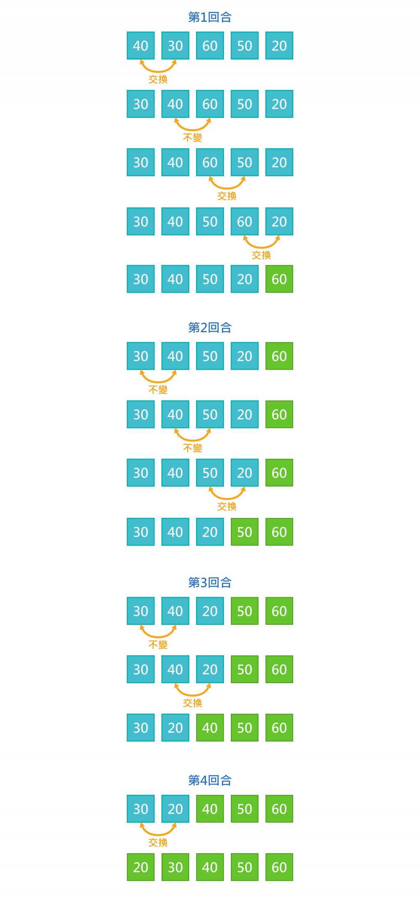
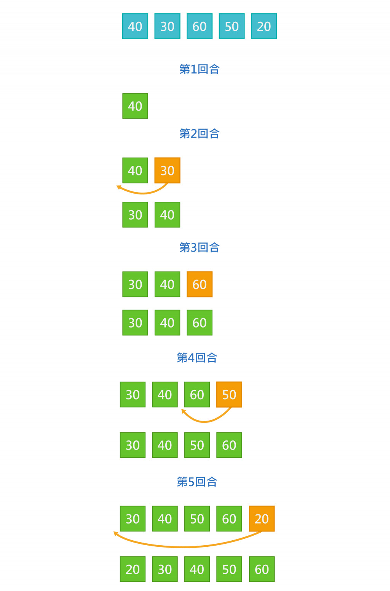
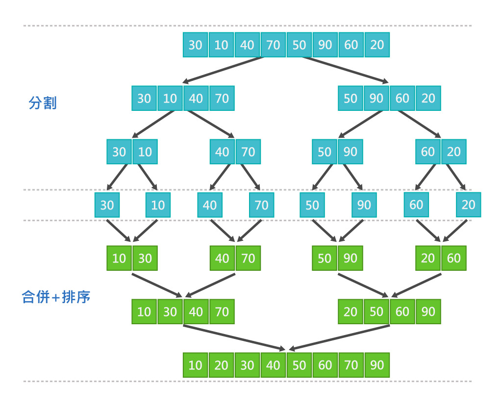
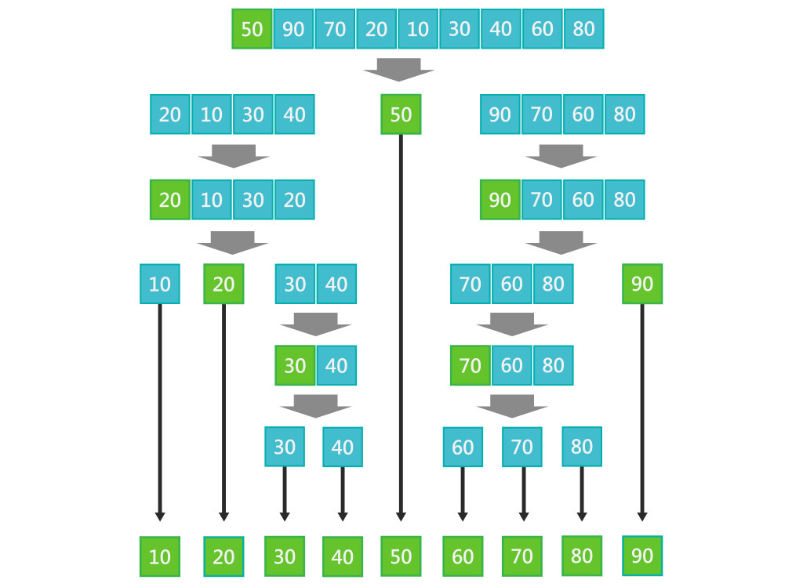
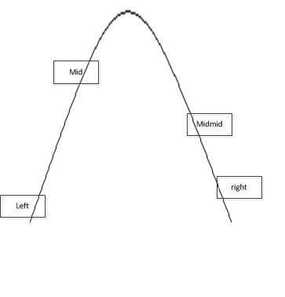
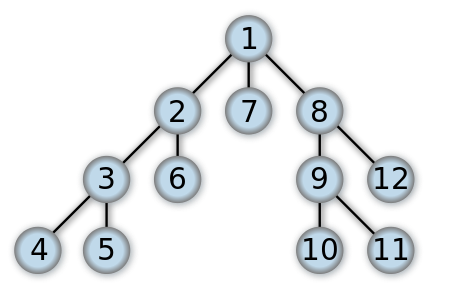
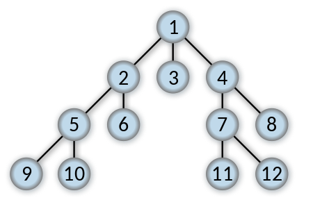
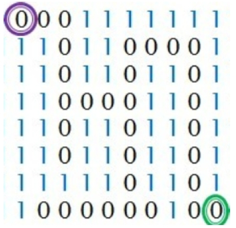

## 排序

針對一個資料集，我們要對其做排序，有可能是由大到小，或由小到大。 其中，要怎麼排序成了一個重要的問題，如果效率不好，載資料量大的時候會很差。 (非常非常之重要，也是白板題愛考的(?))

<!--more-->

## 常用小工具
為了方便，且好看。
### min/max()
想要取兩個數最小值，我們會這樣寫
```cpp
int a = 3, b = 5, mn;
if (a > b) mn = b;
else mn = a;
```
但使用min/max這樣寫就不用多打if else
```cpp
int a = 3, b = 5;
int mx = max(a,b);
int mn = min(a,b);
```

多個數字的max/min 如果量少可以直接大誇號誇起來{}
```cpp
int a = 3, b = 4, c = 5, d = 6;
int mx = max({a,b,c,d});
int mn = min({a,b,b,d});
```

也可以用for迴圈
```cpp
int a[50]; // 假設賦好值了
int mx = a[0];
for (int i = 1 ; i < 50 ; i++) {
    mx = max(mx,a[i]);
}
```

### swap()
如果想要交換兩個數字我們會這樣寫

```cpp
int a = 3, b = 5, str;

str = a;
a = b;
b = str;

//整數的話可以用下列xor操作
a^=b;
b^=a;
a^=b;
```

直接用swap的話，簡單又明瞭。
```cpp
int a = 3, b = 5;
swap(a,b);
cout << a << ' ' << b ;
```
### \_\_gcd()

在基礎數論會提到，就是取最小公因數。正常是直接用輾轉相除法。
```cpp
int gcd(int a, int b) { //輾轉相除法
    int r = a % b;
    while (r != 0) {
        a = b;
        b = r;
        r = a % b;
    }
    return b;
}
```

不過可以直接用\_\_gcd (要兩個下底線 在數字零右邊+shift鍵)
```cpp
__gcd(a,b);
```
c++17可以
```cpp
gcd(a,b);
```

### sqrt() 
開根號
```cpp
double x = 5;
cout << sqrt(x);
printf("%.10lf",sqrt(x)); 
//想要直接幾位數的話，可以用printf印出，跟python的大同小異
```


## 選擇排序法 

### 介紹

原理是反覆從未排序的資料中找出最大(小)值，與最前端尚未排序的資料交換。

舉個例子，假設我們要將 40 30 60 50 20 由小排到大



### 方法

- i從1~N判斷過去
- 針對每一個i，判斷後面的最小值有沒有小於arr\[i]
    - 要怎麼判斷呢？ 設最小值為arr\[i]，如果後面arr\[j]的值小於min，就讓最小值的位置等於j
- 交換最小值跟i的位置

### 時間複雜度$O(n^2)$


```cpp 
void solection_sort (vector<int> &arr, int n){
    for (int i = 0 ; i < n ; i++) {
        int mn = i;
        for (int j = i + 1 ; j < n ; j++) {
            if (array[j] < array[mn]) mn = j;
        }       
        swap(array[i],array[mn]);
    }      
}        
```


## 氣泡排序法

### 介紹

原理是從第一筆資料開始，比較相鄰兩筆資料，如果兩筆大小順序有誤則做交換，反之則不動，接者再進行下一筆資料比較，所有資料比較完第1回合後，可以確保最後一筆資料是正確的位置。

同樣來排序 40 30 60 50 20
       


### 方法
- 判斷n次
- 每次i從1~N-1 如果arr\[i] > arr\[i+1] 則交換

### 時間複雜度$O(n^2)$ 


```cpp  
void bubble_sort (vector<int> &arr, int n) {   
    while (n--) {
        bool check = false;
        for (int i = 0 ; i < n ; i++) {
            if (array[i] > array[i+1])
                swap(array[i],array[i+1]), check = true;
        }    
        if (!check) break;
    }      
}     
   
```

   
## 插入排序法

### 介紹

原理是逐一將原始資料加入已排序好資料中，並逐一與已排序好的資料作比較，找到對的位置插入。

同樣來排序 40 30 60 50 20




### 方法
- 將資料從1~N取出來，放進box裡面
- 每個取出來的資料，從目前box最後一個開始判斷，如果小於的話那就讓他們交換位置。
- 有點像氣泡排序

### 時間複雜度$O(n^2)$


```cpp
void insert_sort (vector<int> &arr, int n) {
    for (int i = 1 ; i < n ; i++) {
        int target = i;
        for (int j = i-1 ; j >= 0 ; j--) {
            if (array[target] < array[j]) {
                swap(array[target],array[j]);
                target = j;
            } 
        }
    }
}
```


           
## 合併排序法
### 介紹
將資料分割成兩部分，再把分割的部分再分割成兩部分，直到每個部份都剩下2個以下，再回頭將這些部分合併。
     
例子，將 30 10 40 70 50 90 60 20 由小排到大
     


實作的部分，因為是使用分治法，所以會在分治那篇做實作，先知道原理就好，在排序的部分很少會自己刻了。
### 時間複雜度$O(nlogn)$

## 快速排序法

### 介紹
在混亂的資料中，快速排序是目前公認效率極佳的演算法，原理是先從原始資料列中找一個基準值(Pivot)，接著逐一將資料與基準值比較，小於基準值的資料放在左邊，大於基準值的資料放在右邊，再將兩邊區塊分別再找出基準值，重複前面的步驟，直到排序完為止。

操作流程:
1. 資料列中找出一個基準值(Pivot)
2. 將小於Pivot的資料放在左邊，大於Pivot的資料放在右邊
3. 左右兩邊資料分別重複1~2步驟，直到剩下1筆資料
4. 合併

例子：將 50 90 70 20 10 30 40 60 80 由小排到大



實作的部分，同樣是使用分治法，所以會在分治那篇做實作，先知道原理就好，在排序的部分很少會自己刻了。

### 時間複雜度$O(nlogn)$
   
## c++內建排序

在c++ <algorithm\> 裡面的函式，用法是
sort( RandomIt first, RandomIt last, Compare comp );
就是一個資料的頭，跟尾巴，以及排序方式的比較函式
同時其時間複雜度也是$O(nlogn)$ 而且優化的最好(如果你能寫贏下個sort就是你的程式碼了)

好用之處在於很便利，而且對於多種資料型態都可以輕鬆排序。(後面基本上都用sort()，不會再用上面的演算法了)

舉個例子


```cpp
#include <bits/stdc++.h>
using namespace std;

bool cmp(int a, int b){
    return a < b; // 由小排到大，所以回傳 a < b 
}
int main(void){
    vector<int> list = {3,9,7,6,5,1,2};
    sort(list.begin(),list.end(),cmp); // 如果沒有cmp函式，預設就是從小排到大
    //sort(list.begin(),list.begin()+7,cmp) 意思相同
    
    // array用法
    int array[7] = {3,9,7,6,5,1,2};
    sort(array,array+7,cmp); 
}
```

cmp的部分也可以用stl模板
```cpp
less<type>()    // <
greater<type>()  // >
less_equal<type>()  //  <=
greater_equal<type>()//  >=
    
//舉例來說
    
vector<int> list = {5,7,2,4,6,9,1};
sort(list.begin(),list.end(),greater<int>());
```       

### sort 是老大
有趣的是，你可能會很好奇sort的效率如何，只能說，如果能找到更好的方法的話，sort就會用那個方法了XDD
因為是個很方便又良好的函式，所以往後幾乎不會用到上面提到的排序法。(ps 用久了也很容易忘記排序怎麼寫)

### 搭配 struct 
sort函數只需要bool function，所以在多資料的時候，只要回傳a.i\<b.i就好，
舉個例子想要判斷班級成績，先比較數學成績，相同的話再比較國文成績，如果都一樣的話，依照名稱排序(字典序)

所以我們先建立一個struct
```cpp
struct info {
    int math_score;
    int chinese_score;
    string name;
};// 記得要分號
```

bool function這樣寫，注意，雖然回傳的是小於，但是判斷的時候不能用小於，因為資料的ab你不知道誰大誰小，所以回傳是true的話sort會知道a比較小，回傳false則b比較小。
```cpp
bool cmp (info a, info b){ //變數形態要注意要跟資料一樣
    if (a.math_score != b.math_score) {
        return a.math_score < b.math_score;
    }else if(a.chinese_score != b.chinese_score){
        return a.chinese_score < b.chinese_score;
    }else{
        return a.name < b.name;
    } 
}
```

sort引用

```cpp
vector<info> arr;
//如果用vector<info> arr
sort(arr.begin(),arr.end(),cmp);
//或者 sort(arr.begin(),arr.begin()+arr.size(),cmp);

//如果用info arr[n];
sort(arr,arr+n,cmp);
```


```cpp
#include <bits/stdc++.h>
using namespace std;

struct info {
    int math_score;
    int chinese_score;
    string name;
}; // 記得要分號

// ab的資料型態要跟想sort的一樣
bool cmp (info a, info b){ 
    if (a.math_score != b.math_score) {
        return a.math_score < b.math_score;
    }else if(a.chinese_score != b.chinese_score){
        return a.chinese_score < b.chinese_score;
    }else{
        return a.name < b.name;
    } 
}

int main(void) {
    int n;
    cout << "輸入班級人數：";
    cin >> n;
    vector<info> arr(n);
    for (int i = 0 ; i < n ; i++) {
        cout << "第" << i + 1 << "同學名稱：" ;
        cin >> arr[i].name;
        cout << "第" << i + 1 << "同學數學成績：" ;
        cin >> arr[i].math_score;
        cout << "第" << i + 1 << "同學國文成績：" ;
        cin >> arr[i].chinese_score;
    }
    sort(arr.begin(),arr.end(),cmp);
    cout << "結果\n";
    for (int i = 0 ; i < n ; i++) {
        cout << "第" << i + 1 << "同學名稱：" << arr[i].name << '\n';
        cout << "第" << i + 1 << "同學數學成績：" << arr[i].math_score << '\n';
        cout << "第" << i + 1 << "同學國文成績：" << arr[i].chinese_score<<'\n';
    }
    return 0;
}
```


## permutation全排列函式 (這邊跳過)

### next_permutation()
```cpp
#include <bits/stdc++.h> 
using namespace std;  
#define int long long

signed main(){  
    ios::sync_with_stdio(false),cin.tie(0);
    string a;
    vector<string> ans;
    cin >> a;
    sort(a.begin(),a.end());
    do{  
        ans.push_back(a);
    }while(next_permutation(a.begin(),a.end()));  
    cout << ans.size() << '\n';
    for (auto it : ans) {
        cout << it << '\n';
    }
    return 0;  
}  
```

### prev_permutation()
```cpp
#include <bits/stdc++.h> 
using namespace std;  
#define int long long
signed main(){  
    ios::sync_with_stdio(false),cin.tie(0);
    string a;
    vector<string> ans;
    cin >> a;
    sort(a.begin(),a.end());
    reverse(a.begin(),a.end());
    do{  
        ans.push_back(a);
    }while(prev_permutation(a.begin(),a.end()));  
    cout << ans.size() << '\n';
    for (auto it : ans) {
        cout << it << '\n';
    }
    return 0;  
}  
```

# 搜尋


## 線性搜尋(暴力搜)
最簡單也最爆力的方法，線性搜尋法是以土法煉鋼的方式走訪集合中的每個元素，並在每次判斷目前走訪到的元素是否正是我們想要找的元素。

舉例來說，我們想知道班上考X分的那個人是誰。 (用pair存名字和分數)
```cpp
vector<pair<string,int>> point; // 假設這邊已經給好所有人的值了 first為名字，second為分數
int target;
cin >> target;
for (auto it : point){
    if (it.second == target) cout << it.first << '\n';
}
```

## 二分搜尋(查找)
針對以排序好的資料，做二分的動作。 但請不要認為這很容易，這是很多人很苦惱的地方，因為邊界的判斷以及判斷的方法其實很難掌握。

<a style = "color:red"> 因為分成超多種情況，基本情況就有四種了 </a>

首先我們先來看二分的模板

```cpp
// l 是左邊界 , r 是右邊界
int BinarySearch_min(vector<int> arr,int n,int key) {
    int l = 0,r = n - 1;
    while(l < r){
        int mid = (l + r)/2;
        if(arr[mid] < key) //加等於的話，會變成找第一個大於的
            l = mid + 1;
        else
            r = mid;
    }
    return (l + r)/2;
}
```

```cpp
// l 是左邊界 , r 是右邊界
int BinarySearch_Max(vector<int> arr,int n,int key) {
    int l = 0, r = n - 1;
    while (l < r) {
        int mid = (l + r + 1) / 2;//取中間靠後
        if(arr[mid] <= key) //少了等於會變成找第一個小於的
            l = mid;
        else
            r = mid - 1;
    }
    return (l + r + 1)/2;
}
```

這兩個模板有什麼差別呢？
第一個模板是盡量往左找目標 (加等於的話，會變成找第一個大於的)
第二個模板是盡量往右找目標 (少了等於，會變成找第一個小於的)

可能會想，直接除二就好，為什麼要這麼麻煩？ 原因是程式在/2遇到小數點會直接捨去，所以有可能會卡在死循環。
<!--  
舉個例子 1 4 8 9 之類的
-->

還有第三個模板 浮點二分，比較簡單，因為浮點除法不會捨去，不過會有誤差問題，所以在判斷的時候要使用之前提到的epsilon

```cpp
double eps = 1e-7;
while (r-l > eps) //精確性
{
    double mid = (l+r)/2;
    if(check(mid)) l = mid;
    else r = mid;
}
```

### 單邊二分搜

上述這樣反覆向左向右是不是很昏頭呢？ 而且也很容易寫錯就變成無窮迴圈 我們也可以用一路向前的方式來寫。

舉個例子，假設我們要在一堆以排序(由小到大)的數列中找到第一個小於X的數字，在起始位置中，最多就是一次跳數列中最大-最小的量，我們可以把這個量每次都除以二並且判斷跳過去是否吻合小於X，如果吻合就跑過去。
這樣時間複雜度也會是$O(nlogn)$，因為每次跳的距離減半，直到沒有。
```cpp
int jump_search (int a[], int n, int x) {
    if (a[0] >= x) return -1 ; // 檢查第一個是否已經大於X了 
    int ans = 0;
    for (int jump = n/2 ; jump > 0 ; jump /= 2) {
        //jump /= 2 也可以寫成 jump >>= 1
        while (ans + jump < n && a[ans + jump] < X)
            ans += jump;
    }
    return ans;
}
```


## 內建二分搜

### binary_search()
binary_search()：回傳是否在以排序數據中「等於」val (True or False)：
bool check = binary_search(v.begin(), v.end(), val);

### lower_bound()
lower_bound：找出以排序數據中「大於或等於」val的「最小值」的位置：
auto it = lower_bound(v.begin(), v.end(), val);
cout << \*it;

### upper_bound()
upper_bound：找出vector中「大於」val的「最小值」的位置:
auto it = upper_bound(v.begin(), v.end(), val);
cout << \*it

### 注意
使用lower\upper內建的話，回傳是位置，要取值記得 \*
這兩個雖然也很常用，不過很多時候的二分還是要靠自己寫，所以上面的二分模板請務必記熟。

## 三分搜尋
對於一個單峰函數(先遞增後遞減，或相反)，或是雙調排序(Bitonic sequence)，我們可以利用三分搜找出其最低點或最高點。 



與二分相似，不過中間變成了mid1,mid2。

直接看個例子：已知函數 f(x) 在區間 [l,r] 上單峰並連續，求 f(x) 在 [l,r] 上的極值。
三分的重點在：mid1 = (2 * l + r)/3 , mid2 = (l + 2 * r)/3

程式碼：

```cpp
double ternary_search() {
    double l = -1000, r = 1000;
    for (int i = 0; i < 300; i++) {
        double m1 = (2 * l + r) / 3;
        double m2 = (l + 2 * r) / 3;
        if (f(m1) >= f(m2)) l = m1;
        else r = m2;
    }
    return f(l);
}
```

# 兩大經典演算法DFS/BFS

## DFS 深度優先搜尋

DFS 是一種用來搜尋一個樹或圖的演算法，每當走到一個節點，就會以那個節點為新起始點，往其中一邊搜尋到到底或下一個節點。當已經走遍節點其中一邊的所有可能，才會開始走節點的另外一邊。

### 圖示



## BFS 廣度優先搜尋
BFS 也是一種用來搜尋一個數或圖的演算法，但不同於 DFS 的是遇到節點時，會同時往節點的各個方向走相同的單位搜尋，不像 DFS 會優先走完其中一邊才走另一邊。

### 圖示



我們直接來看個經典例子，輕鬆了解

## 迷宮問題



### 逃出迷宮

假設 0 代表可以走的路， 1 代表牆壁，我們想要從左上角(入口)走到右下角(出口)。
常問，輸出最短步數/隨意一個解/所有解 

### 思路I DFS

在使用 DFS 的時候，是用特定的走法去走，而因為這個迷宮只有四個方向，可以隨意預設前方有路就直走，前方沒路，看左邊，左邊沒路看右邊，右邊也沒路就退一格。 (這些方向誰先誰後隨意) 不過要注意，是判斷到有路就直接前進，沒路再回來繼續判斷。 是不是很遞迴呢？

### 程式碼

PS ： DFS 好處理，隨意一條路徑以及所有路徑，最短路徑的話就是從所有路徑去判斷誰最短的。 以下程式碼假設問所有路徑

```cpp
int visited[101][51]; 
int n = 100, m = 50; 
//假設迷宮100 * 50 , 並且假設已經隨機布置好迷宮的路了且有答案。

void dfs(int x, int y, int idx){
    visited[x][y]=1; // 1代表走過了
    if (x==n-1 && y==m-1){ // 判斷是否走到出口
        cout << "Path " << idx << ":\n"; //出口走幾步
        return;
    }

    // 四個方向判斷
    if (x+1<n && visited[x+1][y]==0 && map[x+1][y]==0){
        dfs(x+1,y,idx+1);
        visited[x+1][y]=0; //dfs回來了，所以上面那個路徑要返回沒走過
    }
    if (y+1<m && visited[x][y+1]==0 && map[x][y+1]==0){
        dfs(x,y+1,idx+1);
        visited[x][y+1]=0;
    }
    if (x-1>=0 && visited[x-1][y]==0 && map[x-1][y]==0){
        dfs(x-1,y,idx+1);
        visited[x-1][y]=0;
    }
    if (y-1>=0 && visited[x][y-1]==0 && map[x][y-1]==0){
        dfs(x,y-1,idx+1);
        visited[x][y-1]=0;
    }
    return ;
}
```

### 注意
需要注意的是，在遞迴走過的路徑請記得告訴他，走過了，不然如果有迴路的話，會進入死循環哦，以及處理遞迴最重要的邊界問題。

這邊使用 4 個 if，並不是使用 else if，因為走迷宮如果多個方向有路，是要都要去走看看的。只是先後順序而已，如果用 else if 只會走一條路。

### 思路II BFS

在使用 BFS 的時候，很像用倒水進去迷宮的方式，所以當下能走的路走完，才會再往可以進一步的地方往前邁進。做法就是先把上下左右的格子都走一遍，在把可行的節點放進隊列中，慢慢擴大搜索路徑。

### 程式碼
PS ： BFS 最常拿來算最短路徑。

```cpp
int maze[100][100]; //迷宮
int dismap[100][100]; //迷宮走幾步
int n ;
int nxt[4][2] = {{-1,0},{1,0},{0,-1},{0,1}}; // 四個方向

int bfs (){
    deque<pair<int,int>> que;  //隊列
    que.push_back(make_pair(0,0)); //入口放進隊列
    maze[0][0] = 1; //標示走過
    
    while (!que.empty()) {
        int x = que.front().first, y = que.front().second;  //注意用front
        que.pop_front();  
        for (int i = 0 ; i < 4 ; i++) { //四個方向
            int nx = x + nxt[i][0], ny = y + nxt[i][1];
            if (nx < 0 || ny < 0 || nx >= n || ny >= n) continue; //處理邊界問題
            if (maze[nx][ny] == 0) { //判斷有沒有路
                que.push_back(make_pair(nx,ny)); //有路就走
                maze[nx][ny] = 1;
                dismap[nx][ny] = dismap[x][y] + 1; //這裡的距離是上一個走過來的點+1    
            }
        }
    }
    return dismap[n-1][n-1];
}

```


