# 基礎資料結構

## STL
STL (Standard Template Library) 是 C++ 的一個標準函式庫，用來提供許多常用的資料結構。它提供了許多類似陣列和鏈結串列的容器（例如 vector、list 和 deque），以及用於操作這些容器的算法（例如 sort、find 和 remove）。希望透過這篇幫助大家熟悉各種stl容器與其操作。

<!-- more -->

## vector
Vector 是 STL 中的一種容器，它提供了一種以陣列的方式來存儲一系列的物件，並且支持動態的元素增加和刪除操作。換句話說，你可以在執行期改變他的大小，不像傳統的c風格的陣列，一旦宣告就不能改變大小，使用起來比較方便。它是一種模板類別，所以你可以使用任何類型的物件來創建 vector 實例。

下面是一個vector的使用範例:
```cpp
#include <iostream>
#include <vector>

int main() {
  // 宣告
  std::vector<int> numbers;
    
  // 在 vector 末尾添加元素
  numbers.push_back(1);
  numbers.push_back(2);
  numbers.push_back(3);

  // 遍歷 vector 中的元素
  for (int i=0;i<numbers.size();i++) {
    std::cout << numbers[i] << " ";
  }
  std::cout << std::endl;
    
}

```
執行結果 : 


上面這個例子中宣告了一個叫numbers的vector，然後對他進行3次push_back()，push_back()是一個vector的成員函式，他會把元素加入vector的末尾，你可以把他想像成python中 list的append()。最後我們使用一個迴圈印出vector當中的每一個元素。size()也是vector的一個成員函式，他會回傳給你vector的大小。

不過在這個例子中我們並沒有宣告vector的大小，vector也可以在宣告的時候就指定一個大小。他就會根據你給的大小創造一個vector並把所有元素都設為0 (以vector\<int>來說)。所以上面的程式碼也可以這樣寫
```cpp
#include <iostream>
#include <vector>

int main() {
  // 宣告
  std::vector<int> numbers(3);
    
  // 對vector內的元素賦值
  numbers[0]=1;
  numbers[1]=2;
  numbers[2]=3;
  

  // 遍歷 vector 中的元素
  for (int i=0;i<numbers.size();i++) {
    std::cout << numbers[i] << " ";
  }
  std::cout << std::endl;
    
}
```
執行結果
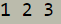


也可以在vector被建構實就指定每個元素的初值
```cpp
vector<int> numbers1(20,3);         //建構一個20個大的陣列，其中每個元素都會是3
vector<int> numbers2={1,2,3,4,5};   //建構一個5個大的陣列，其中的元素分別是1,2,3,4,5
```

vector之間也可以互相賦值
```cpp
vector<int> numbers1 = {1, 2, 3};
vector<int> number2 = numbers1;
```
如果想要改變vector的大小可以使用resize()這個成員函式
```cpp
numbers1.resize(10); //將numbers1這個vector的大小設為10
```
</br>
    
取得長度/容量的用法
+ **vec.empty()** - 如果 vector 內部為空，則傳回 true 值
+ **vec.size()** - 取得 vector 目前持有的元素個數
+ **vec.resize()** - 改變 vector 目前持有的元素個數
+ **vec.capacity()** - 取得 vector 目前可容納的最大元素個數。這個方法與記憶體的配置有關，它通常只會增加，不會因為元素被刪減而隨之減少重新配置／重設長度
+ **vec.reserve()** - 如有必要，可改變 vector 的容量大小（配置更多的記憶體）。在眾多的STL 實做，容量只能增加，不可以減少。
> **—— 不建議使用 size()==0 判斷容器是否為空，用 empty() 判斷較恰當。因為並不是所有容器的 size() 都是 O(1) (不知道我在說什麼的可以先看一下下面的時間複雜度)，例如 `<list>` 是 linked list 結構，其 size() 是 O(n)。**

</br>

> **每個 vector 都有兩個重要的數字：容量 (capacity) 和長度 (size) 。**
>    
> **$\quad$容量 (capacity) : 是這個 vector 擁有的空間。
    > $\quad$長度 (size) : 是實際儲存了元素的空間大小。capacity 永遠不小於 size。**
$\quad\quad\quad\quad\quad\quad$
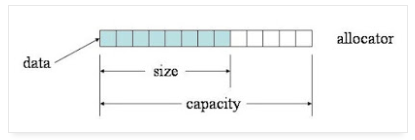
來源: https://mropengate.blogspot.com/2015/07/cc-vector-stl.html

> **$\quad$reserve() 的目的是擴大容量。做完時，vector 的長度不變，capacity 只會長大不會縮小，資料所在位置可能會移動 (因為會重配空間)。
>  $\quad$resize() 的目的是改變 vector 的長度。做完時，vector 的長度會改變為指定的大小，capacity 則視需要調整，確保不小於 size，資料所在位置可能會移動。如果變小就擦掉尾巴的資料，如果變大就補零。如果會超過容量，會做重配空間的動作。**


## iterator 迭代器
C++中的迭代器是一種可遍歷數據容器中元素的對象，它們允許我們以類似指標的方式訪問容器中的元素，而不需要知道底層容器的實現細節。迭代器提供了一種通用的方式來訪問容器中的元素，無論容器的類型如何（例如vector，list，map等）。使用迭代器，我們可以輕松地對容器中的元素進行遍歷、訪問、修改等操作。你可以把迭代器想像成一個位子，他會指向容器中的某個元素，而你可以對迭代器使用 * 來獲得那個元素。

```cpp
#include<iostream>
#include<vector>

using namespace std;

int main(){
    vector<int> temp{1,2,3,4,5};
    vector<int>::iterator it=temp.begin();
    cout<<*it;
}
```

下面我們來看一些搭配vector使用的例子

1. 遍歷容器
- 迭代器最常見的用法是遍歷容器中的元素。通過使用迭代器，我們可以對容器中的元素進行遍歷
```cpp
#include <iostream>
#include <vector>

using namespace std;

int main() {
    vector<int> v = {1, 2, 3, 4, 5};
    
    cout << "所有元素：";
    for (auto it = v.begin(); it != v.end(); ++it) {
        cout << *it << " ";
    }
    cout << endl;
    
    cout << "修改後的所有元素：";
    for (auto it = v.begin(); it != v.end(); ++it) {
        *it *= 2;
        cout << *it << " ";
    }
    cout << endl;
}
```

2 插入和刪除元素
```cpp
#include <iostream>
#include <vector>

using namespace std;

int main() {
    vector<int> v = {1, 2, 3, 4, 5};
    
    v.insert(v.end(), 6);
    for (auto it = v.begin(); it != v.end(); ++it) {
        cout << *it << " ";
    }
    cout << endl;
    
    v.insert(v.begin(), 0);
    for (auto it = v.begin(); it != v.end(); ++it) {
        cout << *it << " ";
    }
    cout << endl;
}
```

```cpp
#include <iostream>
#include <vector>

using namespace std;

int main() {
    vector<int> v = {1, 2, 3, 4, 5};
    
    v.pop_back();
    for (auto it = v.begin(); it != v.end(); ++it) {
        cout << *it << " ";
    }
    cout << endl;
    
    v.erase(v.begin() + 1);
    for (auto it = v.begin(); it != v.end(); ++it) {
        cout << *it << " ";
    }
    cout << endl;
}

```

3 迭代器的算數運算
```cpp
#include <iostream>
#include <vector>

using namespace std;

int main() {
    vector<int> v = {1, 2, 3, 4, 5};
    
    auto it = v.begin();
    it++; 
    cout << "第二個元素：" << *it << endl;
    
    
    auto ait = v.begin();
    ait += 2; 
    cout << "第三個元素：" << *ait << endl;
}
```

不同種類的iterator支援不同的操作
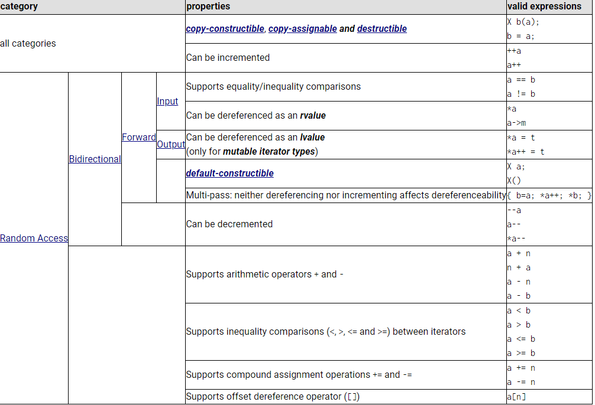


## linked-list (競賽不常用)
除了陣列以外還有一種很常見的資料結構叫鏈結串列，他跟陣列最大的差別在於他的記憶體不是連續的，他是一種節點式的資料結構，每個節點會記得下一個節點的位置。所以每個節點除了存值之外還要花額外的記憶體儲存一個指標。而head會指向第一個節點的位置，最後一個節點會指向nullptr。

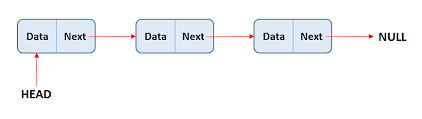


鏈結串列不支援隨機訪問，如果要取一個特定的節點的值需要從頭開始走起，搜尋的時間複雜度會是O(N)。也就是HEAD->Next->Next...，相較之下vector是O(1)他只需要從第一個人的位子推算目標元素的位置就好(因為是連續記憶體)。
另外就是，他需要花額外的記憶體來儲存指標也就是下一個人的位置。

他的好處就是在新增/刪除元素的時候可能會比vector快。

linked list在新增節點時只要改動兩個指標就好

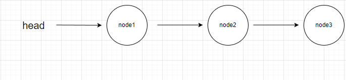

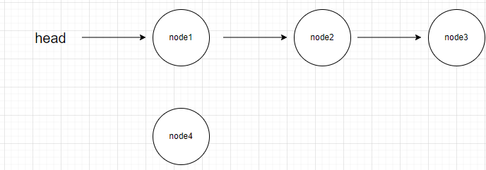

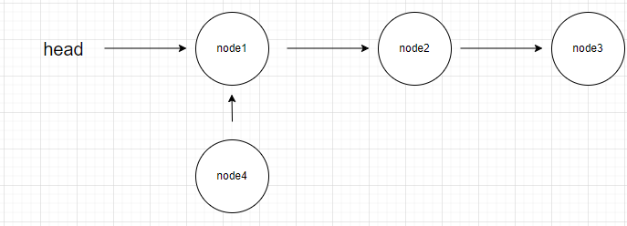

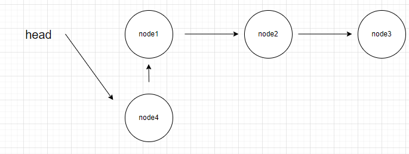

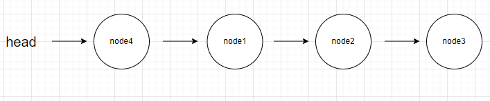

除此之外，因為不是連續記憶體的結構，所以每次要新增節點時直接動態配置新的記憶體就好，不會像陣列一樣不能長大或需要resize() 。

不支援中括弧運算子，會報錯  : 
no match for 'operator[]' (operand types are 'std:\:__cxx11::list<\int>' and 'int')
```cpp
#include <iostream>
#include <list>

using namespace std;

int main(){
    list<int> ll{1,2,3,4,5};
    cout<<ll[3];              //error
}
```
    
取值的方法 : 迭代器
迭代器的型態名子太長了，我們可以使用 auto 來宣告

```cpp
#include <iostream>
#include <list>

using namespace std;

int main(){
    list<int> ll{1,2,3,4,5};
    auto it = ll.begin();
    cout<<*ll.begin();      //印出第一個位置的值
}
```
可以這樣寫嗎?
```cpp
#include <iostream>
#include <list>

using namespace std;

int main(){
    list<int> ll{1,2,3,4,5};
    auto it = ll.begin();
    cout<<*(ll.begin()+3);      //error
}
```
list的迭代器種類不支援 += 一個整數，只能++，換句話說一次只能走一步。
```cpp
#include <iostream>
#include <list>

using namespace std;

int main(){
    list<int> ll{1,2,3,4,5};
    auto it = ll.begin();
    for(int i=0;i<3;i++){
        it++;    
    }
    cout<<*it;
}
```
但你也可以使用advance一行幫你完成
```cpp
#include <iostream>
#include <list>
#include<iterator>

using namespace std;

int main(){
    list<int> ll{1,2,3,4,5};
    auto it = ll.begin();
    advance(it,3);
    cout<<*it;
}
```
插入元入可以使用insert() 他會在迭代器指向的位置前面插入你指定的元素。
```cpp
#include <iostream>
#include <list>
#include<iterator>
#include<vector>

using namespace std;

int main(){
    vector<int> ll{1,2,3,4,5};
    auto it = ll.begin();
    ll.insert(it,0);
    for(auto& k : ll){
        std::cout<<k<<" ";    
    }
}
```
    

## pair
pair 簡單來說就是把講個物件包起來變成一個pair，例如stl中的map和unordered_map中的key和value就是用pair儲存。還有如果一個函式想要回傳兩個物件時也可以使用pair來回傳。
    
下面是一個簡單的範例
可以用.first和.second來取值和賦值。
    
```cpp
#include<utility>
#include<iostream>
#include<string>

using namespace std;

int main(){
    pair<int,string> tp;
    tp.first=1;
    tp.second="aaaaa";
    std::cout<<tp.first<<" "<<tp.second;
}
```
pair也可以在建構的時候給初始值，也支援複製賦值
```cpp
#include<utility>
#include<iostream>
#include<string>

using namespace std;

int main(){
    pair<int,string> tp1(1,"aaaaa");
    pair<int,string> tp2;
    tp2=tp1;
    std::cout<<tp2.first<<" "<<tp2.second;
}
    
```
也可以使用std::make_pair來建構pair物件
```cpp
#include<utility>
#include<iostream>
#include<string>

using namespace std;


std::pair<int,string> test(int a,string b){
    return std::make_pair(a,b); 
}
int main(){
    pair<int,string> tp1=test(1,"aaaaa");
    std::cout<<tp1.first<<" "<<tp1.second;
}
```
也可以試試看使用 auto
```cpp
#include<utility>
#include<iostream>
#include<string>

using namespace std;


std::pair<int,string> test(int a,string b){
    return std::make_pair(a,b); 
}
int main(){
    auto tp1=test(1,"aaaaa");
    std::cout<<tp1.first<<" "<<tp1.second;
}
```


    

## deque
deque 的全名是 double-ended queue，他是一個雙向佇列
deque和vector有一些相似的地方，deque在尾部新增或刪除元素很快，在中間新增或刪除時速度很慢，且也能在執行期動態改變容器大小，與vector不同的是，deque在頭部新增或刪除節點時也非常高效。

建構deque也非常簡單
```cpp
    std::deque<int> values;
```
也可以在建構的時候指定大小
```cpp
std::deque<int> values(10);
``` 
指定大小同時給予每個元素初值
```cpp
std::deque<int> values(10,5);
```
在已經有Deque的情況下，可以通過複製Deque來創建新的Deque容器：
```cpp
std :: deque<int> value1 ( 10 ); 
std :: deque<int> value2 ( value1 ); 
```

通過拷貝其他類型容器（或者普通數組）中指定區域內的元素，可以創建新的Deque容器：
```cpp
#include <array>
#include <iostream>
#include <deque>
using std::cin;
using std::cout;
using std::endl;

int main() {
    int a[] = { 1, 2, 3, 4, 5 };
    std ::deque<int> values_one( a, a + 5 );

    std ::array<int, 5> arr{ 11, 12, 13, 14, 15 };
    std ::deque<int> values_two( arr.begin() + 2, arr.end() );

    for ( auto it = values_one.begin(); it != values_one.end(); it++ ) {
        cout << *it << " ";
    }

    cout << endl;
    for ( auto it = values_two.begin(); it != values_two.end(); it++ ) {
        cout << *it << " ";
    }

    cin.get();
    return 0;
}
```
和之前的stl一樣可以透過迭代器遍歷容器
```cpp
#include <iostream>
#include <deque>
using namespace std;
int main()
{
    deque<int>d{1,2,3,4,5};
    for (auto i = d.begin(); i < d.end(); i++) {
        cout << *i << " ";
    }
    return 0;
}
```
## queue
queue是一個FIFO(first in first out)的容器，可以把它簡單想像成排隊。
因為這個特性，我們只能從他的頭部拿取元素，尾部插入元素
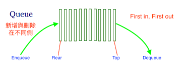


```cpp
#include <iostream>
#include <queue>

using namespace std;

int main() {
    queue<int> q;
    q.push(1); // [1]
    q.push(2); // [1, 2]
    q.push(3); // [1, 2, 3]

    cout << q.front() << endl; // 1
    cout << q.back() << endl; // 3
    cout << q.size() << endl; // 3

    int a = q.front(); // copy
    int &b = q.front(); // reference

    // 印出 queue 內所有內容
    int size = q.size();
    for (int i = 0; i < size; i++) {
        cout << q.front() << " ";
        q.pop();
    }
    cout << "\n";

    // 印出 queue 內所有內容
    /*while (!q.empty()) {
        cout << q.front() << " ";
        q.pop();
    }
    cout << "\n";*/

    return 0;
}
```

## stack
Stack 是一種後進先出（LIFO, Last In First Out）的資料結構，在 C++ 中若要使用堆疊，可以運用 C++ 標準函式庫（STL）所提供的 stack，以下是基本的使用範例：

```cpp
#include <iostream>
#include <stack>  // 引入堆疊>標頭檔

int main() {
  std::stack<int> myStack;  // 建立堆疊

  for (int i = 0; i < 5; ++i) {
    myStack.push(i);  // 放入元素
  }

  // 傳回最上方的元素
  std::cout << "Top: " << myStack.top() << std::endl;

  // 移除最上方的元素
  myStack.pop();

  // 傳回最上方的元素
  std::cout << "Top: " << myStack.top() << std::endl;

  return 0;
}
```

### 取得堆疊內元素個數

若要取得堆疊內的元素個數，可以使用 `size` 函數：
```cpp
#include <iostream>
#include <stack>

int main() {
  std::stack<int> myStack;
  for (int i = 0; i < 5; ++i) {
    myStack.push(i);
  }

  // 取得堆疊內元素個數
  std::cout << "Count: " << myStack.size() << std::endl;

  return 0;
}
```

### 檢查堆疊是否有元素（是否為空）

若要檢查堆疊內是否有任何元素，可以使用 `empty` 函數：
```cpp
#include <iostream>
#include <stack>

int main() {
  std::stack<int> myStack;
  for (int i = 0; i < 5; ++i) {
    myStack.push(i);
  }

  // 檢查堆疊是否有元素（是否為空）
  if (myStack.empty()) {
    std::cout << "堆疊是空的。" << std::endl;
  } else {
    std::cout << "堆疊不是空的。" << std::endl;
  }

  return 0;
}
```


    
## map

### tree
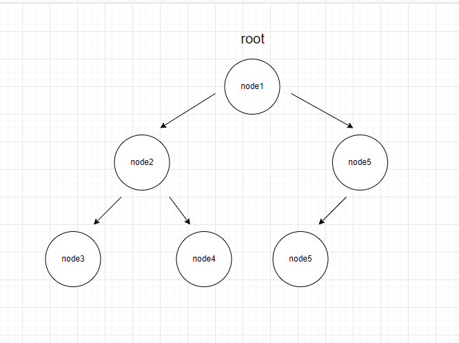

#### tree結構 : 
- 每個節點會接0~多個其他節點
- 變數root指向第一個節點
- 花額外的空間紀錄子節點的位置
- 沒有指向任何節點的節點稱為樹葉
- 樹葉指向 nullptr
- **最多**接兩個節點就叫二元樹

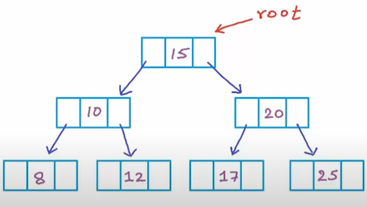


#### tree性質:
- 從樹根到任何一個節點只有一條不重複經過節點的路徑
- 樹的高度
    - 從樹根走到樹葉，不經過重複節點的路徑中，最長的稱為高度
    - 最大 : ?
    - 最小 : ?

- 最大堆積
    - 每個節點內的值比所有子樹中的節點都大
    - 最大值的位置 ?
    - 經常新增刪除，查找最大值。
    - priority queue

- 二元搜尋樹
左邊比較小，右邊比較大


C++ std::map 是一個關聯式容器，關聯式容器把鍵值和一個元素連繫起來，並使用該鍵值來尋找元素、插入元素和刪除元素等操作，他的特色是他的實作方式是紅黑數，所以新增，刪除，搜尋最糟的情況下都可以在O(log N)內完成。

先看一個簡單的範例
```cpp
#include<iostream>
#include<map>

using namespace std;

int main(){
    map<string,int> _map;
    _map["john"]=1;
    _map["marry"]=2;
}
```
跟vector不同，他的鍵值可以放入不是數字的東西，這點相較於vector方便很多。每個鍵值會跟內容值成對，使用pair來儲存。map同樣是節點式的結構，所以不會有像陣列一樣的大小的問題。另外，鍵值是不能被更改的。
迭代器同樣可以用在map上，下面這段程式碼使用迭代器來遍歷map中的所有節點。
```cpp
#include<iostream>
#include<map>

using namespace std;

int main(){
    map<string,int> _map;
    _map["john"]=1;
    _map["marry"]=2;
    _map["asdas"]=3;
    _map["sdfsdb"]=4;
    _map["bfdbbc"]=5;
    auto it = _map.begin();
    for(;it!=_map.end();it++){
        std::cout<<it->first<<" "<<it->second<<std::endl;   
    }
}
```
也可以用std::pair 
```cpp
#include<iostream>
#include<map>

using namespace std;

int main(){
    map<string,int> _map;
    _map["john"]=1;
    _map["marry"]=2;
    _map["asdas"]=3;
    _map["sdfsdb"]=4;
    _map["bfdbbc"]=5;
    for(std::pair<string,int>  pr : _map){
        std::cout<<pr.first<<" "<<pr.second<<std::endl;
    }
}
```

c++17後的語法糖
```cpp
#include<iostream>
#include<map>

using namespace std;

int main(){
    map<string,int> _map;
    _map["john"]=1;
    _map["marry"]=2;
    _map["asdas"]=3;
    _map["sdfsdb"]=4;
    _map["bfdbbc"]=5;
    for(auto [k,v] : _map){
        std::cout<<k<<" "<<v<<std::endl;
    }
}
``` 
語意預設是複製，要改值用參考

## set
跟 map 一樣是 tree 的結構，但他只有鍵值沒有內容值。
```cpp
std::set<int> myset{1, 2, 3, 4, 5};
```

他是集合，不會出現相同的元素。
```cpp
#include<set>
#include<iostream>

using namespace std;

int main(){
    set<int> test{1,2,3,4,5,1,2,3,4,5,6,7,8};
    for(auto n: test){
        std::cout<<n<<" ";
    }
}
```

也可以用vector來初始化
```cpp
#include<set>
#include<vector>
#include<iostream>

using namespace std;

int main(){
    vector<int> temp{1,2,3,4,5,5};
    set<int> test{temp.begin(),temp.end()};
    for(auto n: test){
        std::cout<<n<<" ";
    }
}
```

插入元素。
```cpp
std::set<int> myset;
myset.insert(1);
myset.insert(2);
myset.insert(3);
myset.insert(4);
myset.insert(5);
```

遍歷 set 
```cpp
#include <iostream>
#include <set>

int main() {
    std::set<int> myset = {3, 1};
    myset.insert(2);
    myset.insert(5);
    myset.insert(4);
    myset.insert(5);
    myset.insert(4);

    for (auto s : myset) {
        std::cout << s << " ";
    }
    std::cout << "\n";

    return 0;
}
```

## struct
Struct(結構)，Struct是一種自訂的資料型態，可以把不同的基本資料型態(int.float.double.char)變數組合，形成新的資料型態。

舉個例子

```cpp
#include <bits/stdc++.h>
using namespace std;

struct info {
    string name;
    int height;
    int weight;
    double score;
};  //記得要分號

int main(void) {
    info taro; //定義taro為info型態
    taro.name = "Taro";
    taro.height = 180;
    taro.weight = 75;
    taro.score = 99.8;
    cout << "名稱：" << taro.name << '\n';
    cout << "身高：" << taro.height << '\n';
    cout << "重量：" << taro.weight << '\n';
    cout << "分數：" << taro.score << '\n';
}

```
輸出：
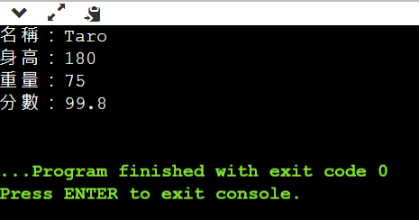


當然也可以是陣列 (定義裡面也可以是陣列)
```cpp
struct info {
    string name[10];
};

info arr[10];
arr[0].name[0] = "123";
cout << arr[0].name[0];
//....
```
