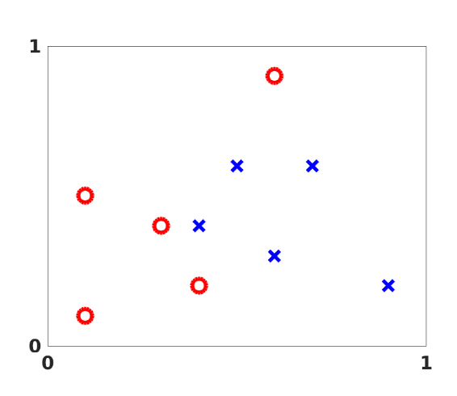
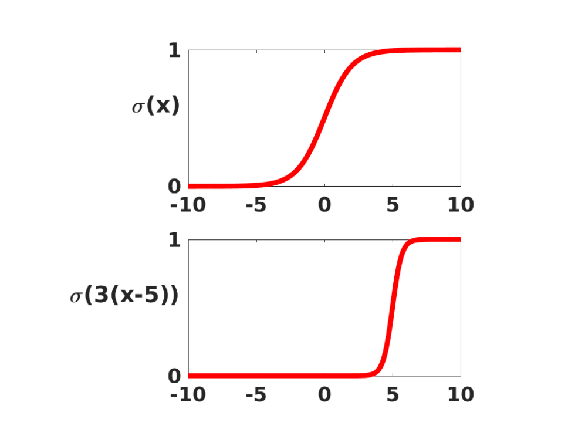
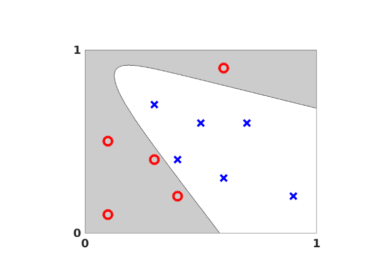
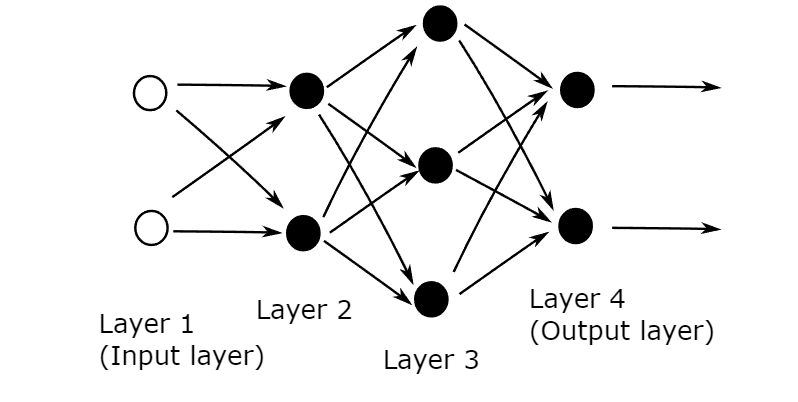
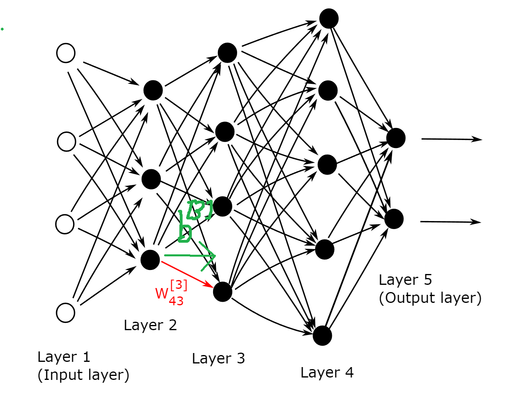
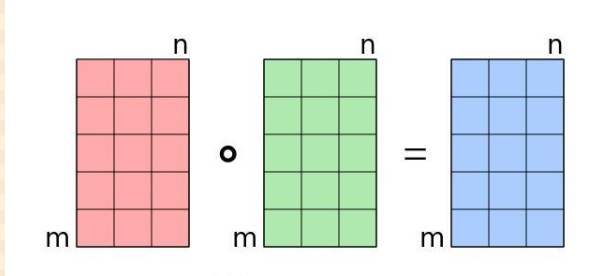
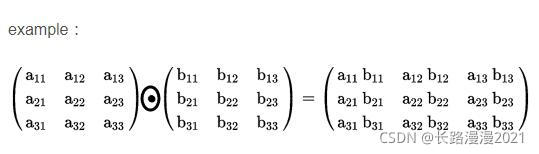

# Deep Learning: An Introduction for Applied Mathematicians

[來源](https://arxiv.org/pdf/1801.05894)

注意，論文中是用 matlab 實作，而我會使用 python 來實作。

<!-- more -->

## 例子

我們想要用一條線分類 O X ，之後將會利用基於 sigmoid function 的神經網路來找。

### sigmoid funcion

Sigmoid function 長如下

$$\sigma(x) = \frac{1}{1+e^{-x}}$$

微分形式

$$\sigma'(x) = \sigma(x)(1-\sigma(x))$$

可以改變為位移，和縮放，例如 $\sigma(3(x-5))$. 右移到 5 然後更加陡峭。

可以利用 sigmoid function 設定精神元層，如果一個神經元為一個向量 $a$，其輸出到下一層則長成如下

$$\sigma(Wa + b)$$

- $W$ 是一個矩陣，代表權重
- $b$ 是一個向量，代表偏差

寫出分量則是

$$\sigma(\sum_j w_{ij}a_j + b_i)$$

為了方便不會用分量來顯示。

### 四層神經網路例子

從 Layer1 到 Layer2 用上述 sigmoid function 表示為

$$\sigma(W^{[2]}a + b^{[2]}) \in \mathbb{R}^2$$

此時 $W^{[2]} \in \mathbb{R}^{2 \times 2}$

從第二層要到第三層，就把剛剛得到的新向量再帶入一次

$$\sigma(W^{[3]} \sigma(W^{[2]}a + b^{[2]}) + b^{[3]}) \in \mathbb{R}^3$$

此時 $W^{[3]} \in \mathbb{R}^{3 \times 2}$

繼續做到第四層

$$\sigma(W^{[4]} \sigma(W^{[3]} \sigma(W^{[2]}a + b^{[2]}) + b^{[3]}) + b^{[4]}) \in \mathbb{R}^2$$

此時 $W^{[4]} \in \mathbb{R}^{2 \times 3}$

所以這四層可以定義成一個函數 $F : \mathbb{R}^2 \rightarrow \mathbb{R}^2$

$$F(x) = \sigma(W^{[4]} \sigma(W^{[3]} \sigma(W^{[2]}a + b^{[2]}) + b^{[3]}) + b^{[4]}) \in \mathbb{R}^2$$

總共有 23 個參數，目標是找出一條線，分開 O X ，也就是需要去 optimizing 參數。 目標使 O 類別 $F(x)$ 趨近於 $[1, 0]^T$ ， X 類別 $F(x)$ 趨近於 $[0, 1]^T$ 

而 $F(x)$ 可以簡化成透過 cost function。 定義資料集為 $\{x^{\{i\}}\}_{i=1}^{10}$ 然後目標為 $y(x^{\{i\}})$。

所以

$$Cost(W^{[2]}, W^{[3]}, W^{[4]}, b^{[2]}, b^{[3]}, b^{[4]}) = \frac{1}{10} \sum_{i=1}^{10} \frac{1}{2} \lVert y(x^{\{i\}}) - F(x^{\{i\}}) \rVert_2^2$$

$\frac{1}{2}$ 是為了方便定義的 (可以看到平方微分會有個 2倍數下來)，通常稱為 quadratic cost function 用最佳化來說這也是一種 objective function

而尋找權重和偏差來做到 minimize cost function 稱為 training 神經網路。注意，調整 scaling cost 不會造成什麼影響，例如 $100Cost$ 或者 $\frac{Cost}{30}$，所以 Cost 上的 $\frac{1}{10}$，$\frac{1}{2}$ 不會有影響。

最終目標達到

接下來就來介紹詳細的內容。

## The General Set-up

### 名詞解釋

上面提到的四層神經網路例子，會稱 Layer1 為 Input layer，Layer4 為 Output layer，中間的層則叫做 Hidden layer。 每一層的向量被稱為神經元 Neurons。

現在來轉換成一般形式，假設總共有 $L$ 層神經網路，第 $1$ 層為輸入層，第 $L$ 層為輸出層，假設第 $l$ 層為 $n_l$ 神經元，整個流程就是從 $\mathbb{R}^{n_1} \rightarrow \mathbb{R}^{n_l}$ 

我們用 $W^{[l]} \in \mathbb{R}^{n_l \times n_{l-1}}$ 定義在 $l$ 層的權重矩陣。而 $w^{[l]}_{jk}$ 就是在 $l$ 層的神經元 $j$ 應用於第 $l-1$ 層神經元 $k$ 輸出的權重。 同樣的 $b^{[l]} \in \mathbb{R}^{n_l}$ 就是第 $l$ 層的偏差。

### 一般形式

如果給定輸入為 $x \in \mathbb{R}^{n_1}$，總共 L 層神經網路，則可以表達為下

$$ \begin{cases}
a^{[1]} = x\\
a^{[l]} = \sigma(W^{[l]}a^{[l-1]} +b^{[l]}), \space for \space l = 2,3,...,L\\
\end{cases}$$ 

假設資料有 $N$ 個則輸入 $\{x^{\{i\}}\}_{i=1}^N$ 會對應到一個目標輸出 $\{y(x^{\{i\}})\}_{i=1}^N$，所以

$$Cost = \frac{1}{N} \sum_{i=1}^{N} \frac{1}{2} \lVert y(x^{\{i\}}) - a^{[L]}(x^{\{i\}}) \rVert_2^2$$

又稱為 Forward Process

## Stochastic Gradient

我們的目標是 minimize $Cost$ function，用最一開始的四層神經元例子，假設狀態權重和偏差那些參數總和為 $p$，也就是說 $p \in \mathbb{R}^{23}$，或者一般化為 $p \in \mathbb{R}^s$，則 $Cost: \mathbb{R}^s \rightarrow \mathbb{R}$。

### gradient descent (GD)

或稱為 steepest desecent，此方法是用迭代的方式進行，目標為讓其收斂到最小化 $Cost$。

假設目前的向量為 $p$，下一個向量為增加一個擾動 $\Delta p$，也就是 $p + \Delta p$ 我們要如何選擇 $\Delta p$ 來使迭代有效果呢? 

如果 $\Delta p$ 很小，則 $\lVert \Delta p \rVert$ 小到可以忽略，所以利用泰勒展開可以得到

$$Cost(p+\Delta p) \approx Cost(p) + \sum_{r=1}^s \frac{\partial Cost(p)}{\partial p_r} \Delta p_r$$

或者用 gradient $\nabla$ 符號來表示

$$Cost(p+\Delta p) \approx Cost(p) + \nabla Cost(p)^T\Delta p$$

透過 Cauchy-Schwarz inequality，假設兩個 $f, g \in \mathbb{R}^s$ 我們有 $|f^Tg| <= \lVert f \rVert_2 \Vert g\Vert_2$ 所以最負值 $|f^Tg|$ 為 $-\lVert f \rVert_2 \Vert g\Vert_2$ 且 $f = -g$ 

所以既然要最小化，我們的 $\Delta p$ 就要選擇 $-\nabla Cost (p)$

然而我們有了方向，但是實際移動的不能太多，所以需要一個 step size $t$ 或稱為學習率

也就是說 

$$p \rightarrow t\nabla Cost(p)$$

會執行直到超出迭代次數，或者達到停止標準 (和預期答案足夠靠近)

### 回顧

我們的 $Cost$ 定義為 

$$Cost = \frac{1}{N} \sum_{i=1}^{N} \frac{1}{2} \lVert y(x^{\{i\}}) - a^{[L]}(x^{\{i\}}) \rVert_2^2$$

每個分量上的 $Cost$ 為

$$C_{x^{\{i\}}} =  \frac{1}{2} \lVert y(x^{\{i\}}) - a^{[L]}(x^{\{i\}}) \rVert_2^2$$

所以取 gradient 後為

$$\nabla Cost(p) = \frac{1}{N} \sum_{i=1}^N \nabla C_{x^{\{i\}}}(p)$$

但是會發現，如果有大量參數，或者大量點，這樣會導致做一次 gradient 計算成本非常昂貴。

### stochastic gradient descent (SGD)

一種很便宜的替代方案是每次都隨機選擇一個點的梯度，替換掉所有點上的平均值，這也是隨機梯度的最簡單形式。方法如下

1. 從$\{1,2,...N\}$  選擇一個"均勻隨機"的值 $i$
2. 更新 $$p \rightarrow t\Delta C_{x^{\{i\}}}(p)$$

或者我們也可以隨機時不取後放回，也就是隨機一輪，這也稱為完成一個 epoch。

1. 從$\{1,2,...N\}$ 打亂成新的排序 $\{k_1, k_2, k_3, ..., k_N\}$
2. $i$ 從 $1$ 到 $N$ 更新 $$p \rightarrow t\Delta C_{x^{\{k_i\}}}(p)$$

問題: 如果學習率太大，容易造成參數更新呈現鋸齒狀的更新，這是很沒有效率的路徑。

### mini-batch stochastic gradient descent

把訓練集分割成比較小的， 一堆小小的資料集，我們稱他們稱為 "mini-batches" 。當你訓練非常多的資料直到收斂為止的過程，小批次梯度下降跑得比批次梯度下降還快得多。

所以假設 $m < N$，也就是一次不取 N ，而是一個小批次 m 。

1. 從 $\{k_1, k_2, k_3, ..., k_m\}$ 均勻隨機從 $1 \sim N$ 取
2. 更新 $$p \rightarrow t \frac{1}{m} \sum_{i=1}^m\Delta C_{x^{\{k_i\}}}(p)$$

### Levenberg-Marquardt algorithm (LM)

能提供數非線性最小化（局部最小）的數值解。此演算法能藉由執行時修改參數達到結合高斯-牛頓算法以及梯度下降法的優點，並對兩者之不足作改善，比如高斯-牛頓算法之反矩陣不存在或是初始值離局部極小值太遠

$$p^{k+1} = p^k + (J^TJ + \mu I)^{-1}[J^T(y - F(p^k))]$$

- J 為 Jacobian 
- 如果 $\mu$ 很小，其實就是高斯牛頓的方法
- 反之，就是最速下降

可以注意到因為 $J$ 為 $m \times n$ 其中 $m$ 為資料點， $n$ 為所有 parameter 的數量，$J^TJ \in \mathbb{R}^{n \times n}$，通常情況下 $m$ >> $n$，但如果遇到 $n$ >> $m$ 該如何解決呢？

### Woodbury matrix identity

在數學中（特別是線性代數領域），Woodbury 矩陣恆等式以 Max A. Woodbury 命名，該公式表明，對某個矩陣進行秩為 𝑘 的修正，其逆矩陣可以通過對原始矩陣的逆矩陣進行秩為 𝑘 的修正來計算。這個公式的其他名稱包括矩陣反演引理（Matrix Inversion Lemma）、Sherman–Morrison–Woodbury 公式或僅稱為 Woodbury 公式。

Woodbury 矩陣恆等式的具體形式為:

$$(A + UCV)^{-1} = A^{-1}U(C^{-1} + VA^{-1}U)^{-1} V A^{-1}$$

所以套用在 L-M 上，假設

$A = \lambda I$, $U = J^T$, $B = I$, $V = J$ ，所以得到

$$( \lambda I + J^T J)^{-1} = \lambda^{-1}I - \lambda^{-1}J^T(\lambda I + JJ^T)^{-1} J \lambda ^{-1}$$

會發現我們成功把 $J^TJ$ 改為 $JJ^T$
## Back propagation (BP)

中文稱反向傳播，是對多層類神經網路進行梯度下降的演算法，也就是用鏈式法則 (chain rule) 以網路每層的權重為變數計算損失函式的梯度，以更新權重來最小化損失函式。

現在先將關注在單獨的偏導數，剛剛的 $C_{x^{\{i\}}}$ 可以先捨去 $x^{\{i\}}$，簡化一下得到

$$C = \frac{1}{2} \Vert y - a^{[L]} \Vert_2^2$$

回顧一下神經網路的一般形式

$$ \begin{cases}
a^{[1]} = x\\
a^{[l]} = \sigma(W^{[l]}a^{[l-1]} +b^{[l]}), \space for \space l = 2,3,...,L\\
\end{cases}$$ 

為了方便起見，我們定義一個新的變數 $z$ 如下

$$z^{[l]} = W^{[l]}a^{[l-1]} +b^{[l]}$$

而 $z_j^{[l]}$ 意思為輸入在第 $l$ 層神經元 $j$ 的權重輸入。

所以一般形式可以簡化如下

$$ \begin{cases}
a^{[1]} = x\\
a^{[l]} = \sigma(z^{[l]}), \space for \space l = 2,3,...,L\\
\end{cases}$$ 

現在，定義 $C$ 偏導數為 $\delta^{[l]}$

$$\delta^{[l]} = \frac{\partial C}{\partial z_j^{[l]}}, for \space 1  \leq j \leq n_l \space, \space 2 \leq l \leq L$$

這個表達式通常被稱為在第 $l$ 層神經元 $j$ 的誤差 error。 實際上被稱為誤差還是有一點模糊的，可以知道我們的目的為最小化 $Cost$，所以 $\delta = 0$ 是一個目標，這也是為什麼 $\delta$ 被稱為誤差原因。

假設 $x, y \in \mathbb{R}^n$ 定義為 $(x \odot y)_i = x_i y_i$，也就是說他的 Hadamard 乘積就是由對應的分量兩兩相乘起來。

利用這種表示法，可以推出以下鍊式法則結果

### Lemma 1

$$\delta ^{[L]} = \sigma ' (z^{[L]}) \odot (a^{[L]} - y) \tag{1.1}$$
$$\delta ^{[l]} = \sigma ' (z^{[l]}) \odot (W^{[l+1]})^T \delta^{[l+1]}, \space for \space 2 \leq l \leq L-1 \tag{1.2}$$
$$\frac{\partial C}{\partial b_j^{[l]}} = \delta_j^{[l]}, \space for \space 2 \leq l \leq L \tag{1.3}$$
$$ \frac{\partial C}{\partial w_{jk}^{[l]}} = \delta_j^{[l]} a_k^{[l-1]}, \space for \space 2 \leq l \leq L \tag{1.4}$$

證明略，有興趣可以直接參考論文裡面的證明。 

這些關係式有很多值得關注的地方。注意到，前面我們有

$$ \begin{cases}
a^{[1]} = x\\
a^{[l]} = \sigma(z^{[l]}), \space for \space l = 2,3,...,L\\
z^{[l]} = W^{[l]}a^{[l-1]} +b^{[l]}\\
\end{cases}$$ 

也就是可以 $a^{[L]}$ 從 $a^{[1]}, z^{[2]}, a^{[2]}, z^{[3]}, ..., a^{[L]}$ 前向推得。

再從 $Lemma \space 1.1$ 可以立即推得 $\delta^{[L]}$ 繼續透過 $Lemma \space 1.2$ 可以 "反向" 推得 $\delta^{[l-1]}, \delta^{[l-2]}, ... ,\delta^{[2]}$

再透過 $Lemma \space 1.3$, $Lemma \space 1.4$ 可以得到偏導數

:::info
gradient 以這種方式推導出來的，又稱為 back propagation 反向推導。 lemma 1.3 1.4 也稱為 back propagation formula 
:::
