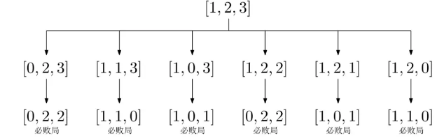
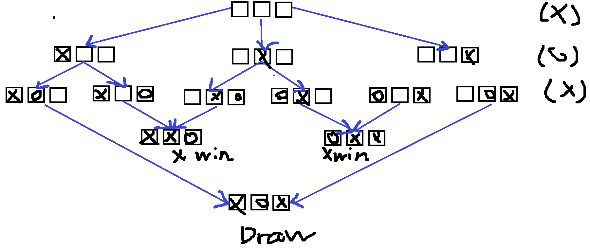
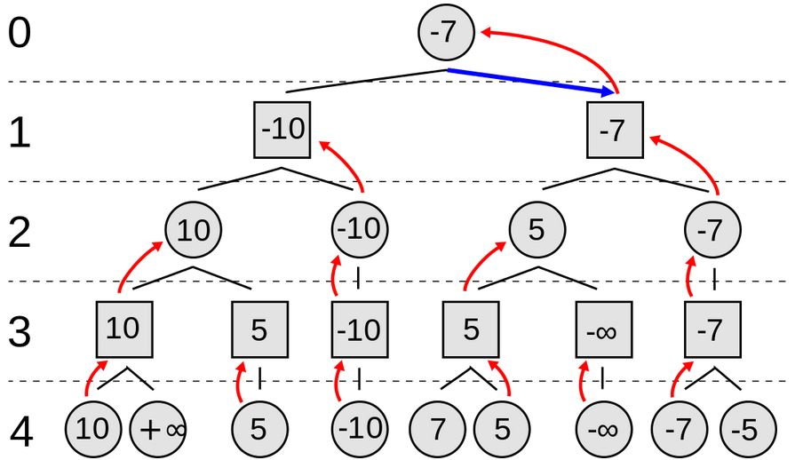
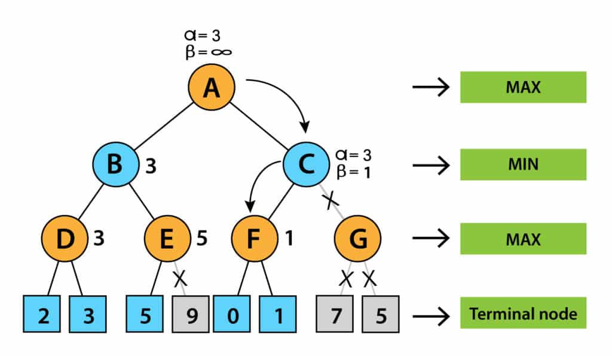

賽局理論（英語：Game Theory），又稱對策論或博弈論，是經濟學的一個重要分支。1944年，約翰·馮·諾伊曼(von Neumann) 與奧斯卡·摩根斯特恩合著了《賽局理論與經濟行為》，標誌著現代系統化賽局理論的初步形成，因此他們被譽為「賽局理論之父」。賽局理論被視為20世紀經濟學最偉大的成果之一。

目前，賽局理論廣泛應用於生物學、經濟學、國際關係、計算機科學、政治學和軍事戰略等領域，研究遊戲或賽局中各方的相互作用。作為一門數學理論與方法，它專注於分析具有競爭或對抗性質的現象，同時也是作業研究的一個重要學科。 (wiki) 

<!-- more -->

## 簡介

賽局理論（Game Theory）又稱博弈論，是個體經濟學的一個分支，討論遊戲或競爭中的個體的預測行為和實際行為，並研究它們的最佳化策略。

### 分類

> 依照遊玩形式
- 靜態 (static): 指玩家同時出招，單次賽局。
- 動態 (dynamic): 指玩家行動有先後順序，通常進行多次賽局。

> 依照玩家競爭模式

- 零和賽局 (Zero-sum game): 遊戲總值不變，輸的總和價值等於贏的總和價值。
- 非零和賽局 (non-constant-sum game): 可共同獲利，或共同損失。

> 依照遊戲性質

- 無偏/公平組合遊戲 (Impartial Game): 
    - 遊戲有兩個人參與，兩者輪流做出決策，雙方均知道遊戲的完整訊息。
    - 任一玩家在某一狀態可以做出的決策指與當前的狀態有關，與遊戲者無關。
    - 遊戲中的狀態不存在循環，且遊戲以玩家無法行動為結束，遊戲一定會在有限步之後以非平局結束。
    > 也就是說不會陷入無限狀況。
- 有偏/非公平組合遊戲 (Partizan Game):  
    - 與公平組合遊戲的區別在於遊戲者在某個確定狀態可以做出的決策與遊戲者有關，因此大部分的棋類都"不是"公平組合遊戲，因為雙方都不能使用對方的棋子。

> 依照遊戲結束條件

- 標準 (normal): 最後一個操作的人贏
- 匱乏 (misère): 最後一個操作的人輸

注意，標準跟匱乏並沒有 "平手" 的手段。

:::info
這些都可以疊加的，例如 "標準無偏動態零合賽局"，而動態靜態基本上不會寫出來，且多數都是動態的形式。
:::

另外還有很多分類會在下面才提到或不會提到。

### 策梅洛定理 (Zermelo's theorem)

對於一個組合賽局，以下三者必定有一成立
1. 先手擁有必勝策略
2. 後手擁有必勝策略
3. 兩人都有平手策略

證明: 若 A 不能必勝，則 B 存在必勝手段或者存在平手策略，反之亦然。

> 目前已經有證明出五子棋先手必勝，所以後來才引入了禁手規定，增加遊玩性，而西洋棋這類的目前不清楚是否存在先手必勝。
> 另外標準跟匱乏兩種並沒有平手的手段，根據這個定理，必定存在先手必勝或者後手必勝

## Bash game

:::info
兩人玩遊戲，總共有 $N$ 顆石頭，兩個人輪流拿，每次只能拿 $1 \sim 3$ 顆，拿走最後一顆石頭的人勝利，問先手必勝還是後手必勝。 
:::

首先，分析一下賽局類型，可以得知他是一個無偏標準賽局。並且定義 $x$ 為石頭當下的數量，所以如果其中一個玩家當下有 $x = 0$ 的石頭則輸，稍微推論一下可以得到以下結論

結論: 若可以讓對手操作後剩餘 $1, 2, 3$ 顆石頭，則我當下可以拿完全部石頭，必贏。

所以可以畫個圖來看 (從對手剩餘 x = 0 反推，能贏還輸)

| x   | win/lose |
| --- | -------- |
| 0   | 1        |
| 1   | 0        |
| 2   | 0        |
| 3   | 0        |
| 4   | 1        |
| 5   | 0        |
| 6   | 0        |
| 7   | 0        |
| 8   | 1        |

### 結論

如果熟悉動態規劃的人，也可以看出在勝利 $x$ 狀態可以轉移到 $x+1$, $x+2$, $x+3$ (使其變輸)。
並且如果小時候玩過這遊戲的話，應該也可以輕鬆得到只要 $n$ 可以被 $4$ 整除的話後手必勝。 (不難看出可以控制 $4$ 的倍數，無論對手取什麼)

> 也就是兩個人加起來拿滿4顆 (先手拿1顆 你就拿3顆)(先手拿2顆 你就拿2顆)(先手拿3顆 你就拿1顆)，且雙方都可以控制這個( $n$ 影響先後手必勝條件)。

對於畫出的每一層圖形，可以沿生出 必勝組態 以及 必敗組態

### 必勝組態&必敗組態

- 必敗組態 : $x = m*4 \space \space, m\geq 0$
- 必勝組態 : 必敗組態的補集

那麼這兩個之間的關係:

- 玩家對於當下所有任何操作都能把對手轉移到必勝態，則當下為必輸態。
- 玩家對於當下存在一種操作都能把對手轉移到必輸態，則當下為必勝態。

也就是說

- 如果玩家當下做任何操作結果都會輸，則當下為必輸態。
- 如果玩家當下存在一種操作會讓自己必贏，則當下為必勝態。

## 賽局和

:::info
在兩堆石頭中，一堆有 $N$ 個，另外一堆有 $M$ 個，兩個輪流拿，每次可以拿取其中一堆任意的 $1,2,3$ 顆石頭，最後一個拿的勝利，請問先手必勝還是後手必勝
:::

不難發現，勝利狀態$(i, j)$可以轉移的狀態有 $(i+1, j), (i+2, j), (i+3, j), (i, j-1), (i, j-2), (i, j-3)$ (使其變輸)，也就是下表

| N\M | 0   | 1   | 2   | 3   |  4   |  5   |  6   |
| --- | --- | --- | --- | --- | --- | --- | --- |
| 0   | 1   |     |     |     |  1   |     |     |
| 1   |     | 1   |     |     |     |  1   |     |
| 2   |     |     | 1   |     |     |     |  1   |
| 3   |     |     |     | 1   |     |     |     |
| 4   |  1   |     |     |     |  1   |     |     |
| 5   |     |  1   |     |     |     |  1   |     |
| 6   |     |     |  1   |     |     |     |  1   |

眼尖的你會發現，只要差值是 $4$ 的倍數的話，先手必敗。

並且這可以看成是一個 $N$ 顆 bash game + $M$ 顆 bash game，把這兩個合起來就稱為賽局和 

### 問題: 若有一堆賽局的話呢? 

如果按照之前想法，那樣會創造很多維度的轉移，很麻煩。

不過實際上，每局賽局可以分為下列兩種情況

- N (Next player win): 下一輪輪到的玩家 (先手) 獲勝。
- P (Previous player win): 上一輪輪到的玩家 (後手) 獲勝。

所以先手必勝 $\rightarrow$ $N$ 類型
後手必勝 $\rightarrow$ $P$ 類型

### 定理

:::info
令 $G_1$、$G_2$ 為兩個賽局的類別。

如果 $G_2 = P$ 則 $G_1 + G_2 = G_1$
:::

所以會發現型別為 $P$ 的賽局不論加多少進來，都不會對原本的賽局造成影響，只需要思考 $N$ 型別的結果就好。

所以假設今天有 $G_1$ $G_2$ $G_3$ 都為  $N$ 型別，$G_4$ 為 $P$，根據定理 $G_4$ 不影響整個賽局和，所以只要考慮 $G_1$ $G_2$ $G_3$，如果 $G_1 + G_2 = P$，則只需要考慮 $G_3$。

所以問題就變成 $G_1 + G_2 + G_3 + G_4 = G_3$

## Mex (mathematics)

> Minimum excluded value，簡寫直接查會是墨西哥

定義:

令 $S$ 是一個非負整數組成的集合，而 $mex(S)$ 定義為最小未出現在 $S$ 中的非負整數。

例如:

$mex(\varnothing) = 0$ 
$mex(\{1,2,3, 5, \cdots \}) = 0$
$mex(\{0,1,2,3, 5, \cdots \}) = 4$
$mex(\{0,1,2,3,4, \cdots w \}) = w+1$

> 後面會一直用到

## Nim game

:::info
有 $N$ 堆石頭，每一堆石頭有 $a_i$ 個，每次可以選其中的一堆非空的石頭堆拿至少一顆，最後一個拿的勝利，問先手獲勝或者後手獲勝。
:::

這其實就是一個賽局和，有 $N$ 個賽局合起來的遊戲。 並且每個賽局我們都可以用非負整數 $x_i$ 來表示每個賽局的狀態，且定義 $x_i = 0$ 為必輸態，正整數為必勝態(因為可以一次拿完)。

可以利用 $xor$ 去滿足以上性質
- 必輸態所有任何操作都能把對手轉移到必勝態
- 必勝態存在一種操作都能把對手轉移到必輸態

當 $0$ (必輸態) $xor$ 任何非 $0$ 正整數都會變成正整數 (必勝態)
任何非 $0$ (必勝態) 都存在一種方式使其 $xor$ 為 $0$  (必勝態)

☆之後會使用 $\oplus$ 代表 $xor$ 操作。

### xor (補充)

運算規則 $a \oplus b$
| a   | b   | result |
| --- | --- | ------ |
| 0    |  0   |   0     |
|  0   |  1   |   1     |
|  1   |  0   |     1   |
| 1   | 1   | 0      |

並且具有以下性質

- 結合率: $(a \oplus b) \oplus c = a \oplus (b \oplus c)$
- 交換率: $a \oplus b =  b \oplus a$
- 恆等: $a \oplus 0 = a$
- 歸零: $a \oplus a = 0$

換成數字的話，要轉二進位來看。

例如 $6 = (110), 5 = (101), 3 = (011)$
則 $6 \oplus 5 \oplus 3 = 0$

### 尼姆數 Nimber

> 又稱 Grundy 數，後面會用這個詞代替。

兩個數 $\alpha$ 和 $\beta$ 尼姆和定義為兩個非負整數以位元進行 $XOR$ 運算的結果，也就是

$$
\alpha + \beta = \alpha \oplus \beta
$$

而尼姆數就被定義為尼姆堆和的值，假設尼姆堆 $S$ 為 $\{a_1, a_2, \cdots, a_n\}$

$$
Nim(S) = a_1 \oplus a_2 \oplus \cdots \oplus a_n
$$

> 用石頭例子就是每一堆石頭做 xor 的結果

不妨看以下例子 $\{1, 2, 3 \}$

會發現，每個殘局的尼姆數等於 $0$，並且剛開始尼姆數也等於 $0$，可以猜測

- 輪到自己時尼姆數 $> 0$ 則必勝
- 輪到自己時尼姆數 $= 0$ 則必敗

為什麼呢?

換個例子，假設目前有 $\{5, 6, 7, 8\}$ 此時這局的尼姆數為 $5 \oplus6\oplus7\oplus8 = 12$ 也可以寫成

$$
Nim(\{5, 6, 7, 8\}) = 12 = Nim(12)
$$

同時 $\oplus$ 有歸零和恆等性質，所以有

$$
5 \oplus 6 \oplus 7 \oplus 8 \oplus 12 = Nim(\{5, 6, 7, 8, 12\}) = 0
$$

只要先手讓尼姆數變成 $0$ 就可以製造目前尼姆數永遠 = 0 的情況。

根據結合率

$$
5 \oplus 6 \oplus 7 \oplus 8 \oplus 12 = 5 \oplus 6 \oplus 7 \oplus (8 \oplus 12) = 5 \oplus 6 \oplus 7 \oplus 4 = 0
$$

所以只要讓 $8$ 石頭的那組拿掉 $4$ 顆就會使尼姆數 $= 0$

下一位因為至少需拿掉一顆石頭，所以不論做什麼都會破壞尼姆數，使其不等於 $0$，也就是說我們可以是拿到變成 $\{0, 0, 0, 0\}$ 的那個人，所以必勝。

> 換句話說，如果輪到我們的時候尼姆數 = 0，則必敗。

另外，根據結合率性質，推得只要 $xor$ 出來的結果是一樣的就都是相同的局面，換句話說，一個集合為 $\{ a_1, a_2, \cdots, a_n\}$ 的 Nim game，等價於僅有一堆數量為 $Nim(\{ a_1, a_2, \cdots, a_n\})$ 的 Nim game。

### 證明 general 形式

:::info
若目前集合 S 為 $\{ a_1, a_2, \cdots, a_n \}$ ，$a_i$ 代表每組賽局的石頭數量，則當且僅當 Nim 和為 $0$ 時，該狀態為必敗狀態，否則該狀態必勝。
:::

證明這個我們只需要證明以下三個定理

- 定理1: 沒有後繼狀態的狀態是必敗狀態。
- 定理2: 對於 $Nim(\bar{S}) \neq 0$ 時候，一定存在某個合法操作使得 $Nim(S') = 0$ 
- 定理3: 對於 $Nim(\bar{S}) = 0$ 時候，一定不存在某個合法操作使得 $Nim(S') = 0$

> $\bar{S}$ 為某個局面，$S'$ 為該局面下一個石頭狀態，合法表示有拿取至少一顆並且只拿其中一堆石頭。

對於定理1，因為遊戲性質，沒有後繼狀態的狀態只有一種可能，全部都是 $0$，所以該局面必敗，同時有 $Nim(S^*) = 0 \space$  ($S^*$ 代表最後情況)

對於定理2，不訪假設 $Nim(\bar{S}) = k \neq 0$ 若我們將其中一個 $\bar{a_i}$ 改成 $a_i'$，則 $a_i' = \bar{a_i} \oplus k$
假設 $k$ 的二進制最高位 $1$ 為 $d$，即 $2^d \leq k < 2^{d+1}$，根據 $xor$ 定義方式。存在奇數個二進制在第 $d$ 位為$1$，也就是大於 $0$，另外滿足這個條件的 $\bar{a_i}$ 也一定滿足 $\bar{a_i} > \bar{a_i} \oplus k$ (最高位會變成 $0$)，所以把 $\bar{a_i}$ 變成 $a_i'$ 是一個合法操作。

對於定理三，如果我們要將定理二的 $\bar{a_i}$ 改成 $a_i'$，根據 $xor$ 性質，我們可以得到 $a_i' = \bar{a_i} \oplus k = \bar{a_i} \oplus 0 = \bar{a_i}$，而這並不是一個合法操作，得證。

## 有向圖遊戲與SG函數

大部分無偏遊戲都可以轉成有向圖遊戲，並且根據無偏定義，不會有環，所以以下提到的有向圖也是一個有向無環圖(DAG)。

> 這也是我們的目標之一，把前面的 Nim game 轉化為可以套用在所有博奕的萬用模型

在一個有向無環圖中，只有一個起點，上面有一個棋子，兩個玩家輪流沿著有向邊推動棋子，不能走的玩家判負。

### SG 函數

對於狀態 $x$ 和他的所有 $k$ 個後繼狀態 $y_1, y_2, \cdots, y_k$，定義 $SG$ 函數

$$
SG(x) = mex(\{SG(y_1), SG(y_2), \cdots, SG(y_k)\})
$$

### Sparague-Grundy Theorem (SG定理)

而對於由 $n$ 個有向圖遊戲組成的組合遊戲，設它們的起點分別為 $s_1, s_2, \cdots, s_n$ 則有

當且僅當 $SG(s_1) \oplus SG(s_2) \oplus \cdots \oplus SG(s_n) \neq 0$ 這個遊戲是先手必勝的，同時定義這是一個組合遊戲狀態 $x$ 的 $SG$ 值。

### 證明

先略(可以用歸納法證明)。

### SG 定理應用

$SG$ 定理適用  所有公平(無偏)的兩人遊戲  ，常被用於決定遊戲的輸贏結果。

計算給定狀態的 Grundy 值，步驟一般有

- 獲取從此狀態可能的轉換
- 每個轉換都可以導致一系列獨立的博弈，計算每個獨立博弈的 Grundy 值，進行 $xor$。
- 每個轉換計算了 Grundy 值後，狀態的值是這些數字的 mex。
- 如果該值為 $0$，則當前狀態為輸，否則贏。

### 例子: 圈圈叉叉

在一個連續的三個空白格子上遊玩。先手僅能放置叉叉，後手僅能放置圈圈，每次輪到的玩家要將符號填入一個空白的格子，盤面上出現連續兩個格子中含有自己的符號時獲勝，空白格子皆被填滿時若是沒有人獲勝，則平局。

賽局需要在有限時間內結束，因此一定會有起點跟終點，然後不會有無限跟迴圈的狀況，所以一定可以畫出一個 DAG 出來，並且建邊的條件是可以從點 $v$ 轉移到點 $u$ 即可建立一條邊。

這樣就可以更明確的知道是如何轉移的。

### 將 Nim game 轉成有向圖遊戲

可以將一個有 $x$ 物品的堆視為節點 $x$ 當 $y < x$ 則節點 $x$ 可以到 $y$
則，由 $n$ 個堆組成的 Nim game 可以視為 $n$ 個有向圖遊戲。
根據上面推論，得出 $SG(x) = x$。

> 先不要看圈圈叉叉，回到拿石頭 (越拿越少才可以移動到下一個)

### $n$ 級勝態

所以如果一個 Nim game，當某堆石頭有 $a_i$ 個時候，他可以藉由操作得到 $0 \sim a_i - 1$ 狀態，定義 $0$ 級勝態為必敗態。

如果一個狀態是 $n$ 級勝態，則他能達到所有 $0 \sim n-1$ 的勝態。

example:
當前狀態可以達到 $0,1,4,5$ 級勝態，則他是 $2$ 級勝態
當前狀態可以達到 $1,2,3$ 級勝態，則他是 $0$ 級勝態
當前狀態可以達到 $0,1,2,3$ 級勝態，則他是 $4$ 級勝態

會發現要求出當前狀態的 n 級勝態，即為求出 MEX (所有可達到的狀態的集合)。

### 回顧

所以我們再來看一次 Nim game 的勝態，一堆小石頭有 $a_i$ 堆時，他為 $a_i$ 級勝態，利用尼姆數我們 xor 起來，是不是就是相當於做 $SG$ 定理呀。

:::warning
無偏賽局就是想辦法轉換為有向圖問題然後求出SG
:::

## 有偏賽局 (非公平組合遊戲)

這部分超難，例如證明西洋棋先後手必勝問題。所以我也只提我會的東西。
 
### 博弈論基本定理 (Min-max theory)

定理:

如果 $X \subseteq \mathbb{R}^n, Y \subseteq \mathbb{R}^m$ 為緊緻凸集 (compact)，$f : X \times Y \rightarrow \mathbb{R}$ 為連續的凹凸函數(即 $f(x, y)$ 對於 $x$ 是凸函數，對於 $y$ 是凹函數)，則有

$$
\max_{y\in Y} \min_{x\in X} f(x, y) = \min_{y\in Y} \max_{x\in X} f(x, y)
$$

這個常用於棋類等，且可以發現這個是應用在零和賽局。

### Alpha-beta pruning 

Alpha-beta剪枝是一種搜尋演算法，用以減少極小化極大演算法（Minimax演算法）搜尋樹的節點數。這是一種對抗性搜尋演算法，主要應用於機器遊玩的二人遊戲（如井字棋、象棋、圍棋）。當演算法評估出某策略的後續走法比之前策略的還差時，就會停止計算該策略的後續發展。該演算法和極小化極大演算法所得結論相同，但剪去了不影響最終決定的分枝。

Alpha-beta的優點是減少搜尋樹的分枝，將搜尋時間用在「更有希望」的子樹上，繼而提升搜尋深度。該演算法和極小化極大演算法一樣，都是分支限界類演算法。若節點搜尋順序達到最佳化或近似最佳化（將最佳選擇排在各節點首位），則同樣時間內搜尋深度可達極小化極大演算法的兩倍多。

> Donald Knuth和Ronald W. Moore在1975年最佳化了演算法，Judea Pearl在1982年證明了其最佳性

