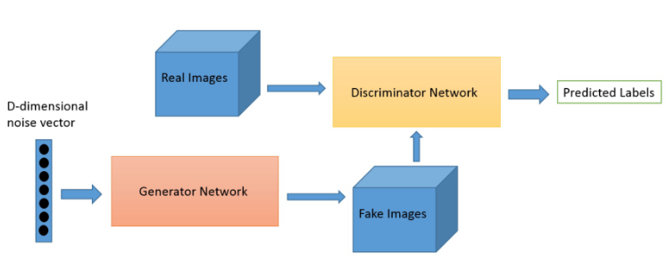
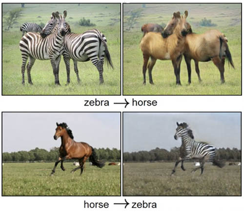
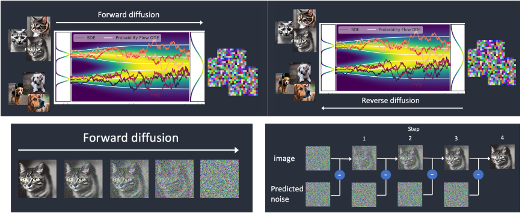
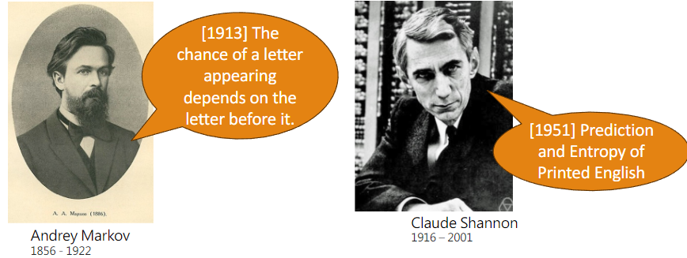
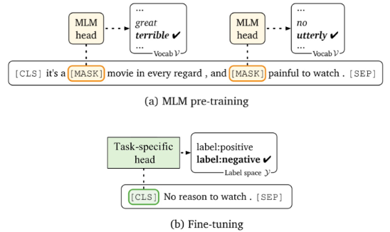

# NLP 簡介

高宏宇 - 教授 

## 生成式 AI (Generative Artificial Intelligence)

生成式 AI 是一類算法的總稱，這些算法能夠創建新穎的內容。這類算法（例如 ChatGPT）可以應用於多種形式的內容生成，包括：

- 音頻：生成新的音樂作品、聲音效果等。
- 程式代碼：自動編寫或優化程式代碼。
- 圖像：創建新的視覺藝術作品或照片般真實的圖片。
- 文字：寫作文章、翻譯或其他任何形式的文字內容。
- 視頻：生成新的動畫或模擬實景視頻。
- 其它可能的應用包括遊戲內容生成、模擬對話等。

<!-- more -->

### 原理

生成式 AI 通常基於深度學習模型，這些模型通過學習大量數據來理解和模擬特定形式的內容。例如，聊天機器人如 ChatGPT 通過學習大量文本數據來生成人類般的回答。生成型模型不僅能夠模仿學習到的內容類型，還能創作出全新的未見過的內容。

這類人工智慧的應用非常廣泛，不僅可以提高創意產業的效率，還能在教育、娛樂等領域開創新的可能性。

### 圖像生成技術
1. GAN（生成對抗網絡）：透過對抗過程，讓生成網絡和判斷網絡相互競爭，進而生成高質量的圖像。
    - NVIDIA：開發了StyleGAN2，專注於生成高解析度和高質量的圖像。
    - DeepMind：開發了BigGAN，用於生成大規模且細節豐富的圖像。
2. Stable Diffusion：Stability AI 開發的技術，可以根據文字描述生成圖像。
    - StabilityAI：推出了Stable Diffusion，支援文本到圖像的生成。
Transformer技術：
    OpenAI：開發了DALL-E和CLIP，專門從文本描述生成對應的圖像。
LeepMotion：推出了Midjourney，是一個新的圖像生成工具。
文本生成技術
3. GPT（生成預訓練變換器）：使用深度學習的變換器結構來生成連貫和有意義的文本。
    - OpenAI：推出了ChatGPT和GPT-4等系列產品。
    - Meta：開發了LLaMA2，一個高性能的語言模型。
    - Google：提供了T5、XLNet、PaLM等多種語言模型。
語音生成技術
4. GAN和VAE（變分自編碼器）：用於生成自然語音。
    - Google：WaveNet，用於生成接近真實的語音。
    - OpenAI：WaveGlow，一種結合了GAN和VAE的語音合成技術。
程式代碼生成技術
    - Seq2Seq和GPT：自動編寫或優化程式代碼。
OpenAI：推出了Copilot，幫助開發者通過建議代碼片段來提高編碼效率。

### GAN (生成對抗網路) 

Generative Adversarial Network

1. D-維噪聲向量
這是GAN的輸入，通常是隨機生成的，目的是提供初始的「種子」，從而讓生成網絡（Generator Network）可以開始生成假的圖像。
2. 生成網絡（Generator Network）
這是GAN中的核心部分之一，負責接收D-維噪聲向量作為輸入，並通過學習如何模仿真實圖像的分布，生成假的圖像（Fake Images）。生成網絡的目標是創造足夠逼真的圖像，以至於鑑別網絡（Discriminator Network）難以區分真假。
3. 假圖像（Fake Images）
由生成網絡產生的圖像，這些圖像是對真實圖像的模仿。初始階段，這些假圖像的質量可能不高，但隨著訓練的進行，它們會逐漸變得更加逼真。
4. 真實圖像（Real Images）
這些是從數據集中提取的實際圖像，用於訓練鑑別網絡，使其能夠識別出哪些是真實的，哪些是由生成網絡創造的假圖像。
5. 鑑別網絡（Discriminator Network）
GAN的另一核心部分，它的任務是區分輸入的圖像是真實的還是假的。它接收來自生成網絡的假圖像和真實圖像作為輸入，並試圖正確標記它們。
6. 預測標籤（Predicted Labels）
鑑別網絡對圖像進行分類後的結果，表明每個圖像是「真實」還是「假」的。這些預測用於訓練生成網絡和鑑別網絡，使生成網絡能夠生成更逼真的圖像，而鑑別網絡則變得更擅長於識別假圖像。

### Diffusion Model (擴散模型)

- 正向擴散（Forward Diffusion）
    - 過程：這是擴散模型的第一階段，其中原始圖像逐步被加入噪聲，直至完全變為噪聲。如圖所示，從清晰的貓的圖像開始，逐步增加噪聲，最後變成不可辨識的噪點圖案。
    - 目的：增加噪聲的過程是為了建立一個從“清晰圖像到純噪聲”的轉化映射，這一映射在模型訓練中是非常重要的。
- 反向擴散（Reverse Diffusion）
    - 過程：這是擴散模型的第二階段，通過從加噪後的圖像中逐步去除噪聲，逐漸恢復到原始或接近原始的圖像。這個過程是模型生成新圖像的核心。
    - 技術：通常使用隨機微分方程（SDE）或概率流（Probability Flow ODE）等數學工具來指導這一逆過程，確保噪聲能夠按照預定的路徑被有效去除。
應用

這種模型在生成圖像、視頻、聲音等多種媒體內容方面具有極高的應用價值，因為它可以從隨機噪聲中創建高質量的、結構化的輸出。這種模型的一大優點是生成過程的可控性和生成結果的多樣性。

### 那文字呢？

## NLP (自然語言處理)

Natural Language Processing

- 希望讓電腦理解人類語言
- 有一門課為計算語言學(基本上是一樣的事情)

### NLP Levels

1. 形態學（Morphology）
這一層次涉及到詞語的結構及基於詞根、前綴、後綴和詞形變化的詞形構造。
前綴/後綴：分析詞語的開頭和結尾，以了解它們的意義或語法功能。
詞形還原/詞幹提取：將詞語還原到基本形式，或提取詞幹以分析基本的意義。
拼寫檢查：檢測和更正文本中的拼寫錯誤。
2. 句法（Syntax）
這一層次涉及到句子的結構，如何將詞語組合成合乎語法的句子。
詞性標注：確定文本中每個詞的詞性（如名詞、動詞等）。
句法樹：創建表示句子結構的樹狀圖，顯示詞語之間的層次關係。
依存句法樹：構建展示詞語間依賴關係的圖，通常用於理解句子中各個元素的語法功能。
3. 語義（Semantics）
這一層次處理詞語和句子的意義，如何從文本中提取意義。
命名實體識別/規範化：識別文本中的專有名詞（如人名、地點等），並將其規範化為標準形式。
關係提取：從文本中識別實體之間的關係。
詞義消歧：確定在給定上下文中詞語的確切意義。
4. 語用學（Pragmatics）
這一層次涉及到語言的實際使用情境和語言的功能。
共指消解：識別文本中提到的多個表達是指向同一實體。
主題分段：將文本分割成不同的主題區塊。
摘要：提取文本的主要內容，生成摘要。

### example

給一個新聞，你需要做什麼？

- 分類
- 語言
- 分辨假新聞? 
- 摘要
- 等等

### 電腦該如何了解？

Ｑ：曾有一項調查發現，很多員工生病的時候不敢請假，因為他們擔心
老闆會不高興，覺得他們沒有責任感。有人認為，員工會這麼想是公司
的責任。一個好的公司應該能照顧員工，而不是讓他們拿健康去換錢。
因此，讓員工有幸福感，應該是未來企業努力的方向。
這篇文章說了什麼內容？

1.老闆應該給員工多一點兒假
2.常關心別人的人更有責任感
3.對公司有意見要勇敢說出來
4.照顧身體比認真工作更重要

(by 科技大擂台, 2017)

### NLP 歷史

1. 2000年代初：基礎技術的發展
    - Yoshua Bengio: 開發了神經機率語言模型，為後續的深度學習模型奠定了基礎。
關鍵技術:
    - Parsing tree（句法樹）: 用於分析句子結構。
        - TF-IDF（詞頻-逆文檔頻率）: 一種評估詞語重要性的統計方法。
        - Bag of word（詞袋模型）: 處理文本數據的基本方法，忽略語序和語法結構。
        - Vector space（向量空間）: 將文本數據轉換為向量，以便用於各種機器學習算法。
2. 2013年：語義理解的突破
    - Google: word2vec: 這是一種創新的詞嵌入方法，用於將詞語轉換成密集的向量，以更好地捉摸詞語間的語義關係。
3. 2018年：變革性的變換器架構（Transformer Era）
    - BERT（Bidirectional Encoder Representations from Transformers）: Google 開發的模型，利用雙向變換器架構，大幅提升了機器對語言的理解能力。
4. 2019 - 2020年：生成預訓練變換器的進一步發展
    - GPT-2及GPT-3: OpenAI 開發的模型，具有強大的文本生成能力，能夠創建高度連貫和有說服力的文本。
5. 2022 - 2024年：指令型生成預訓練變換器和聊天型GPT
    - Instruct-GPT和ChatGPT: 這些模型設計用於更好地理解和執行用戶指令，並與用戶進行自然的對話。
    - LLMs（Large Language Models）: 指大規模語言模型，這些模型由於其巨大的參數量和廣泛的訓練數據，展現出卓越的語言處理能力。

## 語言模型 (Language Model)

> Andrey Markov 就是在 1913 年發明馬可夫鏈的人。

<!-- 熵用於描述一個信息源發出的信息量的平均不確定性。在更技術性的語言中，熵是衡量一個隨機變數不確定性的度量。如果一個隨機變數的可能狀態多且分布均勻，它的熵就高；相反，如果這個隨機變數的取值非常確定，它的熵就低。 -->

### 學習

轉移學習（Transfer Learning）
- 轉移學習是一種機器學習方法，它允許模型首先在一個大規模的數據集上預訓練，然後在特定的任務上進行微調。這樣可以將在一個任務上學到的知識應用到其他相似的任務中。

    1. 預訓練（Pre-training）
        - 過程：通常在大規模的數據集上進行，使用的是自監督學習方法，如掩碼語言模型（Masked Language Model, MLM）。
        - 例子：如圖中的(a)部分所示，句子中的某些詞（如 "painful"）被隨機遮蔽（表示為 [MASK]），模型需預測這些被遮蔽的詞，這有助於模型學習語言的深層特征和語境。
    2. 微調（Fine-tuning）
        - 過程：預訓練完成後，模型會在特定的任務上進行微調。這通常涉及較小的數據集，這些數據集是針對特定任務標記的。
        - 例子：如圖中的(b)部分所示，使用特定於任務的頭部（例如情感分類）進行訓練，根據輸入的句子來預測特定的輸出（如標籤“positive”或“negative”）

這種預訓練和微調的方法非常高效，因為預訓練的模型已經學會了許多有用的語言表示，微調階段則讓模型能夠專注於特定任務的細節，從而在特定的應用中達到更好的性能。這一方法在自然語言處理領域非常流行，廣泛用於各種語言理解任務中。
