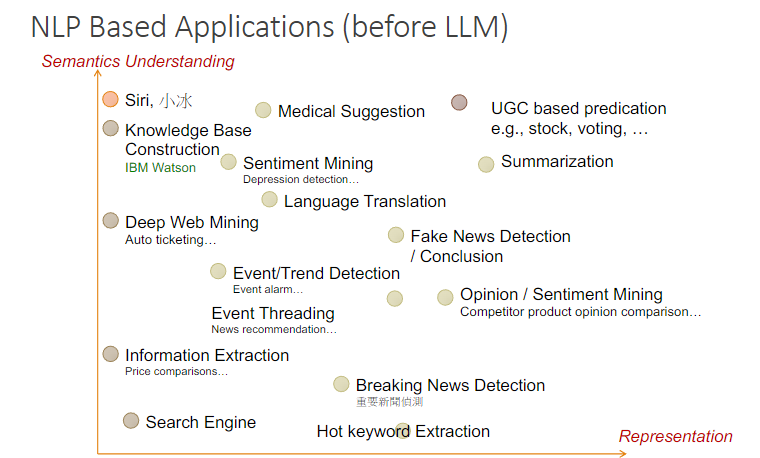
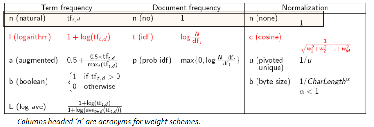
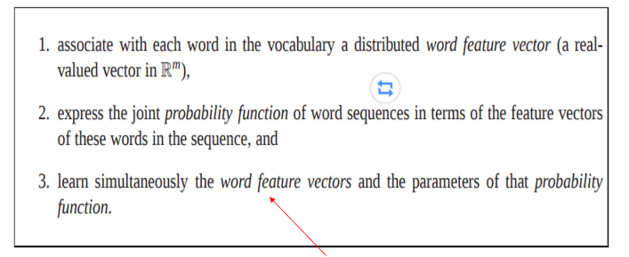
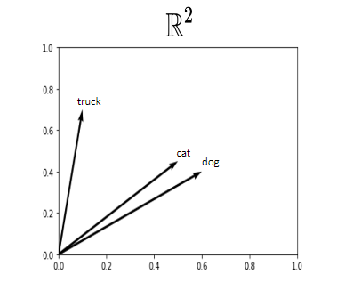
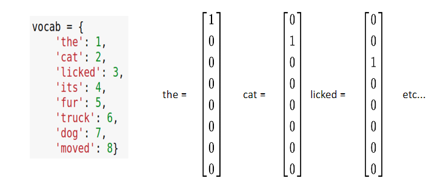
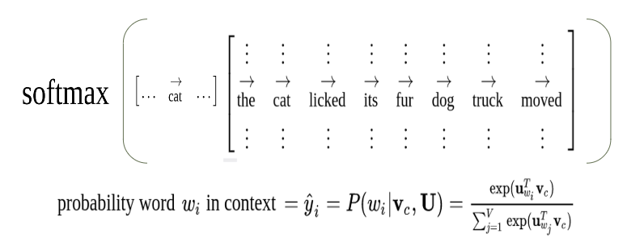
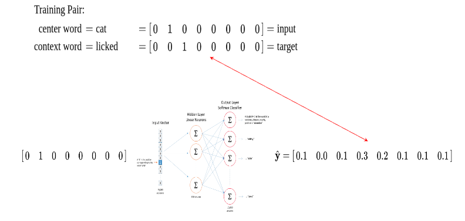
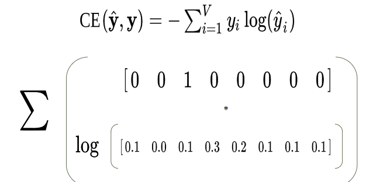

# NLP II

高宏宇 - 教授 

自然語言處理（Natural Language Processing，縮寫為 NLP）是計算機科學、人工智能和語言學的交叉學科，它的目的是讓計算機能夠理解、解釋和生成人類語言的內容。NLP 研究如何讓計算機更好地處理或模仿人類的自然語言交互。

### 語言

根據語言學角度，要理解句子的意涵，最重要的從以下幾點分析

- 分句（Splitting text into sentences）：
    - 將文本拆分成單獨的句子，便於進一步處理。
- 詞性標注（Part-of-speech tagging）：
    - 確定句子中每個單詞的詞性，如名詞、動詞等。
- 子句識別（Identifying subclauses）：
    - 在句子中識別不同類型的子句結構。
- 主語和賓語識別（Determine the subject and the direct object）：
    - 確定句子的主語和直接賓語，這對理解句子的意義非常重要。

對於人類來說，上述任務相對容易，但對計算機而言卻是一大挑戰，需要複雜的算法和大量的數據來訓練模型以達到人類的處理水平。

<!-- more -->

### Example 

Word sense ambiguity (詞意歧義)指的是一個詞在不同的語境中可能有多種不同的意思，這可能會導致理解上的混淆，特別是在語境不明確的情況下。

例子：「Watch for kids」
這個短語很好地展示了詞義歧義，因為根據“watch”的不同解釋，可以有多種含義：

- watch 作為動詞（留意、注意）：「注意孩子」

- watch 作為名詞（手錶）：這種解釋則可能理解為「為孩子準備手錶」

這兩個意思因為詞義不同，導致歧義，需要根據具體的語境來確定正確的解釋。

## 自然語言處理（NLP）

自然語言處理（Natural Language Processing，縮寫為 NLP）是一個位於以下領域交叉點的學科：

- 計算機科學（Computer Science）：處理如何用計算機來處理和分析語言數據。
- 人工智能（Artificial Intelligence）：目標是讓機器能夠模擬和理解人類語言的能力。
- 語言學（Linguistics）：研究語言的結構和意義，幫助理解語言的規則和使用方式。

但想達成目標其實是一件很困難的事情，主要有以下兩點。
- 語言理解的複雜性：完全理解並準確表示語言的意義（甚至只是給出一個準確的定義）是一個非常困難的目標。語言包含豐富的上下文、模糊性、文化背景和情感，這些都使其很難精確地用機器進行表達和處理。
- AI 完整性（AI-complete）：根據 Christopher Manning 的說法，完美的語言理解被視為 AI 完整性 問題，這意味著它的難度相當於解決整個人工智能領域的終極目標。換句話說，如果我們能實現完美的語言理解，那麼我們將會解決整個人工智能的核心挑戰。

### 應用

## 自然語言處理（NLP）難點：

1. 正確識別名詞短語的角色
    - 問題：名詞短語（noun phrases）在句子中可能扮演多種角色，如主語、賓語、屬性等。由於語言中的模糊性，NLP 系統很難準確區分它們的功能，尤其是當句子結構複雜或具有多層嵌套時。
    - 例子：在句子「The book on the table belongs to John」中，名詞短語「the book」和「the table」的角色容易混淆。
2. 抽象概念的表示
    - 問題：許多詞語和概念是抽象的，難以通過具體的物理表示來描述。NLP 系統很難對這些抽象概念進行準確的語義表示。
    - 例子：如「愛」或「自由」這樣的抽象概念，NLP 系統很難捕捉其精確的含義，因為它們依賴於上下文和文化背景。
3. 同義詞的分類
    - 問題：語言中存在大量同義詞，儘管它們在不同上下文中具有相似的含義，但實際使用上可能有細微的差異。NLP 系統有時難以正確區分這些詞語的語義差異。
    - 例子：「快樂」和「高興」在某些情況下可能可以互換使用，但它們可能代表不同的情感強度。
4. 表示概念的數量
    - 問題：自然語言中，數量是通過不同方式表示的，這可能會使 NLP 系統難以準確理解和表示。這種挑戰在語言轉換或摘要生成中尤其明顯。
    - 例子：在句子「She has three apples」和「She has a few apples」中，雖然數量表述不同，但都表示某種數量概念，NLP 系統需要準確理解並區分這些表達。

:::warning
請注意，中文和英文還是有非常大的不同，中文又比英文更加複雜難理解 !!
:::

## Vector-space Model

### 索引（Indexing）

- 倒排索引（Inverted Index）
    - 概念：倒排索引是一種針對大規模文檔集合的有效索引方式。它將詞彙與其在文檔集合中的出現位置關聯起來。
    - 詞項（Terms）：詞彙項目是詞語或表達方式的具體單位。
    - 詞彙表（Vocabulary, V）：一個集合，包含了所有感興趣的詞彙或詞項。
- 倒排索引的簡單例子：
    - 字典結構：倒排索引的基本形式可以類比於字典。
    - 每個鍵（key）是詞項 𝑤∈𝑉，即詞彙表中的一個詞。
相關的值 
    - b(𝑤) 指向一個「桶」或「發布列表」（posting list），該列表包含指向文檔中所有出現該詞的地方的指針。

### Vector-space Model

在向量空間模型中，**文檔**被表示為一個高維向量，該向量的每個維度代表文檔中的一個詞項。這種方法將文本轉化為數學表示，從而可以用數學方法計算和比較文檔之間的相似性。

### 文檔表示為向量
每個文檔 $d$ 都表示為一個詞項的序列：

$$
d = (w(1), w(2), w(3), ..., w(|d|))
$$

- $w(1), w(2), w(3)$ 是文檔中的詞項，文檔 $d$ 是由這些詞項組成的向量。

### 稀疏表示
向量空間的維度非常高，因為文檔語料庫中的**詞彙表大小 $|V|$** 通常遠遠大於單個文檔中包含的詞項數量 $|d|$。因此，文檔向量往往是**稀疏的**，即大部分維度的值為零。

## TF-IDF

### 詞頻（Term Frequency, TF）

- **定義**：某個詞項在文檔中出現的頻率（Term Frequency, TF）反映了它在該文檔中的重要性。
- **公式**：詞項 $w_j$ 在文檔 $d_i$ 中的出現次數為 $n_{ij}$，其詞頻為：
$$
\text{TF}_{ij} = \frac{n_{ij}}{|d_i|}
$$
- 如果一個詞在文檔中多次出現，則該詞對該文檔的重要性通常較高。

### 逆文檔頻率（Inverse Document Frequency, IDF）

- **定義**：逆文檔頻率（IDF）反映詞項在語料庫中區別不同文檔的能力。如果一個詞項僅出現在少數文檔中，它往往對區分文檔更有幫助。
- **公式**：詞項 $w_j$ 出現在 $n_j$ 個文檔中，而語料庫總文檔數為 $n$，其 IDF 為：
$$
\text{IDF}_j = \log \left( \frac{n}{n_j} \right)
$$
- 當 $n_j$ 越小，即該詞項出現在的文檔數越少，該詞的區別能力越強，IDF 值越大。

### TF-IDF
- **綜合公式**：TF 和 IDF 綜合起來，可以計算一個詞項在文檔中的重要性：

$$
\text{TF-IDF}_{ij} = \text{TF}_{ij} \times \text{IDF}_j
$$

- 詞項 $w_j$ 在文檔 $d_i$ 中的重要性由其 TF 和 IDF 的乘積決定。TF 評估詞項在文檔中的相對頻率，而 IDF 衡量詞項在整個語料庫中區分文檔的能力。

## BM25

Okapi BM25 是一種用於信息檢索的排名函數，主要應用於搜索引擎中，用來根據給定查詢計算相關文檔的排名。它是 TF-IDF 的替代方案，並且比傳統的 TF-IDF 更精確。

$k$ 和 $b$ 是 BM25 的自由參數，可以調整以優化模型性能。
通常，$k=2$，$b=0.75$ 是經常使用的默認值。
BM25 通常表示為以下公式：

$$
\text{BM25}(q, D) = \sum_{i=1}^{n} \text{IDF}(w_i) \cdot \frac{f(w_i, D) \cdot (k+1)}{f(w_i, D) + k \cdot (1 - b + b \cdot \frac{|D|}{\text{avgdl}})}
$$

其中：
- $q$ 是查詢，$D$ 是文檔
- $w_i$ 是查詢中的詞項
- $f(w_i, D)$ 是詞項 $w_i$ 在文檔 $D$ 中的出現次數
- $|D|$ 是文檔 $D$ 的長度（詞語數量）
- $\text{avgdl}$ 是語料庫中文檔的平均長度
- $\text{IDF}(w_i)$ 是詞項 $w_i$ 的逆文檔頻率

參數解釋
$k$：控制詞頻的飽和程度，當詞頻非常高時，增加的影響會減少。$k$ 值越高，詞頻對得分的影響越大。
$b$：控制文檔長度的規範化程度。$b=1$ 表示完全規範化，$b=0$ 則忽略文檔長度的影響。

## 語詞表示

### Synonymy 和 Polysemy

#### 1. **Synonymy（同義詞）**
- **定義**：同一個概念可以用不同的詞語表達。
- **例子**：如「bandit（強盜）」、「brigand（土匪）」、「thief（小偷）」。
- **對檢索的影響**：同義詞可能會**負面影響召回率（recall）**。因為檢索系統可能只匹配了其中一個詞語，而錯過了其他同義詞所表達的相關文檔。

#### 2. **Polysemy（一詞多義）**
- **定義**：相同的詞語在不同的語義上下文中可能有完全不同的含義。
- **例子**：「bank」可以指：
  - 存儲重要物品的場所，如「血庫」（repository where important material is saved）。
  - 水體旁邊的斜坡，如「河岸」（the slope beside a body of water）。
- **對檢索的影響**：多義詞可能會**負面影響精確率（precision）**。檢索系統可能會錯誤地匹配到與查詢詞義無關的文檔。

#### 3. **混合情況（Hybrid cases）**
有些情況下，同義詞和多義詞問題會混合存在，使得檢索系統難以準確匹配查詢與文檔的真正語義。

### 概念匹配 v.s. 詞語匹配

- **問題**：查詢與文檔在概念上可能非常接近，但對應的**餘弦相似度（cosine similarity）** 較小，原因包括：
  - 使用了不同的語言表達：
    - 如「計程車」、「出租車」都指代**出租車**。
  - 使用了不同領域的專業詞彙：
    - 如「智慧型行動運算裝置」與「手機」，「高效能溫度調節器」與「冰箱」。
  - 字典中只出現了極小部分的同義詞：
    - 如「COVID-19」、「新冠病毒」、「SARS-CoV-2病毒」等指代相同的病毒。

## 突破性論文 《A Neural Probabilistic Language Model》

Bengio 等人在 2003 年發表的重要論文《A Neural Probabilistic Language Model》

### 分布式詞特徵向量：

- **定義**：詞彙中的每個詞都與一個分布式詞特徵向量相關聯，這是一個實數向量，屬於 $\mathbb{R}^m$ 空間。這表示詞在連續向量空間中的嵌入，其中每個維度捕捉詞的某些語義或語法屬性。

### 詞序列的聯合概率函數：

- **運作方式**：模型根據序列中詞的特徵向量來表達詞序列的聯合概率函數。這種方法允許模型使用連續詞表示來估計語言中詞序列的可能性，從而更有效地捕捉詞之間的依賴性。

### 特徵向量和概率函數參數的同時學習：

- **方法**：詞特徵向量和概率函數的參數是同時學習的。這種一體化學習方法有助於以更好地捕捉正在建模的語言數據的統計屬性的方式調整詞向量和模型參數。

### 例子

舉個例子，狗狗跟貓咪會比卡車來的接近。
餵食貓咪，可以用狗狗來取代，但用同樣是名詞的卡車就非常的不合適。

## Latent Semantic Indexing (LSI)

**Latent Semantic Indexing (LSI)** 是一種統計技術，使用 SVD 來處理文本數據。LSI 旨在估計隱藏在給定概念生成詞彙的結構，並發現詞彙與概念之間最重要的關聯模式。

### 基本原理和應用
LSI 是數據驅動的，通常需要大量的句子或文檔集合來有效執行。以下是LSI處理文本文件的具體步驟和方法：

#### 1. **構建術語-文檔矩陣 (Term-Document Matrix)**
- **矩陣 $X$ 表示**：
  - $X$ 是一個術語-文檔矩陣，其中 $X = [x_1 ... x_n]^T$。
  - 每一行代表一個文檔的向量空間表示。
  - 每一列包含數據集中每個文檔中該術語的出現次數。

#### 2. **執行奇異值分解 (SVD)**
- **計算 $X$ 的 SVD**：
  - SVD 將矩陣 $X$ 分解為三個矩陣 $U$、$S$ 和 $V^T$，其中 $S$ 是對角矩陣，包含奇異值。
  - 奇異值矩陣 $S$ 中的值反映了術語和文檔矩陣中模式的重要性。

#### 3. **降維和數據重構**
- **保留最大的 K 個奇異值**：
  - 將除了最大的 $K$ 個奇異值之外的所有奇異值設為零，這一步稱為降維。
  - 使用降維後的矩陣 $U$、$S$ 和 $V^T$ 重新構造矩陣 $X$，得到近似矩陣 $\hat{X}$：
    $$
    \hat{X} = U \hat{S} V^T
    $$
  - 這一步有助於去除數據中的噪聲和不重要的信息，突出最重要的語義和概念結構。

### LSI 的優勢
LSI能有效地改善信息檢索的質量，通過識別和利用文檔中的潛在語義結構。這使得它在處理同義詞和多義詞問題時特別有用，有助於提高搜索引擎的準確性和相關性。

LSI 是自然語言處理和信息檢索中一個強大的工具，被廣泛用於各種應用，從搜索引擎優化到用戶行為分析等。

### LSI 大缺點

- 矩陣維度還是和詞彙量相同，處理矩陣的 SVD 效率太差了 $O(N^3)$，根本不可能。
- 增加新單詞，會整個需要重解，沒有容錯。

## 概率模型

#### 1. **單元語言模型（Unary language model）**
- **公式**：
  $$
  P(w_1, \dots, w_n) = \prod_i P(w_i)
  $$
- **評論**：不考慮詞序是荒謬的。此模型假設詞彙的出現是獨立的，忽略了詞語之間的依賴性。

#### 2. **二元語言模型（Binary language model）**
- **公式**：
  $$
  P(w_1, \dots, w_n) = \prod_i P(w_i \mid w_{i-1})
  $$
- **評論**：這種模型比單元模型好，因為它考慮了鄰近的詞語依賴，但仍受限於短距離上下文的限制。

#### 3. **word2vec 模型**
- **連續詞袋模型（Continuous Bag of Words, CBOW）**
  - **公式**：
    $$
    P(w_c \mid w_{c-m}, \dots, w_{c-1}, w_{c+1}, \dots, w_{c+m})
    $$
  - **例子**：「The cat [center word] its fur」，中心詞為 "its"，使用其左右的詞來預測。

- **跳躍模型（Skip-Gram）**
  - **公式**：
    $$
    P(w_{c-m}, \dots, w_{c-1}, w_{c+1}, \dots, w_{c+m} \mid w_c)
    $$
  - **例子**：左側上下文為 "The cat"，中心詞為 "licked"，右側上下文為 "fur"。

### 評論
這些模型試圖用不同的方式捕捉詞語之間的語義和語法關係。單元和二元模型較為基本，著重於詞語的獨立性或與前一詞的關係。而 word2vec 的兩種模式，CBOW 和 Skip-Gram，則通過考慮一個更寬的上下文窗口來增強對詞語間複雜關係的捕捉，能更好地處理詞義多樣性和豐富的語境信息。

## 生成概率估計

1. **輸入向量選擇**
   - 輸入向量從隱藏層矩陣中選擇輸入嵌入。

2. **Softmax 運算**
   - 通過與輸出矩陣的乘法操作後應用 Softmax，創建一個詞彙表上的概率分佈。
   - 對於上下文中的詞這個概率應該高，對於其他詞則低。

### 損失函數

- 交叉熵用來衡量概率分佈之間的距離。

### GloVe（全局向量）
- word2vec 在學習相似性和線性規律方面表現出色。
- 但它沒有充分利用共現統計信息。
- GloVe 通過考慮全局統計信息改進了 word2vec。
- 預訓練向量：[https://nlp.stanford.edu/projects/glove/](https://nlp.stanford.edu/projects/glove/)

### FastText
- FastText 是更新的技術，也展示了良好的結果。
- 考慮字符級特徵，因此可以對詞表外的詞進行猜測和生成向量，利用形態學中的模式。
- 預訓練向量可支持多種語言：[https://fasttext.cc/](https://fasttext.cc/)