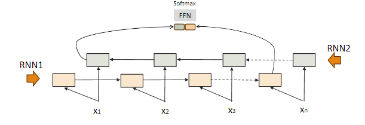

# NLP word embedding and RNN

高宏宇 - 教授

## N-grams

**N-gram** 是一個包含 n 個單詞的序列。通過不同數量的單詞組合，N-gram 模型可以捕捉語言中的上下文關係。

- **1-gram（unigram）**：單詞序列中的每個單詞單獨作為一個項目，例如：
  - "please"
  - "turn"
  - "your"
  - "homework"
- **2-gram（bigram）**：兩個連續的單詞組合，例如：
  - "please turn"
  - "turn your"
  - "your homework"
- **3-gram（trigram）**：三個連續的單詞組合，例如：
  - "please turn your"
  - "turn your homework"
- **N-gram** 模型可擴展至更高的數值，例如 4-gram、n-gram 等。

<!-- more -->

### N-gram 語言模型

我們可以使用一種簡單的統計方法來構建 N-gram 語言模型，該模型依賴於計算特定 n-gram 在語料庫中出現的次數。該方法假設詞語的出現僅取決於前 n-1 個詞，而不考慮更長距離的語境。

### Bi-gram 模型示例

假設有以下句子：

- "I want to eat lunch."
- "I want to eat Chinese food."
- "I don't want to spend time cooking."

在 Bi-gram 模型中，我們需要統計每個二元詞組出現的次數。例如：

- $C(\text{I want}) = 2$
- $C(\text{want to}) = 3$
- $C(\text{spend time}) = 1$

這樣的模型可以通過統計不同 n-gram 的出現次數來預測接下來的單詞，從而達到基本的語言生成和建模的效果。

### 模型比較

#### 1. **N-Gram 語言模型**
- **定義**：一種純粹的統計模型，基於先前出現的 $n-1$ 個詞來預測接下來的詞，並計算詞序列的出現概率。
- **特點**：N-Gram 模型簡單易用，但它僅考慮有限的上下文，難以捕捉長距離依賴。

#### 2. **神經網絡語言模型（Neural Language Models）**
- **定義**：利用神經網絡來預測詞語序列的可能性，通過學習詞向量來捕捉語義和語法關係。
- **特點**：相比 N-Gram 模型，神經網絡語言模型能更好地處理長距離依賴，並且能學習到更豐富的語言結構。

## 困惑度（Perplexity, PPL）

**困惑度（Perplexity, PPL）** 是一種量化標準，用來評估語言模型的能力或效果。

- **定義**：給定詞語序列和一個 N-gram 模型，困惑度是通過以下公式計算的：
  
  $$ PPL = 2^{-\frac{1}{N} \sum_{i=1}^N \log_2 P(w_i \mid w_{i-1}, w_{i-2}, \dots)} $$

- **解釋**：困惑度值越低，表示語言模型的能力越好，能更準確地進行詞語預測。

### 意義

1. **不確定性的度量**：
   - 困惑度量化了模型在進行預測時所面臨的不確定性或不可預測性。
2. **平均分支因子**：
   - 困惑度可以視為在每個序列步驟中「平均分支因子」的度量，表示在每一步中模型可能選擇的選項數量。
3. **模型表現的量化**：
   - 在語言建模中，困惑度反映了模型對語言規則和結構的理解程度。
   - 困惑度越低，表明模型對語言的理解和預測能力越好，表明模型能有效捕捉語言模式。
4. **壓縮效率的指標**：
   - 困惑度也可以視為模型如何有效壓縮測試數據的度量。
   - 困惑度越低，表示模型以更高的概率進行預測，減少了不確定性，從而有效地壓縮了信息。

## Word Embedding

**Word Embedding** 是一種將詞語表示為連續向量的技術，這些向量能夠捕捉詞語之間的語義和語法關係。

#### 1. **概念空間（Concept Space）**
- **定義**：概念空間是指詞嵌入向量所在的向量空間，詞語以稠密向量的形式分布在這個空間中，能夠反映詞語之間的語義相似性。

#### 2. **詞項向量（Term Vector）**
- **定義**：詞項向量是指每個詞語對應的一個稠密向量，這些向量用來表示詞語在概念空間中的位置。

#### 3. **稠密向量（Dense Vectors）**
- **定義**：稠密向量嵌入將詞語表示在連續的向量空間中，詞語之間的相似性可以根據向量之間的距離來衡量。
- **特性**：語義相似的詞會在空間中靠得更近。

#### 4. **Word2Vec**
- **Word2Vec** 是一種常用的詞嵌入方法，它基於上下文來學習詞語的向量表示，能夠捕捉到詞語的語義信息。

#### 5. **上下文嵌入（Contextualized Embeddings）**
- **定義**：上下文嵌入會根據詞語所處的語境來動態調整詞嵌入向量，讓相同的詞在不同的語境中可以有不同的表示。

### 嵌入的特性

1. **類比關係/關聯相似性**
   - 詞嵌入可以捕捉詞語之間的類比關係。例如：
     $$
     \text{Washington} - \text{U.S.} = \text{London} - \text{U.K.} 
     $$
     
     $$ 
     \text{Washington} - \text{U.S.} + \text{U.K.} = \text{London} 
     $$

## Word2Vec

**Word2Vec** 是一種詞嵌入技術，通過將詞語表示為向量，捕捉詞語的語義關係。Word2Vec 有兩種主要的模型架構：**Skip-gram** 和 **CBOW**。

#### 1. **Skip-gram**
- **定義**：使用目標詞來預測其上下文詞語。
- **原理**：Skip-gram 模型的目標是給定一個中心詞，預測這個詞周圍的上下文詞語。這使得模型能夠學習到詞與其上下文的語義聯繫，特別適合於處理稀疏數據。

#### 2. **CBOW（Continuous Bag of Words）**
- **定義**：使用上下文詞來預測目標詞。
- **原理**：CBOW 模型的目標是根據周圍的上下文詞語來預測中心詞。這種模型利用上下文信息來預測詞語，對於捕捉局部語境非常有效。

### Word2Vec 流程

#### 1. **將目標詞與其鄰近的上下文詞作為正樣本**

#### 2. **隨機從詞彙表中抽取其他詞作為負樣本**

#### 3. **使用邏輯回歸訓練分類器以區分正負樣本**

#### 4. **使用學到的權重作為嵌入向量**

### 上下文嵌入（Contextualized Word Embeddings）

**上下文嵌入** 是一種將詞嵌入與模型緊密結合的技術。它能根據具體任務的上下文動態調整詞語的表示，使模型能夠更好地理解詞語在不同上下文中的語義。

#### 1. **嵌入設計為模型的一部分**
  
#### 2. **根據下游任務調整**

### 神經網絡架構中的嵌入層和語言模型層

- 在神經網絡架構中，詞嵌入層通常作為輸入層，將詞語轉換為向量。
- 語言模型層（LM Layers）則可以進一步處理這些嵌入，捕捉更多的語法和語義信息。

## 神經語言模型

需要一個模型結構來處理嵌入中的隱藏特徵。神經語言模型利用神經網絡來學習和表示複雜的語言模式。

- **FFN（前饋神經網絡，Feedforward Network）**
- **RNN（循環神經網絡，Recurrent Neural Networks）**

### 深度學習基礎

1. **模型（Model）**
   - 模型指的是用來表示輸入數據與輸出預測之間關係的架構或結構。
2. **優化器（Optimizer）**
   - 優化器是一種算法，用於在訓練過程中調整模型的參數，以最小化預測值與實際輸出值之間的誤差。
3. **損失函數（Loss Function）**
   - 損失函數（目標函數）用來衡量模型的預測輸出與真實目標輸出之間的差異。

### 訓練神經網絡

訓練過程通常包括以下步驟：

1. **數據準備**：準備訓練和測試數據集。
2. **模型構建**：使用深度學習框架（TensorFlow, PyTorch 等）構建模型。
3. **損失函數定義**：選擇適當的損失函數。（交叉熵，Logloss 等）
4. **優化器選擇**：選擇合適的優化算法。（Adam, SGD 等）
5. **模型訓練**：使用訓練數據集訓練模型。
6. **模型評估**：使用測試數據集評估訓練好的模型。（F1, LCS 等）

### 激活函數

- 使用激活函數的核心思想是為神經網絡引入非線性。
- 神經網絡模型旨在避免最終的處理階段僅僅是輸入的線性變換，從而使模型能夠在複雜問題上有良好的表現。
- 常用的激活函數包括：Sigmoid, ReLU, tanh, GeLU。

## FFN

### 前饋神經網絡（FFN）

- 前饋神經網絡（FFN）是一種多層的前饋網絡，網絡中的單元之間的連接沒有循環。

### 前饋神經網絡（FFN）的缺點

- **缺乏序列建模**：
  - 在自然語言處理（NLP）任務中，理解詞語的順序及其依賴關係對準確的預測至關重要。
- **固定輸入大小**：
  - FFN 需要固定大小的輸入，這在 NLP 任務中會產生問題，因為輸入序列的長度通常是變化的。
- **有限的上下文信息**：
  - 許多 NLP 任務需要捕捉長距依賴性和理解文本的廣泛上下文，而這些更適合能夠有效建模序列數據的模型。

## RNN

### 遞歸神經網絡（RNN）

- 在時間 $t$ 的方程式如下：
   $$ y_t = g(Vh_t) $$
   $$ h_t = f(Ux_t + Wh_{t-1}) $$
- 其中 $f$ 和 $g$ 是激活函數。

### RNN 的特性

- **序列處理**：
  - RNN 能處理序列數據，允許它們模擬數據中的時間依賴性。
- **遞歸連接**：
  - RNN 維持內部記憶，有助於捕捉長期依賴。
- **參數共享**：
  - RNN 在不同時間共享參數，增強了學習序列數據的效率。
- **梯度消失問題**：
  - 傳統的 RNN 可能會遇到梯度消失的問題，這阻礙了長期依賴的學習。

## RNN 應用

### RNN 應用於命名實體識別（NER）

- 在標記分類任務中，每個輸出應該映射到一個 one-hot 向量。
- 在 RNN 模型中增加了一個前饋網絡。

### RNN 應用於序列分類

- RNN 用於對整個序列進行分類，而不是序列中的單個標記。
- 取文本最後一個標記的隱藏層。

### 堆疊式 RNNs

- 堆疊式 RNNs 由多個網絡組成，其中一層的輸出作為後續層的輸入。

- **堆疊式 RNNs 通常比單層網絡表現更好**：
  - 網絡在不同層次上誘導不同程度的抽象表示。
  - 堆疊網絡的初始層會產生有用的抽象表示，這些表示可以為後續層提供支持。
- **然而，隨著堆疊層數增加，訓練成本也會快速上升**。

### 雙向 RNNs

- **在許多應用中，RNN 需要訪問整個輸入序列**。
- **引入了雙向 RNN**：
  - 它結合了兩個獨立的雙向 RNN，一個從頭到尾處理輸入，另一個則從尾到頭處理。

### 用於序列分類的雙向 RNNs

- **來自前向和後向傳遞的最終隱藏單元結合在一起，表示整個序列**。
- **這個結合的表示作為後續分類器的輸入**。

## 總結

- **語言模型（LM）**：為詞語序列賦予概率的模型。
- **N-gram 語言模型（LM）**：傳統的統計語言模型。

### 嵌入方法：
- **稀疏向量（Sparse vectors）**：使用上下文來編碼詞嵌入。（如 TF-IDF, PPMI）
- **稠密向量（Dense vectors）**：應用自監督學習來生成。（如 Word2Vec, Contextualized Embeddings）

### 神經語言模型（Neural LMs）：
- **FFN**：全連接的稠密神經網絡。
- **RNN**：循環神經網絡，儲存時間序列的隱藏狀態。

<!-- ## 總結 

### How

把文章切句子，找詞性 (主詞 名詞 動詞) by 語言學，可以理解句子
對於古老方式這很難，不過現在有 GPT 那些的

### Word sense ambiguity 

有多種意思的話，怎麼理解? 

ex: Watch for kids ? 
是小孩手錶 or 注意小孩活動告示? 

- 很有趣 back Translation 
    ex:  把中文翻英文 再把英文翻中文 大概有一半會不一樣
    
## 舊方法

用一些方法找出關鍵字，然後分類 (example: 好/壞)。

像這張圖，那如果出現了紅色的 "新鮮" 和 "價位低"，要怎麼知道是好還是壞呢? 又或者是罕見詞出現呢？

希望比較彈性一點

### One-hot encoding 

壞處: 
- 必須要同樣字才行
- 向量太大了，效率很有問題

但以前沒辦法只能這樣做

### Word embedding(dense space)

(2000~2014) 左右。

所以需要壓縮一下空間。 使向量短，且彼此間可能有所關連。

使之後如果遇到比較不一樣的字詞，可以評估到底是哪一種分類。

### Synonymy and Polysemy

因為語言有

Synonymy (同義詞)

Polysemy (一詞多義)

可能會產生模糊的狀況

### Concept matching v.s. term matching 

不同領域間會使用不同的字詞
(計程車，出租車)

(智慧型行動裝置，手機)

或者是專有名詞 ex (COVID-19，新冠病毒，武漢肺炎)

### How do we represent the meaning of a word 

wordnet 有建立一些資料集合

但後來發現建立不完，所以其實也不太好用。

### Continuous, Distributed 

### Language Model

(Andrey Markov, Claude Shannon)
: 大語言模型是一個接龍遊戲

GPT 只知道接龍，不知道語意 (但其實不太對)

轉成 vector space 比較 dense 就可算出彼此間的相關性，不須處理比較長的 vector

ex: RAG LLM 

但也造成了他學會了一些歧視 (例如 男生醫生 女生護士)。

### Distributional Hypothesis

相似的詞會在類似的地方

ex: The cat licked its fur 
The dog licked its fur

但不會出現 eat run bite 或者 wheel truck 

大型語言就是這樣靠自我監督，慢慢把彼此間關聯。

其實之前 NLP 的時候就有了。 1990 

- 有出現不見得是相關
- 沒出現不見得是相關

LSI 用統計方式，再用 SVD 把重要成份取出來，但現在這個方法不好。

- 矩陣很大 ex: 100000\*100000 跑 SVD 很麻煩
- 運算量太高，不太適用
- 不過感覺很厲害，在那時候是很厲害的一種想法

### Probabilistic Model

用條件機率的方式來做處理

> 感覺有點類似馬可夫過程

### Model Parameters 

- 有個前提，如果一個類神經網路，可以透過加加減減得到後面的文字。懂得文字的意思，那中間的幾百個數字是不是能很清楚代表文字的意思？

很像 GPT 背了一堆書，你給他開頭，他回答了一串文字，那這樣他是不懂嗎？ 好像也說不過去，但你說他懂，但他好像只是會背書。

### What vectors should I use -- it depends 

 -->