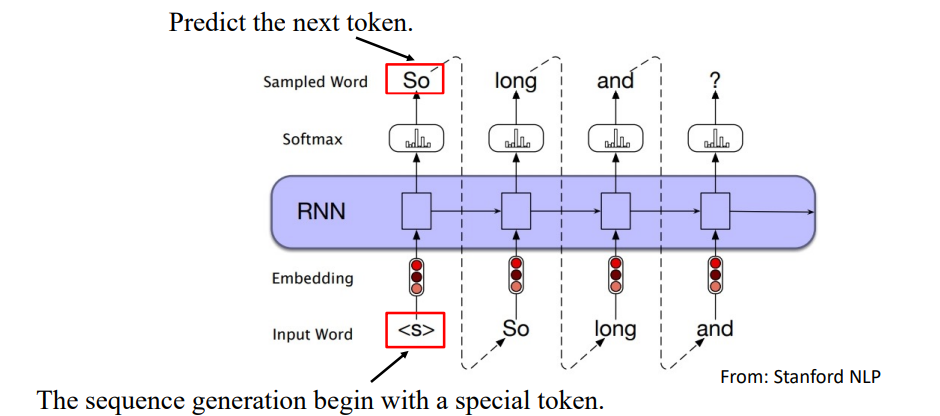
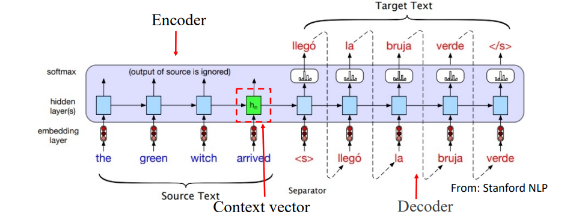
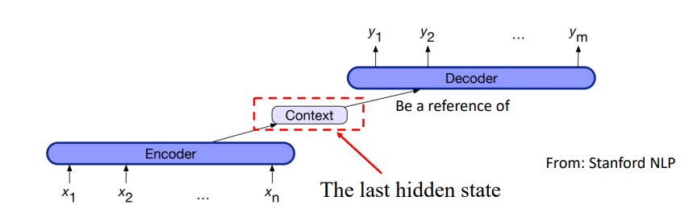
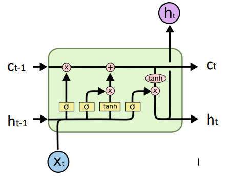
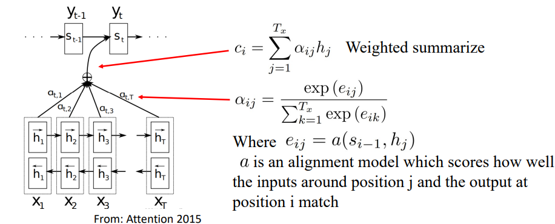
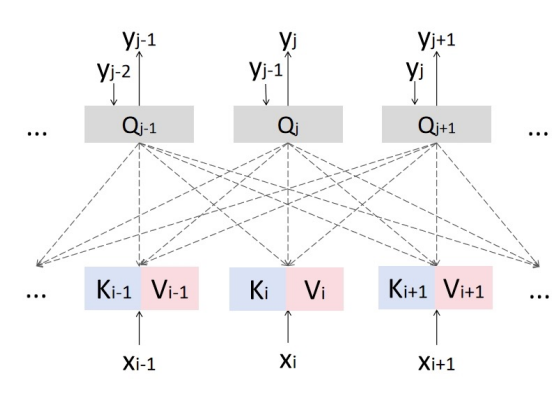

# NLP Sequence-to-sequnce Model

高宏宇 - 教授

## 前言

### 機器翻譯

**機器翻譯** 在自然語言處理（NLP）的發展中起到了關鍵作用。
- 許多 NLP 語言模型的進展最初是由解決翻譯問題的需求所推動的。

#### 序列到序列模型（Sequence-to-sequence Models）和注意力機制（Attention Mechanisms）

- **例子**：`HOW DARE YOU!` → `你怎麼敢！`

<!-- more -->

---

### 機器翻譯的挑戰

- 與分類等其他任務不同，**機器翻譯的輸入和輸出具有不同的長度**。
  - **×** 我們不能簡單地在最後加一個前饋神經網絡（FFN）。
  - **√** 隱藏狀態應用於編碼原始序列，並且應將其傳遞到生成過程中。

## Sequence to sequence Model 

### 序列到序列模型（Sequence to Sequence Model）

**序列到序列模型（Seq2Seq）** 的核心思想是將可變長度的輸入序列映射到可變長度的輸出序列。

這種靈活性使其在各種任務中廣泛應用，例如：

- **機器翻譯**：將一句話從一種語言翻譯到另一種語言。
- **文本摘要**：將長篇文章濃縮為較短的摘要。
- **對話生成**：根據輸入的上下文生成適當的回應。

### 序列模型（Sequential Models）

**序列模型**，也稱為時間序列模型，是一類神經網絡架構，專門用於建模數據序列。

常見的序列模型包括：
- **RNN（遞歸神經網絡）**
- **LSTM（長短期記憶網絡）**

每個序列模型的輸出依賴於由前一步提供的隱藏狀態變量。

## RNN 

1. **輸入編碼**：
   - 輸入序列被逐個元素地餵入 RNN 中。

2. **隱藏狀態更新**：
   - RNN 在每個時間步根據當前輸入元素和前一隱藏狀態更新其隱藏狀態。

3. **輸出生成**：
   - RNN 使用每個時間步的隱藏狀態來逐個元素生成輸出序列。

4. **迭代**：
   - 步驟 2-3 被迭代，直到達到所需的輸出序列長度，或達到特定的終止條件（例如生成結束序列的標記）。

### RNN Sequence Generation 過程

**過程**：`Input` → `Embedding(連續向量化)` → `RNN` → `softmax(詞彙機率)` → `得到 Output` → `Output 成 input 繼續做` 

### RNN 機器翻譯

### 編碼器-解碼器 RNN

**序列到序列模型**和**注意力機制**

編碼器-解碼器網絡由三個概念組件組成：

1. **編碼器（Encoder）**：
   - 接受一個輸入序列 $x_1:n$，並生成對應的上下文表示序列 $h_1:n$。
2. **上下文向量（Context Vector）**：
   - 是 $h_1:n$ 的函數，用來將輸入的關鍵信息傳遞給解碼器。
3. **解碼器（Decoder）**：
   - 接受上下文向量作為輸入，並生成一個任意長度的隱藏狀態序列 $h_1:m$，從中可以得到對應的輸出序列 $y_1:m$。

### 梯度消失/爆炸問題 (Gradient Vanishing/Exploding Problem)

1. **梯度計算**：
   - 在反向傳播過程中，梯度是相對於每個時間步的隱藏狀態通過損失函數計算的。
   - 更新公式如下：
      $$ y_t = g(Vh_t) $$
      $$ h_t = f(Ux_t + Wh_{t-1}) $$
2. **梯度公式**：
   - 使用參數 W 作為例子，梯度計算如下：
     $$ \frac{\partial L}{\partial W} = \sum_{t=1}^T \frac{\partial L}{\partial h_T} \frac{\partial h_T}{\partial h_t} \frac{\partial h_t}{\partial W} $$
   - 這顯示了梯度如何通過時間的連鎖法則相互依賴，並指出梯度在時間回溯過程中可能會消失。
3. **問題的影響**：
   - 隨著時間 ( t 很大) 的回溯，梯度需要乘以更多的因子，這可能導致梯度非常小（梯度消失）或非常大（梯度爆炸），影響學習效率和模型性能。

梯度消失會導致以下幾個問題：

- **信息丟失**：
  - 隨著時間步的增加，梯度消失阻止了 RNN 從早期時間步保留重要信息。
- **訓練不穩定**：
  - 隨著早期時間步的梯度消失，網絡參數的更新變得緩慢甚至停滯。
- **生成長序列的困難**：
  - RNN 在生成長序列時表現不佳。生成的序列可能變得無意義或不連貫。

## LSTM (Long Short-Term Memory)

長短期記憶網絡（LSTM）是為了解決 RNN 的梯度消失問題而提出的。

#### LSTM 架構

LSTM 通過引入幾個關鍵組件改進了傳統 RNN 的結構，包括：

- **遺忘門（Forget Gate）**：控制保留多少之前的記憶
   $$ R_t = \sigma(W_{rx}x_t + U_{rh}h_{t-1} + b_r) $$
- **輸入門（Input Gate）**：控制多少新信息被存儲在單元狀態
   $$ K_t = \sigma(W_{kx}x_t + U_{kh}h_{t-1} + b_k) $$
- **輸出門（Output Gate）**：控制多少記憶單元的信息被用來計算當前的輸出
   $$ V_t = \sigma(W_{vx}x_t + U_{vh}h_{t-1} + b_v) $$
- **單元狀態更新**：
   $$ c_t = R_t \cdot C_{t-1} + K_t \cdot \sigma_c(W_{cx}x_t + U_{ch}h_{t-1} + b_c) $$
- **隱藏狀態更新**：
   $$ h_t = V_t \cdot \tanh(c_t) $$

### LSTM 能部分避免梯度消失問題的原因

LSTM 通過以下幾個機制部分避免了梯度消失問題：

- **門控機制和記憶單元**：
  - 這些組件使 LSTM 能夠選擇性地保留或丟棄信息，這在時間序列數據處理中尤其重要。
- **選擇性信息保留**：
  - 這些門控機制包括遺忘門、輸入門和輸出門，幫助調節信息流入和流出記憶單元的過程。
- **維持穩定的梯度流動**：
  - 在訓練過程中，這些機制幫助維持穩定的梯度流，這減少了梯度消失的影響，使 LSTM 能夠更有效地捕捉長期依賴。

### 時間序列問題

傳統的序列模型，如簡單的 RNN，面臨以下問題：

- **梯度消失/爆炸**：
  - 雖然 LSTM 在某種程度上緩解了這個問題，但它仍然存在。

- **不可並行化**：
  - 由於序列模型依賴於前一時間

> 並行化很重要! 特別是處理大規模數據的時候!

## Attention 注意力

Attention 即為注意力，Attention-based Model 其實就是一個相似性的度量，當前的輸入與目標狀態越相似，那麼在當前的輸入的權重就會越大，說明當前的輸出越依賴於當前的輸入。嚴格來說，Attention 並算不上是一種新的model，而僅僅是在以往的模型中加入 attention 的思想，所以Attention-based Model 或者 Attention Mechanism 是比較合理的叫法，而非Attention Model。

### 注意力機制（Attention Mechanism）

**注意力機制**解決了梯度問題，並為語言模型（LMs）提供了可並行化的解決方案。

#### 核心思想：

- 使模型能夠在進行預測或生成輸出時，專注於輸入序列中最相關的部分。
  
這一機制通過對不同部分的權重分配來選擇最重要的信息，從而在長序列數據中有效捕捉關鍵上下文，並且由於不再依賴於前一時間步的隱藏狀態，模型可以更好地並行處理，提升訓練效率。

### Attention

注意力機制最初與 RNN 結合使用來增強序列模型的性能。

#### 注意力機制的工作原理

- **加權摘要（Weighted Summarize）**：
  - 每個輸出 $c_i$ 是輸入序列中的隱藏狀態 $h_j$ 的加權和，加權係數 $\alpha_{ij}$ 決定了每個狀態對輸出的貢獻程度。
  - $c_i = \sum_{j=1}^{T_x} \alpha_{ij} h_j$
- **計算注意力權重**：
  - 注意力權重 $\alpha_{ij}$ 是通過一個 softmax 函數計算得出的，該函數是基於能量分數 $e_{ij}$ 的指數。
  - $\alpha_{ij} = \frac{\exp(e_{ij})}{\sum_{k=1}^{T_x} \exp(e_{ik})}$
  - 其中，$e_{ij} = a(s_{i-1}, h_j)$ 是一個對齊模型，評估前一隱藏狀態 $s_{i-1}$ 和當前隱藏狀態 $h_j$ 之間的匹配程度。

這種機制允許模型在生成每個輸出時，更加關注與當前預測任務最相關的輸入部分。

:::warning
但因為 RNN 是不可平行化的！
:::

## Attention without RNN

### 注意力機制：不使用 RNN 的實現方式

此圖展示了不依賴於遞歸神經網絡（RNN）的注意力機制，通常被稱為自注意力（Self-Attention）或 Transformer 注意力機制。以下是它與基於 RNN 的注意力機制的主要不同之處：

#### 不依賴序列模型
- **傳統 RNN**：依賴於過去的隱藏狀態來處理當前輸入，逐步計算，限制了平行處理能力。
- **自注意力**：直接在輸入序列上平行計算注意力權重，提高計算效率。

#### 注意力得分計算
- **RNN**：注意力得分基於隱藏狀態和前一輸出或上下文。
- **不用 RNN**：注意力得分通過對輸入 $x$ 進行線性變換得到的查詢 $Q$、鍵 $K$ 和值 $V$ 計算：
  - 查詢 $Q = W^Q y$，鍵 $K = W^K x$，值 $V = W^V x$。

#### 自注意力計算公式
$$\alpha_i = \text{Softmax}\left(\frac{Q^T K}{\sqrt{d}}\right)$$
  - $Q^T $$ 表示查詢和鍵之間的點積，用於評估序列中每個位置的相對重要性。
  - 除以 $\sqrt{d}$ 是為了調節點積的規模，以保持訓練的穩定性。

#### 輸出計算
- 輸出 $y_{output}$ 是注意力權重 $\alpha_i$ 和對應的值 $V$ 的加權和：
  - $y_{output} = \sum_{i=1}^N \alpha_i V_i$

#### 總結
- 與 RNN 相比，自注意力架構能夠在不需要逐步處理序列的情況下，更有效地捕捉長距離依賴，特別適合於大規模數據集上的訓練，提升計算效率和模型性能。

### 為何使用 $\sqrt{d}$ 正規化點積

在自注意力機制中，模型參數應進行正規化以確保它們的平均值為 0 且變異數為 1。假設 $q_i$ 和 $k_i$ 是平均值為 0、變異數為 1 的隨機變量：

- 期望 $E(q_i k_i) = E(q_i)E(k_i) = 0$
- 變異數 $\text{Var}(q_i k_i) = E(q_i^2 k_i^2) - E(q_i k_i)^2 = \text{Var}(q_i)\text{Var}(k_i) = 1$

當計算查詢和鍵的點積 $Q^T K$ 時，變異數變為 $d$ （因為每項都被相加），如下所示：

$$\text{Var}(Q^T K) = \text{Var}\left(\sum_{i=0}^d q_i k_i\right) = d \cdot 1 = d$$

為了保持變異數不變，需要通過 $\sqrt{d}$ 進行除法：

$$\text{Var}\left(\frac{Q^T K}{\sqrt{d}}\right) = \frac{d}{(\sqrt{d})^2} = 1$$

這樣做可以確保輸出變異數不因維度的擴大而增加，從而在訓練中維持數值穩定性，防止梯度消失或爆炸問題。

## 總結

### Sequential Models

- RNN : Recurrent Neural Network 為 NLP 中基本的神經網路
- LSTM: 設計來 "緩和" RNN 梯度(消失、爆炸)問題。

### Attentions

- Attention with RNN: 避免梯度問題。
- Attention without RNN: 可平行化和簡化。

