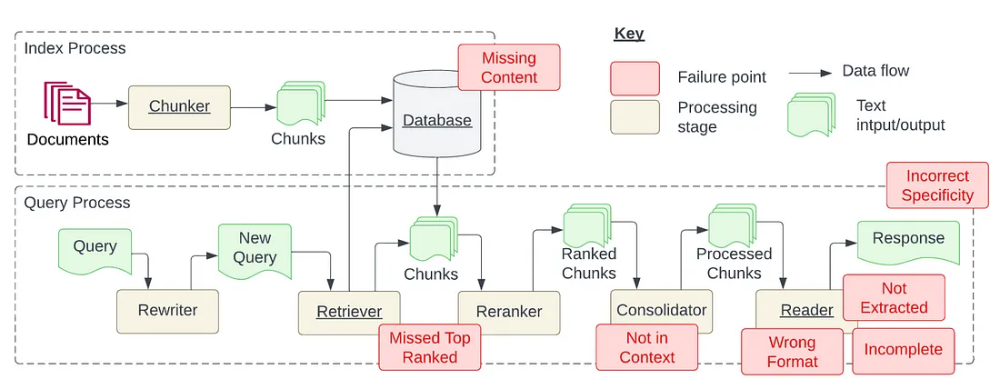

在寒假快結束的時候，我參加了2025 TSMC IT CareerHack，主題是智慧市場資訊分析助理。在這期間我學到了很多 LLM ，RAG 的知識，雖然沒有得名，不過我認為這三天的學習價值是非常高的。 

在開始介紹 RAG 前，我們先來討論一下 AI 幻覺。

## 幻覺 (Hallucination)

「幻覺」在 AI 領域指的是 大型語言模型（LLM）或生成式 AI 創造出不準確、捏造或無根據的資訊。這些資訊雖然可能語法流暢、看起來合理，但實際上是錯誤的，甚至完全虛構。

這個現象類似於人類的大腦在缺乏資訊時，會自動「填補空白」，以形成完整的敘述。

<!-- more -->

### 常見問題

- 捏造數據或事實: 例如 AI 被詢問某篇論文的來源時，它可能隨機產生一篇不存在的學術論文，包含假的作者與發表年份。
    > 這個我超級常遇到的
- 上下文錯誤 (沒有對焦): AI 可能會誤解問題或錯誤連結不同主題，導致生成的回應與使用者的需求不符。

在GPT-3等系統中，人工智慧會根據之前的一系列單詞（包括它自己先前回應過的單詞）生成下一個單詞，隨著對話時長的增加，可能會不斷地產生幻覺。

(簡單說，同一個對話中，很容易一開始很精準，但後面就開始亂回答了)

### 類型

- 數據的幻覺：來源內容存在差異（大型訓練數據集通常會發生這種情況）
- 訓練的幻覺：當數據集中幾乎沒有差異時，幻覺仍然會發生。在這種情況下，它源自模型的訓練方式。造成這種幻覺的原因有很多，例如：
    1. 錯誤解碼
    2. 模型先前生成的歷史序列的偏差
    3. 模型在其參數中編碼其知識的方式產生的偏差

### 如何解決?

幻覺現象仍未完全被了解。 因此，從業者仍在進行研究以試圖減輕/減緩其出現。特別是，研究表明，語言模型不僅會產生幻覺，還會放大幻覺。

現在常見的 "緩解" 方式有下

- 限制 AI 回答範圍
- 驗證 AI 回答的準確性
- 強化 AI 訓練與監管
- 使用 RAG（Retrieval-Augmented Generation）技術
讓 AI 先從可靠來源檢索資訊，再進行回答，避免憑空捏造。

## RAG 

### 簡介

RAG（Retrieval-Augmented Generation，檢索增強生成）是一種結合資訊檢索與大型語言模型（LLM, Large Language Model）的技術，旨在提升生成式 AI 的準確性與資訊完整性。

流程可分為
- 索引處理（Index Process）
- 查詢處理（Query Process）

在索引處理階段，系統首先從文件中提取內容，並透過 Chunker 將長文本拆分成較小的區塊，然後將這些區塊存入資料庫。這個階段的主要風險在於可能有遺漏內容（Missing Content），導致某些關鍵資訊未被正確儲存，進而影響後續的查詢結果。

當使用者提出查詢時，系統會進入查詢處理階段。首先，Rewriter 會對查詢進行優化，以提高檢索效率。接著，Retriever 會從資料庫中擷取相關的文本區塊，並由 Reranker模組確保最相關的資訊排名靠前。然而，在這個過程中，可能發生Missed Top Ranked 的問題，導致系統未能檢索到最有價值的資訊。

接下來， Consolidator 會進一步處理文本，確保資訊的上下文完整性，但若處理不當，可能會出現 Not in Context，導致最終回答與查詢需求不符。最終，Reader 負責解析處理後的文本，並產生回應。然而，這個階段可能會因為 Wrong Format、Not Extracted、Incomplete 而影響最終結果。

### RAG 的價值

> 這邊的 RAG 會指 LLM 搭配 RAG，然後 LLM 指的是純用 LLM 解決。

- 減少幻覺（Hallucination）：傳統 LLM 可能會捏造資訊，而 RAG 透過即時檢索外部資料來提高準確性。
- 知識更新即時性：LLM 需要重新訓練才能學習新知識，而 RAG 可透過檢索外部資料庫來即時提供最新資訊。
- 更符合專業領域需求：適用於法律、醫療、金融等高精確度領域，因為它能從可靠的知識庫檢索答案，而非憑空生成。
    1. 在企業內部應用（如知識管理、技術支援）
    2. 用於法律或醫療領域（提供最新法規、臨床研究資訊）
    3. 強化聊天機器人（提升客服準確性）

## 如何優化 RAG

### Missing Content

當 RAG 系統面對的問題無法從現有文件中得到答案時，就會出現這種情況。在最佳情況下，我們會希望 RAG 系統直接回答「我不知道」。然而，實務上RAG 系統常常會編造或錯誤回答問題。

針對這個問題，目前有兩大解決策略：

1. 資料清理 
    原始資料對於資訊處理系統準確性的重要性，如果輸入資料錯誤或矛盾，或預處理步驟不當，那麼無論檢索增強生成（RAG）系統多麼先進，都無法從混亂資料中提取有價值的資訊。這意味著我們必須在資料來源選擇、資料清洗、預處理等環節投入資源和技術，以確保輸入資料盡可能的準確和一致。
2. Prompt Engineering: 
    在知識庫缺乏相關訊息，導致系統可能給出看似合理但實際上錯誤的答案的情況下，使用 Prompt Engineering 是一個非常有幫助的解決方式。例如透過設定 Prompt：「如果你對答案不確定，就直接告訴我你不知道」，如此可以鼓勵模型採取更謹慎和誠實的回應態度，從而避免誤導用戶。雖然不能確保系統回答的絕對準確性，但透過這樣的 Prompt，確實能提高回答品質。
    
### Missed Top Ranked

這個挑戰主要的問題在於「答案在文件中，但因為排名靠前，而未能提供給用戶」

有兩種解決方式：

1. 調整參數優化搜尋效果: 如 chunk_size
2. 優化檢索文件的排序: 
    在把檢索到的文件送到 LLM 前，先對文件進行最佳化排序，能大幅提升 RAG 系統的效能，因為初始排序無法反映件與查詢的真實相關性。

### Not in Context

「答案所在的文檔雖從資料庫中檢索出來，但並未包含在生成答案的上下文中。」這種情況通常發生在返回的文檔太多，需透過一個整合過程來選取答案的情境。

為了解決這個問題，擴大上下文的處理範圍是一種方式，此外也建議可以嘗試以下方法：

1. 調整檢索策略: 像是 Vectorstore、ParentDocument、Multi Vector
2. Finetune Embeddings: 
    針對特定任務對 Embedding model 進行 Finetune，是提升檢索準確性的有效方法。

### Wrong Format 

當你使用 prompt 要求 LLM 以特定格式（如表格或清單）提取資訊，但卻被而被 LLM 忽略時，可以嘗試以下 3 種解決策略：

1. 改進 prompt
    - 明確說明指令
    - 簡化請求並使用關鍵字
    - 提供範例
    - 採用迭代提示，提出後續問題
2. Output Parsers
Output Parsers 負責取得 LLM 的輸出，並將其轉換為更合適的格式，因此當你想使用 LLM 產生任何形式的結構化資料時，這非常有用。他主要是在以下方面幫助確保獲得期望的輸出：
    - 為任何提示/查詢提供格式化指令
    - 對大語言模型的輸出進行「解析」。

### Incomplete

有時候 LLM 的回答並不完全錯誤，但會遺漏了一些細節。這些細節雖然在上下文中有所體現，但並未被充分呈現出來。例如，如果有人詢問「文檔A、B和C主要討論了哪些方面？」對於每個文檔分別提問可能會更加適合，這樣可以確保獲得更詳細的答案。

提高 RAG 系統效能的一個策略是添加一層查詢理解層，也就是在實際進行檢索前，先進行一系列的 Query Rewriting。

1. 數據清洗 (或者說需要預處理)
    數據的品質直接影響到檢索的效果。在責備你的 RAG 系統之前，確保你已經投入足夠的精力去清洗數據。
2. 訊息壓縮
    把足夠小的數據，比較能夠讓 LLM 聚焦。

### 未來發展

- RAG + 強化學習（RLHF, Reinforcement Learning from Human Feedback），透過人類回饋來優化 AI 生成內容的準確度。
- 更強的檢索機制，如 LlamaIndex，讓 AI 能有效利用外部 API、企業內部知識庫進行檢索。
- 在多模態（Multi-Modal）領域的應用，讓 RAG 不僅能檢索文本，也能處理影像、影片、音頻等資料。

## 簡報 (智慧市場資訊分析助理)

以下是我參加台積電黑客松的比賽簡報，因為我們有 demo 所以簡報內容較少。

[簡報連結](https://www.canva.com/design/DAGfIrOJlM4/qgJlwt6cNVNPlhUUdtR1WA/edit?utm_content=DAGfIrOJlM4&utm_campaign=designshare&utm_medium=link2&utm_source=sharebutton)

<!-- <PDF url="https://theme-hope-assets.vuejs.press/files/sample.pdf" /> -->