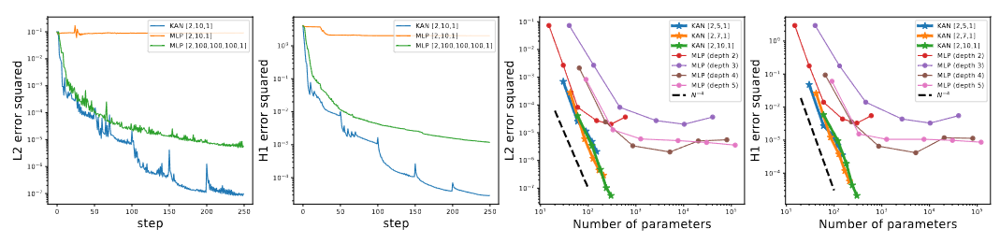

## 簡介

KAN (Kolmogorov–Arnold Networks) 為從 Kolmogorov-Arnold 表示定理受到的啟發，也因此取名為 KAN。論文中說明此為一種替代 MLP 的方法，和 MLP 不同的在於， MLP 在節點 "神經元" 上使用固定激活函數不同，KANs 則在邊 "權重" 上具備可學習的激活函數。 KANs 完全不使用線性權重——每個權重參數都被一個以 spline (樣條函數) 參數化的單變量函數所取代。

<!--more-->

從結構上來說，和 MLP 的思路挺類似的


雖然激活函數是參數化的 spline 組成，但實際上 KAN 的計算不會比 MLP 高。 比如在一些 PDE 求解上，兩層 10 寬的 KAN 比四層 100 的 MLP 有 100 倍的準確效率，且參數效率為 100 倍

> 原文: 2-Layer width-10 KAN is 100 times more accurate than a 4-Layer width-100 MLP ($10^{−7}$ vs $10^{−5}$ MSE) and 100 times more parameter efficient ($10^2$ vs $10^4$ parameters)

### spline & MLP & KAN 

KAN 簡單來說就是 spline 和 MLP 的結合，有點互補的概念。 spline 本身在高維度函數中會遇到 COD (curse of dimensionality problem) 的問題，而 MLP 雖然本身沒有 COD 問題，但是他在低維度上不如 spline 精確，因為他無法有效優化單變數函數 (固定的線性權重無法表達其複雜性)。


論文指出， KAN 同時擁有 MLP 的外部自由度 (權重節點設置)，以及 spline 的內部自由度(每個權重不再是單純的固定數值)

舉個例子: 

$$
f(x_1, x_2, ...,x_N) = exp(\frac{1}{N}\sum_{i=1}^N sin^2(x_i))
$$


在 MLP 上訓練起來就很不好，但用 KAN 之後卻有奇效。


並且 KAN 只用了 $[100, 1, 1]$ 的網路層，雖然文中並沒指出 MLP 使用什麼層數，以及其他參數的設定。

不過從 github 可以看到

```python=
def create_dataset(f, 
   n_var=2, 
   f_mode = 'col',
   ranges = [-1,1],
   train_num=1000, 
   test_num=1000,
   normalize_input=False,
   normalize_label=False,
   device='cpu',
   seed=0):
```

也就是說，是從 $[-1, 1]$ 抽取 1000 個訓練點，預設輸出為 n_var dimension，也就是預設 Size$([1000, 2])$

> 不過我自己訓練出來很快就收斂了 不知道為啥
> 阿我 git 下來用論文用的 KAN 跑，結果跑出來不一樣 0.0 

### Should I use KANs or MLPs?

最後，論文也有給了一個小結論 


簡單來說: 想要準確性嗎，想要 model 小一點嗎，選擇 KAN 就對了，不過速度不如 MLP。

> 雖然我看起來就是論文中畫了很多大餅，說自己的這個方法多好多厲害 0.0

現在來看看 KAN 到底是如何運作的吧!

## Kolmogorov–Arnold representation theorem

### Kolmogorov–Arnold representation theorem

If f is a multivariate continuous function on a bounded domain, then f can be written as a finite composition of continuous functions of a single variable and the binary operation of addition. More specifically, for a smooth $f : [0, 1]^n \rightarrow \mathbb{R}$

$$
f(x) = f(x_1, ...,x_n) = \sum_{q=1}^{2n+1} \Phi_q(\sum_{p=1}^n \phi_{q,p}(x_p))
$$

where $\phi_{q,p}:[0,1] \rightarrow \mathbb{R}$ and $\Phi_q : \mathbb{R} \rightarrow \mathbb{R}$


可以直觀的從這張圖來了解，其中 $p$ 對應輸入，$q$ 對應輸出 $\phi$ 則是針對單變量轉換函數 (外部自由度)，可以用 B-spline 參數化也就是圖上的 B 函數，$\Phi$ 則是對每個 $q$ 求和的輸出在做一次轉換。

> 加入 $\Phi$ 的原因主要是為了引入非線性和增強表達能力。如果直接進行求和，這個模型就只是一個線性組合，而無法有效表達複雜的非線性關係

這個理論提出了任何多變量函數都可以被表達為單變量函數的組合，並且這些單變量函數的輸出可以通過求和來表示複雜的多變量函數。

### 謬誤

你可能會天真的認為，這好像是一個好消息，對於學習一個高維度函數可以總結為學習一個多項式的一維函數，但實際上這些一維函數可能是非平滑的，甚至是分形 (fractal) 的，所以在很多情況下只是理論合理，但沒有用處。

### 樂觀

論文中表示，雖然如此，但依舊對於 Kolmogorov-Arnold 定理有樂觀的看法，並且拓展了一下，認為不需要拘泥於原本的方程式，原本有兩層非線性和 (2n+1) 項，他們想要推廣到任意寬度和深度。

其次論文也表明，在日常和科學中，大多數函數通常都是平滑且具有稀疏的結構，並且認為物理學家通常更關心典型情況而不是最壞的情況。

### B spline (補充)

Given $m+1$ knots, denote $t_i \in$  $[0, 1]$, satisfying $t_0 < t_1 < ... <t_m$

> (備註: 我在兩個文章中看到可以是 non-decreasing 但又有一篇寫嚴格大於，雖然看起來不會有什麼影響)
> 因為實際上，他有規定 0/0 = 0

For a given sequence of knots, there is, up to a scaling factor, a unique spline $B_{i,p}(t)$ satisfying 

$$
B_{i,p}(t) = 
\begin{cases}
non-zero &  \text{if } t_i ≤ t <t_{i+p+1}\\
0 & otherwise
\end{cases} 
$$

The usefulness of B-splines lies in the fact that any spline function of order $n$
 on a given set of knots can be expressed as a linear combination of B-splines

$$
S(t) = \sum_{i=0}^m P_ib_{i,n}(t), \space t\in[0,1]
$$

Where $P_i$ called **de Boor point**.

> P 是特徵多邊形的頂點

Additionally, the B-spline basis functions satisfy the partition of unity property:

$$
\sum_{i=0}^{m-p-1} B_{i, p}(t) = 1
$$

for all $t$ between $t_p$ and $t_{m-p}$


When the $m+1$'s  ($n$ degree) B-spline basis function can use  **Cox-de Boor recurrence algorithm**,  as follows

$$
B_{j,0} (t) := 
\begin{cases}
1 & t_j < t < t_{j+1} \\
0 & otherwise
\end{cases}
$$

$$
B_{j,n}(t):= \frac{t - t_j}{t_{j+n} - t_j}B_{j, n-1}(t) + \frac{t_{j+n+1} - t}{t_{j+n+1} - t_{j+1}} B_{j+1, n-1}(t)
$$

## KAN architecture 

假設有一組監督式學習輸入輸出 data $\{x_i, y_i\}$，我們想要找到 $f$ 使得 $y_i \approx f(x_i)$ ，而透過 Kolmogorov–Arnold representation theorem 告訴我們，完成時可以找到近似的 $\phi_{q,p}$ 和 $\Phi_{q}$。

於是 KAN 受到這個啟發設計一個 Neural Network。由於所有需要學習的函數都是單變量函數，因此我們可以將每個一維函數參數化為 B-spline 曲線，並具有局部 B-spline 基函數的可學習係數。

接下來論文會將 KAN 推廣到更深和更高維度，透過參考 MLP，一旦定義好了一層，接下來就只需要通過不斷的堆疊就可以使得網路更深層，因此定義了 KAN layer

### KAN Layer

A KAN layer with $n_{in}$ dimensional inputs and $n_{out}$ dimensional outputs can be defined as a matrix of $1D$ functions.

$$
\Phi = {\phi_{q,p}} \quad \quad p = 1, 2, ..., n_{in}, \quad \quad q = 1, 2, ..., n_{out}
$$

where $\phi_{q,p}$ have trainable parameter.

而 KAN 的原型就是從 Kolmogorov-Arnold representations，輸入層有 $n_{in} = n$，$n_{out} = 2n+1$，輸出層則是 $n_{in} = 2n+1$, $n_{out}$ = n。 (用簡單的兩層 KAN layers)，接下來就可以簡單的堆疊使網路達到更深層。 

### 記號

> 這邊想了一下還是用英文寫比較看得懂。
> 用 MLP 的格式參考，其實會發現是一樣的。

KAN is represented by an integer array 

$$
[n_0, n_1, ..., n_L]
$$

where $n_i$ is the number of nodes in the $i^{th}$ layer of the computational graph. We denote the $i^{th}$ neuron in the $l^{th}$ layer by $(l, i)$, and the activation value of the $(l, i)$-neuron by $x_{l,i}$. Between layer $l$ and layer $l+1$, there ard $n_l n_{l+1}$ activation functions. 

The activation function that connects $(l, j)$ and $(l+1, i)$ is denoted by 

$$
\phi_{l,i,j}, \quad \quad l = 0, ...,L-1, \quad i = 1,...,n_{l+1}, \quad j = 1,...n_l
$$

The pre-activation of $\phi_{l, i,j}$ is simply $x_{l, i}$ ; the post-activation of $\phi_{l,i,j}$ is denoted by $\tilde{x}_{l,i,j} \equiv \phi_{l,i,j}(x_{l,i})$, so that 

$$
x_{l+1,j} = \sum_{i=1}^{n_l} \tilde{x}_{l,i,j} = \sum_{i=1}^{n_l} \phi_{l,i,j}(x_{l,i}), \quad \quad j = 1, ..., n_{l+1}
$$

In matrix form, this reads 

$$
x_{l+1} = 
\begin{pmatrix} 
\phi_{l,1,1}(\cdot) & \phi_{l,1,2}(\cdot) & \cdots & \phi_{l,1,n_l}(\cdot) \\
\phi_{l,2,1}(\cdot) & \phi_{l,2,2}(\cdot) & \cdots & \phi_{l,2,n_l}(\cdot) \\
\vdots & \vdots &  & \vdots \\
\phi_{l,n_{l+1},1}(\cdot) & \phi_{l,n_{l+1},2}(\cdot) & \cdots & \phi_{l,n_{l+1},n_l}(\cdot) \\ 
\end{pmatrix} x_l
$$

and write this matrix $\Phi_l$ corresponding to the $l^{th}$ KAN layer.

### General KAN network

所以一個 General KAN network 有 $L$ 層，如果輸入 $x \in \mathbb{R}^{n_0}$ 則有

$$
KAN(x) = (\Phi_{L-1} \circ \Phi_{L-2} \circ \cdots \circ \Phi_1 \circ \Phi_0) x
$$

當然也可以全部寫出來 (這邊直接複製)


注意: 這邊操作都是可微的，所以可以透過 back propagation 訓練。

> 我還沒推過，論文也沒寫 back propagation 過程，不過我去翻程式碼是有看到他們直接 call 自動微分

所以現在再回來看這張圖，可以很清楚明瞭過程了!


### 優化

雖然構造看起來很簡單，但實際上要優化是一件不容易的事情，論文中提出了三個關鍵

(1) Residual activation functions:

activation function 是 spline 和 b 函數的和， spline 可以倍參數化成 B-spline 的線性組合，其中 c 是可以訓練的。 

$$
\begin{align} 
\phi(x) = w(b(x) + spline(x))\\
b(x) = silu(x) = \frac{x}{1+e^{-x}} \\
spline(x) = \sum_i c_iB_i(x)
\end{align}
$$

> silu 是 sigmoid 和 ReLU 的改進版 = $x \times \sigma(x)$ 

而其實 $w$ 不是必要的，但是為了更好控制 activation function 幅度大小，所以還是引入了。

(2) Initialization scales:

每個 activation function 初始化為 $spline(x) \approx 0$ ，$w$ 用 Xavier 來初始化，同時 $c_i \sim N(0, \sigma^2)$ 論文中設 $\sigma = 0.1$

> Xavier 想避免梯度消失

(3) Update of spline grids:

解決 spline 在有界區域上定義但激活值在訓練期間超出固定區間的問題。 而這有兩種方式，用梯度下降學習，或者用正規化使輸入範圍固定，但論文中顯示前者效果大於後者。

> 不過在其餘優化上，論文表示還沒有想法，所以現在的效率也是不太好。

### 參數數量

簡單起見，我們假設

- Depth: $L$
- $n_0 = n_1 = \cdots =n_L = N$
- spline of order $k$ (usually $k=3$) on $G$ intevals (for $G+1$ grid points)

總共會有 $O(N^2 L(G+k)) \sim O(N^2LG)$ 參數，而 MLP 則只需要 $O(N^2L)$ 幸運的是，KAN 通常需要比 MLP 遠小得多的 N。

## Appoximation theory (KAT)

Let $x \in \mathbb{R}^n$, suppose  $f = (\Phi_{L-1} \circ \Phi_{L-2} \circ \cdots \circ \Phi_1 \circ \Phi_0) x$

where $\Phi$ are (k + 1)-times continuously differentiable. Then there exists a constant C depending on f and its representation, such that we have the following approximation bound in terms of the grid size G: 

There exist $k-th$ order B-spline functions $\Phi^G_{l,i,j}$ such that for any $0 ≤ m ≤ k$, we have the bound

$$
||f -  (\Phi^G_{L-1} \circ \Phi^G_{L-2} \circ \cdots \circ \Phi^G_1 \circ \Phi^G_0) x||_{c^m} \leq C G^{-k-1+m}
$$

> 這邊用 $c^m$ 範數來測量 $m$ 階導數的大小。

$$
||g||_{c^m} = max sup|D^\beta g(x)|
$$

定理證明的話，略 (Theorem 2.1)。

但結論就是，通過有限個網格大小可以很好的近似函數，同時 residue rate 和維度無關，所以可以一定程度的對抗 COD ， 而 MLP 所依賴的 UAT 定理則說明了 MLP 受到了 COD 的限制。


## Grid Extension

想要從粗網格 (coarse grid) 延伸至細網格 (fine grid) 以進行更精確的 B 樣條（B-spline）近似。

1. 粗網格的定義：假設我們要在區間 $[a, b]$ 中，以 B 樣條來近似一維函數 $f(x)$。首先，建立一個粗網格，將 $[a, b]$ 區間分成 $G_1$ 個小區間（intervals），在每個區間端點形成節點（grid points），標記為 $t_0 = a, t_1, t_2, \cdots, t_{G_1} = b$。在這些節點的兩端再添加額外的節點，以確保邊界條件，形成了拓展節點序列 $\{t_{-k}, \cdots, t_{-1}, t_0, \cdots, t_{G_1}, t_{G_1+1}, \cdots, t_{G_1+k}\}$。

2. B 樣條基函數：對於每個節點區間的連續性，在粗網格上會有 $G_1 + k$ 個 B 樣條基函數（B-spline basis functions）。每個 B 樣條 $B_i(x)$ 只在範圍 $[t_{-k+i}, t_{i+1}]$ 上非零，因此每個 B 樣條都是局部定義的，這特性讓樣條只在其局部節點範圍內影響函數的形狀。

3. 函數近似的表示：在粗網格上，函數 $f$ 可以表示為這些 B 樣條基函數的線性組合：
   $$
   f_{\text{coarse}}(x) = \sum_{i=0}^{G_1 + k - 1} c_i B_i(x)
   $$
   其中 $c_i$ 是對應基函數的係數。

4. 細網格的建立與轉換：接著，將粗網格的區間數增加至 $G_2$，以更細的節點劃分形成細網格。細網格上的函數 $f_{\text{fine}}(x)$ 同樣表示為 B 樣條基函數的線性組合：
   $$
   f_{\text{fine}}(x) = \sum_{j=0}^{G_2 + k - 1} c'_j B'_j(x)
   $$

5. 係數轉換：要將粗網格的係數 $c_i$ 轉換為細網格的係數 $c'_j$，這可以透過最小化 $f_{\text{fine}}(x)$ 與 $f_{\text{coarse}}(x)$ 之間的距離來完成。具體來說，就是找到 $c'_j$ 的最佳解，使得兩者的差異在某種分佈下最小，即解以下公式：
   $$
   \{c'_j\} = \arg \min_{\{c'_j\}} \mathbb{E}_{x \sim p(x)} \left( \sum_{j=0}^{G_2 + k - 1} c'_j B'_j(x) - \sum_{i=0}^{G_1 + k - 1} c_i B_i(x) \right)^2
   $$
   並透過最小二乘演算法來實現。
   > 在 k 階 b-spline $[a, b]$ 有 $G_1$ 想要擴大到 $G_2$


通常 spline grid 區間越多，擬和越準確，這個特點被 KAN 很好的繼承下來。 不過卻也會造成 overfitting 以及 underfitting ，下圖就顯示在 grid > 1000 左右，會出現 bad landscape loss。 同時比較小的 KAN 表現更好一點。


這張圖也表示了用 mean of squared 比單純 mean 好

> 蠻好笑的是，論文都會寫他的例子是 toy example

## Simplification techniques


### 稀疏化 (Sparsification)

- 因為沒有所謂線性的 "權重"，所以 KAN 需要定義自己的激活函數 L1 norm.
- 論文發現 L1 norm 不足夠實現 KAN 的稀疏化，需要額外的 entropy regularization

L1 norm: 在 $N_p$ 個輸入的平均幅度

$$
|\Phi|_1 \equiv \frac{1}{N_p} \sum_{s=1}^{N_p} |\phi(x^{(s)})|
$$

對於具有 $n_{in}$ 輸入和 $n_{out}$ 輸出的 KAN 層，定義 $\Phi$ 的 L1 norm 為所有激活函數的 L1 norm 總和

$$
|\Phi|_1 \equiv \sum_{i=1}^{n_{in}} \sum_{j=1}^{n_{out}} |\phi_{i,j}|
$$

此外定義 $\Phi$ 的 entropy

$$
S(\Phi) \equiv -\sum_{i=1}^{n_{in}} \sum_{j=1}^{n_{out}} \frac{|\phi_{i,j}|}{|\Phi|_1} log(\frac{|\phi_{i,j}|}{|\Phi|_1})
$$

總訓練目標 loss $l_{total}$ 為預測 $l_{pred}$ 加上 KAN 所有層的L1 和 entropy 正則化

$$
l_{total} = l_{pred} + \lambda (\mu_1 \sum_{l=0}^{L-1} |\Phi_l|_1 + \mu_2 \sum_{l=0}^{L-1} S(\Phi_l))
$$

> 通常 $\mu_1 = \mu_2 = 1$，$\lambda$ 為控制總正則化量的值

### 視覺化 (Visualization)

為了獲得大小的感覺，將激活函數 $\phi_{l,i,j}$ 設定透明度為 $tanh(\beta A_{l,i,j})$ $\beta = 3$，小幅度的函數逐漸消失，以便可以更專注重要的函數

> 有點不太懂怎麼去做

### 剪枝

經過稀疏化懲罰後，想將網路修剪成更小的子網路，在節點對 KAN 進行稀疏化。對於每個節點 $i^{th}$ 神經元在第 $l^{th}$ 層的傳入傳出分數定義為

$$
I_{l,i} = max_k(|\phi_{l-1,k,i}|_1), O_{l,i} = max_j(|\phi_{l+1, j, i}|_1) 
$$

若傳入傳出分數都大於預設超參數 $\theta = 10^{-2}$ 則認為很重要，其餘不重要的都會被剪枝。

### 符號化 (Symbolification)

論文中懷疑某些激活函數實際上是符號的，例如 $cos$, $log$, 他們提供一個介面設定為指定的符號形式, **fix_symbolic(l,i,j,f)** 可以將 $(l,i,j)$ 激活為 $f$，然後不能夠簡單的將激活函數設定為準確的符號公式，因為輸入輸出可能需要位移和縮放，因此，論文中從樣本中獲得 preactivations $x$ 和 postactivations $y$，並擬合仿射 (affine) 參數 $(a, b, c, d)$ 使得 $y≈ cf(ax+b) +d$，擬合是透過 a b 的迭代網路搜尋以及線性迴歸。

### 簡化過程

論文提出，簡化這個結構可以透過以下過程

- 稀疏化訓練 (Training with sparsification)
- 剪枝 (Pruning)
- 符號化 (Setting symbolic functions)
- 進一步訓練 (Further training)
- 輸出 (Output the symbolic formula)


## 一些結果

### toy data

- 擬合符號函數 (不同維度)


顯示出更深層的 KAN 具有更強大的表達能力。 (不過 MLP 同時也是一樣)


### 特殊函數

- 擬合 15 個數學和物理上特殊函數上的表現


KAN 通常具有較小的訓練次數和損失

- ellipj - 雅可比橢圓函數
- ellipkinc - 不完全橢圓積分 K
- ellipeinc - 不完全橢圓積分 E
- jv 和 yv - 第一和第二類貝索函數
- kv 和 iv - 修改過的貝索函數
- lpmv_m_0, lpmv_m_1, lpmv_m_2 - 連帶勒讓德函數
- sph_harm_m_0_n_1, sph_harm_m_1_n_1, sph_harm_m_0_n_2, sph_harm_m_1_n_2, sph_harm_m_2_n_2 - 球諧函數

### Feynman 數據集


> 論文中說他們發現 自動的 KAN 形狀通常比人類結構小，認為 KAN 可能比我們想像中的更有效，但同時可能會使解釋性變得微妙。

### PDE 

We consider a Poisson equation with zero Dirichlet boundary data. For Ω = $[−1, 1]^2$, consider the PDE

$$
\begin{align}
u_{xx} + u_{yy} = f && in \space \Omega \\
u = 0 \space &&on \space  \partial \Omega \\
\end{align}
$$

We consider the data $f = −π^2(1 + 4y^2) sin(πx) sin(πy^2) + 2π sin(πx) cos(πy^2)$ for which $u =
sin(πx) sin(πy^2)$ is the true solution. We use the framework of physics-informed neural networks




### 持續學習性


KAN 表現的很好，MLP 則會有災難性遺忘問題。


### Knot Theory

We find that an extremely small [17, 1, 14] KAN is able to achieve 81.6% test accuracy (while Deepmind’s 4-layer width-300 MLP achieves 78% test accuracy)

KAN 用了大概 200 個參數，MLP 用了 $3 \times 10^5$


### 結論

KAN 為機器學習領域的一線希望，並且很適合那些需要理解，和解釋基礎原理的任務，非常適合科學研究。
> 可以參考論文最後面可視化那邊。

- 複雜性/過擬和: KAN 可能會過擬和(特別是資料有限情況)，從而導致誤認為噪聲 (noise) 是重要的。
- 計算優化: KAN 目前在 GPU 優化面臨挑戰。
- 適用性: KAN 主要設計用於科學任務，理解底層函數很重要，但可能不適用於大規模識別或分類領域。


## KAN github

https://github.com/KindXiaoming/pykan

## References
- [論文來源](https://arxiv.org/html/2404.19756v1)
- https://martin12345m.medium.com/%E5%88%9D%E6%8E%A2kolmogorov-arnold-networks-kan-%E7%A5%9E%E7%B6%93%E7%B6%B2%E8%B7%AF%E7%9A%84%E6%96%B0%E6%9B%99%E5%85%89-32c7473a93f5
- https://blog.csdn.net/qq_27590277/article/details/138555114
- https://www.p-chao.com/2024-05-04/kan%E8%AE%BA%E6%96%87%E7%AC%94%E8%AE%B0/
- https://en.wikipedia.org/wiki/Kolmogorov%E2%80%93Arnold_representation_theorem
https://blog.csdn.net/jarodyv/article/details/138751803
- https://blog.csdn.net/weixin_44397852/article/details/108836781
- ChatGPT